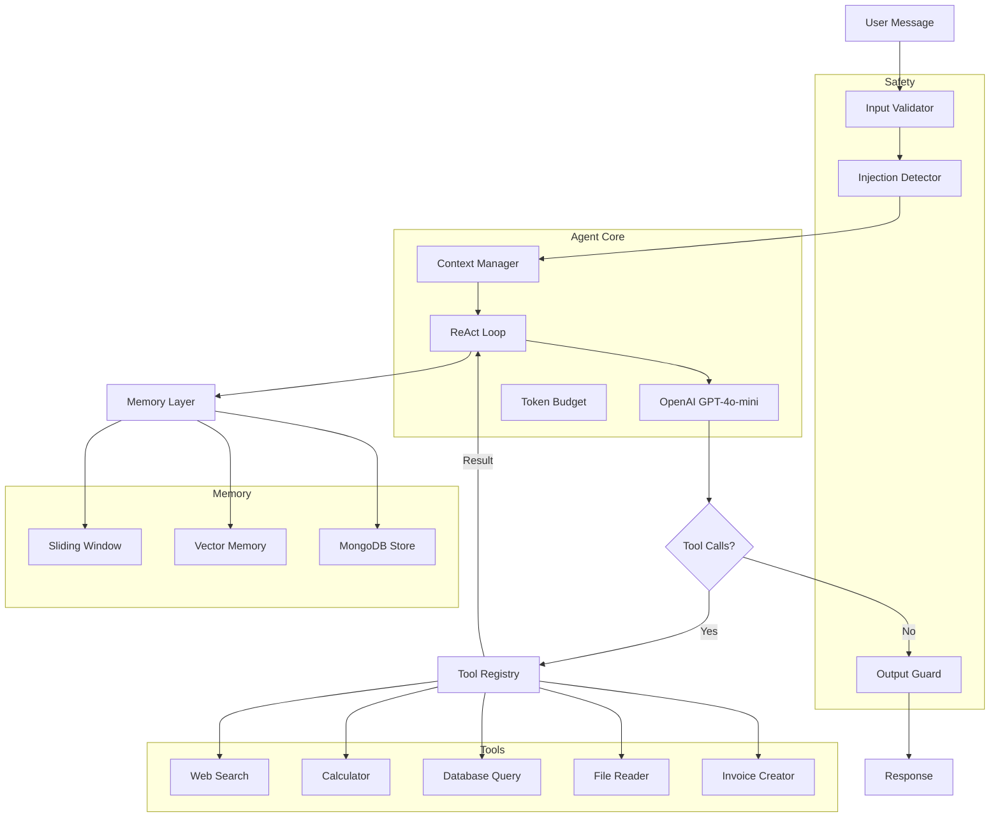
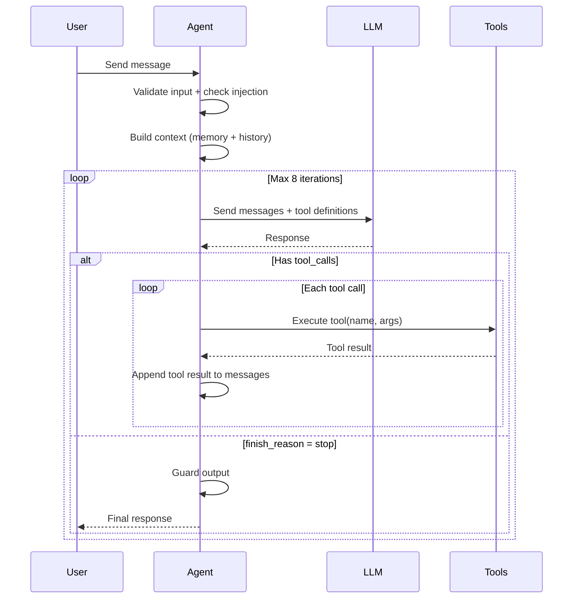

# 04 - JugaadDesk Agent

**Client:** JugaadDesk, Pune — SaaS business assistant with tools, memory, and guardrails.

**Tech:** OpenAI, Fastify, Raw SDK (no frameworks), MongoDB

## Architecture



## How the ReAct Loop Works



## Setup

```bash
cp .env.example .env
# Add your OPENAI_API_KEY
npm install
npm run dev
```

## API

```bash
# Chat with the agent
curl -X POST http://localhost:3004/chat \
  -H "Content-Type: application/json" \
  -d '{"message": "What items do we have in inventory?", "sessionId": "demo"}'

# Clear session
curl -X POST http://localhost:3004/chat/clear \
  -H "Content-Type: application/json" \
  -d '{"sessionId": "demo"}'

# Health check
curl http://localhost:3004/health
```

## File Structure

```
src/
  index.js               — Fastify server
  db.js                  — MongoDB connection + seeding
  agent/
    react-loop.js        — THE CORE: ReAct loop from scratch
    planner.js           — Plan-then-execute strategy
    context-manager.js   — Context window management
    token-budget.js      — Token allocation across components
  tools/
    registry.js          — Tool registry + dispatcher
    definitions.js       — OpenAI function schemas
    web-search.js        — Simulated web search
    calculator.js        — Math operations
    database.js          — MongoDB queries
    file-reader.js       — Local file reading
    invoice-creator.js   — Invoice generation
  memory/
    conversation.js      — Sliding window + summary
    vector-memory.js     — Embedding-based retrieval
    mongodb-store.js     — Persistent storage
  safety/
    input-validator.js   — Sanitize user input
    output-guard.js      — Validate output
    injection-detector.js — Detect prompt injection
```

## Key Concepts

- **ReAct Loop**: Reason + Act. LLM decides which tool to call, gets result, reasons again.
- **Token Budget**: Split context window across system prompt, memory, tools, reasoning, response.
- **Sliding Window Memory**: Keep recent messages, summarize old ones with LLM.
- **Vector Memory**: Embed past interactions, retrieve relevant ones for context.
- **Safety Layer**: Input validation, prompt injection detection, output filtering.
