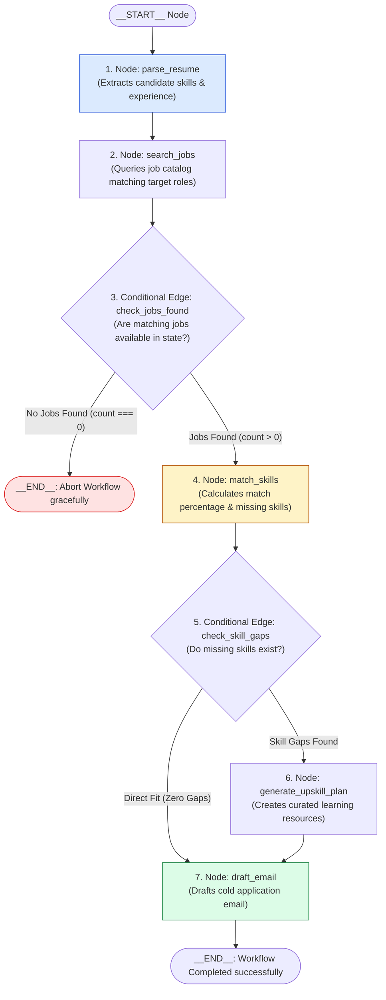
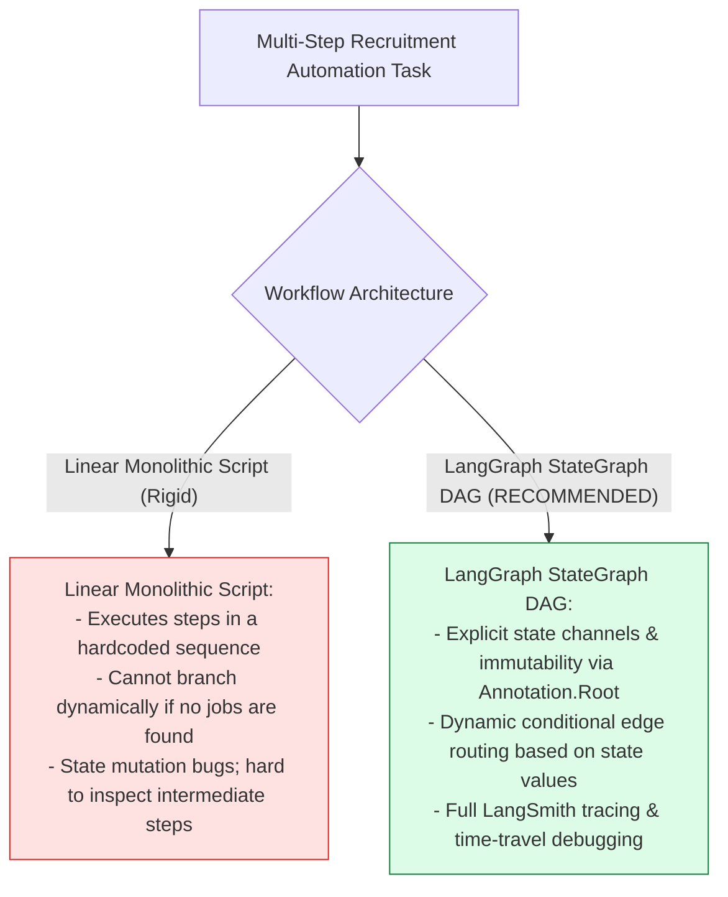
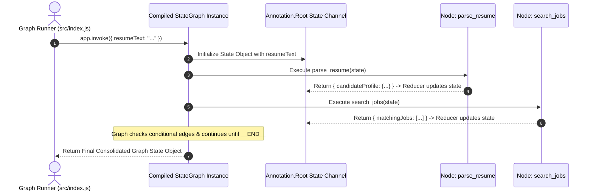

# Module 00: Stateful Graph Workflow Engine Overview & Architecture

## Overview

Complex multi-agent AI processes (such as automated job candidate screening, skill-gap analysis, and outreach email generation) require structured, predictable execution graphs rather than unconstrained LLM loops. **Karigar Flow** is an enterprise-grade **Stateful Workflow Engine** built with **LangGraph (`@langchain/langgraph`)**. It models recruitment workflows as a **State Graph (DAG)** of processing nodes (**Parse Resume** $\rightarrow$ **Search Jobs** $\rightarrow$ **Match Skills** $\rightarrow$ **Draft Application Email**) featuring explicit state channels, state reducers (`Annotation.Root`), conditional edge routers, and LangSmith telemetry observability.

Understanding **LangGraph StateGraph Topologies**, **State Channels & Reducers**, **Conditional Edge Branching**, and **Execution Tracing** is essential for workflow engineering.

---

## 1. LangGraph State Machine Workflow Topology

---

## 2. Linear Sequential Scripts vs. LangGraph State Graphs

### Karigar Flow Graph Node Architecture Reference Matrix

| Graph Node Name | Source Module | Primary Engineering Responsibility | Input State Keys | Output State Keys |
| :--- | :--- | :--- | :--- | :--- |
| **`parse_resume`** | `src/graph/nodes.js` | Parses raw resume text into structured candidate profile. | `resumeText` | `candidateProfile` |
| **`search_jobs`** | `src/graph/nodes.js` | Queries job catalog matching candidate target roles. | `candidateProfile` | `matchingJobs` |
| **`match_skills`** | `src/graph/nodes.js` | Evaluates skill gap matrix & candidate fit percentage. | `candidateProfile`, `matchingJobs` | `skillMatchAnalysis` |
| **`generate_upskill_plan`** | `src/graph/nodes.js` | Generates learning recommendations for missing skills. | `skillMatchAnalysis` | `upskillPlan` |
| **`draft_email`** | `src/graph/nodes.js` | Drafts personalized application email to hiring manager. | `candidateProfile`, `skillMatchAnalysis` | `applicationEmail` |

---

## 3. Asynchronous Graph Execution & State Reducer Sequence

---

## Key Production Takeaways

1. **Model Workflows as Explicit State Graphs**: Using `@langchain/langgraph` to construct directed acyclic graphs (DAGs) ensures complex AI workflows remain structured, deterministic, and maintainable.
2. **Immutability via State Reducers (`Annotation.Root`)**: Use state reducers to define exact state channels, ensuring graph nodes produce predictable, immutable state updates as data flows through the graph.
3. **Dynamic Branching with Conditional Edges**: Implement conditional edge functions (`addConditionalEdges`) to route execution dynamically based on runtime node outputs (e.g. aborting early if no matching jobs are found).
4. **End-to-End Tracing Observability**: Integrate LangSmith tracing handlers to monitor graph execution node latencies, state transitions, and LLM token usage across production workflow runs.

