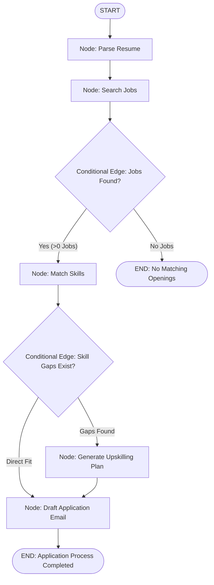

# File 00: Stateful Graph Workflow Engine Overview & Architecture

## Overview
**Karigar Flow** is an enterprise-grade **Stateful Workflow Engine** built with **LangGraph (`@langchain/langgraph`)**. It models recruitment workflows as a **State Graph (DAG)** of processing nodes (**Parse Resume** $\rightarrow$ **Match Jobs** $\rightarrow$ **Analyze Skill Gaps** $\rightarrow$ **Draft Application Email**) with conditional edge routing, state reducers, and LangSmith observability.

---

## 1. LangGraph State Machine Workflow Topology

---

## 2. Graph Node Matrix

| Node Name | Source Module | Responsibility |
| :--- | :--- | :--- |
| **`parse_resume`** | `src/graph/nodes.js` | Extracts skills, years of experience, and target roles from raw resume text |
| **`search_jobs`** | `src/graph/nodes.js` | Queries `jobs.json` catalog matching candidate target roles |
| **`match_skills`** | `src/graph/nodes.js` | Performs skill gap analysis between resume skills and job requirements |
| **`generate_upskill_plan`** | `src/graph/nodes.js` | Generates curated learning resources for missing skills |
| **`draft_email`** | `src/graph/nodes.js` | Generates personalized cold email tailored to hiring managers |

---

## Key Takeaways
1. Uses **LangGraph StateGraph** to manage complex, multi-branching workflow loops.
2. Employs **State Reducers** (`Annotation.Root`) to preserve and update state values deterministically as state transitions through graph nodes.
3. Supports **Conditional Edge Routing** based on runtime node evaluation outputs.
