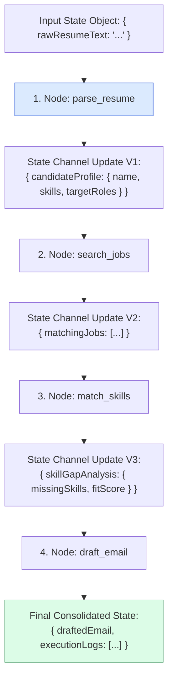
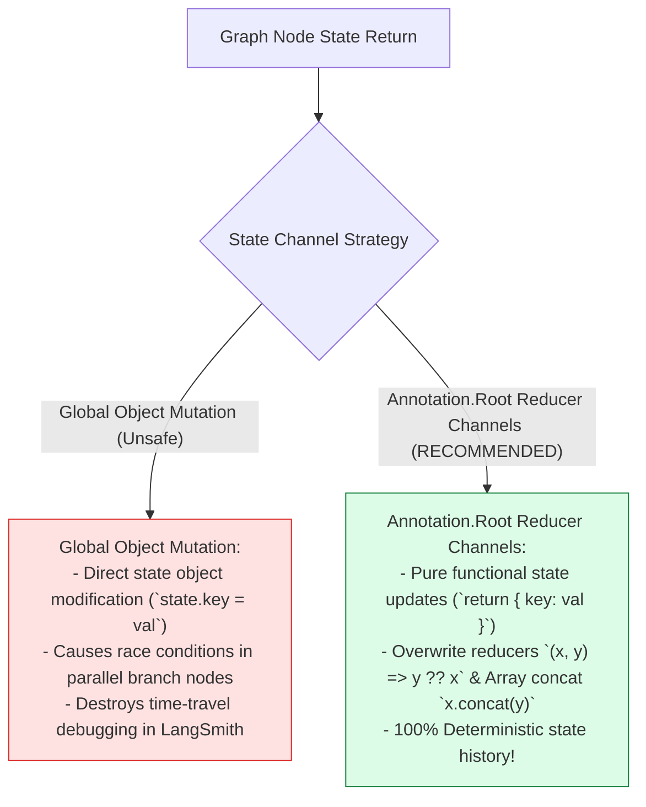
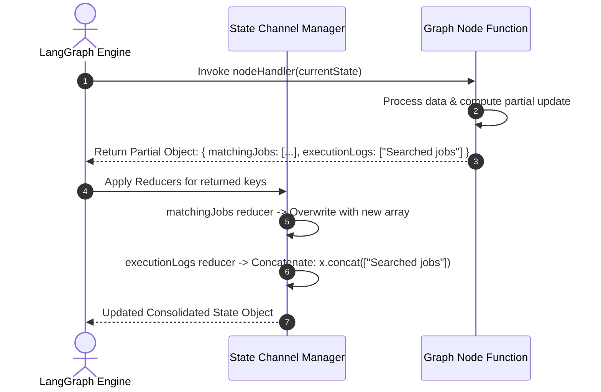

# Module 01: Graph State Schema Definition & Reducers (`src/graph/state.js`)

## Overview

In LangGraph state machines, nodes do not communicate by directly calling one another; instead, they operate as pure functional transforms on a single shared state object. The **Graph State Schema (`src/graph/state.js`)** uses **`Annotation.Root()`** to construct the strongly-typed shared state channel schema for Karigar Flow, defining initial default values and explicit **State Reducer Functions** (`reducer: (x, y) => y ?? x` for overwrites and `(x, y) => x.concat(y)` for log appends) that govern how node outputs update state.

Understanding **`Annotation.Root()` State Channels**, **State Reducer Functions**, **State Channel Immutability**, and **Execution Telemetry Logging** is essential for LangGraph applications.

---

## 1. Graph State Channel Transition Topology



---

## 2. Dynamic Object Mutation vs. Immutable Reducer Channels



### GraphState Channel Schema Matrix

| State Channel Key | Channel Data Type | Reducer Strategy | Default Value | Technical Function |
| :--- | :--- | :--- | :--- | :--- |
| **`rawResumeText`** | `String` | Overwrite `(x, y) => y ?? x` | `""` | Raw unparsed candidate resume text. |
| **`candidateProfile`** | `Object` | Overwrite `(x, y) => y ?? x` | `null` | Extracted profile (skills, experience). |
| **`matchingJobs`** | `Array<Object>` | Overwrite `(x, y) => y ?? x` | `[]` | Retrieved matching jobs from catalog. |
| **`skillGapAnalysis`** | `Object` | Overwrite `(x, y) => y ?? x` | `null` | Skill gap analysis and fit score. |
| **`upskillPlan`** | `Array<Object>` | Overwrite `(x, y) => y ?? x` | `[]` | Curated upskilling resources array. |
| **`draftedEmail`** | `String` | Overwrite `(x, y) => y ?? x` | `""` | Final drafted email text. |
| **`executionLogs`** | `Array<String>` | Array Append `(x,y) => x.concat(y)` | `[]` | Accumulated audit log trace entries. |

---

## 3. Asynchronous Reducer Merging Sequence



---

## 4. Code Walkthrough (`src/graph/state.js`)

```javascript
import { Annotation } from "@langchain/langgraph";

/**
 * Shared State Schema Definition for Karigar Flow Workflow Engine
 * Constructed using LangGraph's Annotation.Root schema decorator
 */
export const GraphState = Annotation.Root({
  /**
   * Raw resume text input provided by candidate
   */
  rawResumeText: Annotation({
    reducer: (x, y) => y ?? x,
    default: () => ""
  }),

  /**
   * Extracted candidate profile object (parsed skills, experience, target roles)
   */
  candidateProfile: Annotation({
    reducer: (x, y) => y ?? x,
    default: () => null
  }),

  /**
   * List of matching job openings retrieved from job catalog
   */
  matchingJobs: Annotation({
    reducer: (x, y) => y ?? x,
    default: () => []
  }),

  /**
   * Skill gap analysis object (matched skills, missing skills, candidate fit percentage)
   */
  skillGapAnalysis: Annotation({
    reducer: (x, y) => y ?? x,
    default: () => null
  }),

  /**
   * Recommended learning resources for missing skills
   */
  upskillPlan: Annotation({
    reducer: (x, y) => y ?? x,
    default: () => []
  }),

  /**
   * Drafted cold application email body to hiring manager
   */
  draftedEmail: Annotation({
    reducer: (x, y) => y ?? x,
    default: () => ""
  }),

  /**
   * Accumulated graph execution logs (uses Array Concat Reducer)
   */
  executionLogs: Annotation({
    reducer: (x, y) => (Array.isArray(x) ? x.concat(y) : [y]),
    default: () => []
  })
});
```

---

## Key Production Takeaways

1. **Use `Annotation.Root()` for State Typing**: Construct the graph state object using LangGraph's `Annotation.Root()` to enforce clear data typing and state channel definitions across all node handlers.
2. **Define explicit Reducer Functions**: Provide explicit reducer logic (`(x, y) => y ?? x` for overwrites; `(x, y) => x.concat(y)` for logs) to dictate how partial node updates merge into global state.
3. **Return Partial State Updates**: Instruct node handlers to return only the specific state keys they modify (`return { matchingJobs: [...] }`), relying on LangGraph reducers to merge updates cleanly.
4. **Maintain Execution Audit Logs**: Use an append-only state channel (`executionLogs`) to record step execution events for telemetry and debugging.


## Learn from the implementation

Use the matching source file as an executable example, not just something to copy. Before running it, state in your own words what data enters the module, what it returns, and which values it changes. Then trace one realistic request from the caller through each function.

Pay special attention to these questions:

- **Data flow:** Which object, array, string, or state value moves between functions? What shape must it have?
- **Control flow:** Which branch, loop, early return, or retry changes the outcome? What condition selects it?
- **Async boundaries:** Where does the code wait for an LLM, database, network, file system, or tool? What should happen if that operation rejects or returns no result?
- **Side effects:** Which lines log information, make an external request, store data, or mutate in-memory state? Keep those distinct from pure calculations.
- **Production limits:** Which assumptions are only safe for a tutorial—for example, in-memory storage, fixed thresholds, approximate token counts, mock data, or a hard-coded batch size?

A useful practice is to change one input at a time and predict the result before executing it. If you can explain why the output changed, when the module should be used, and one way it could fail, you understand the concept rather than only the syntax.
