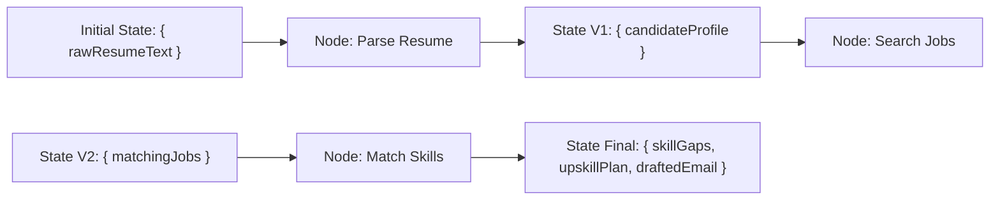

# File 01: Graph State Schema Definition (`src/graph/state.js`)

## Overview
The **Graph State Schema** defines the shared, strongly-typed state object that flows through every node in the LangGraph state machine, using **`Annotation.Root()`** to specify state keys and reducer update functions.

---

## 1. Graph State Transition Flow



---

## 2. Graph State Schema Implementation (`src/graph/state.js`)

```javascript
import { Annotation } from "@langchain/langgraph";

export const GraphState = Annotation.Root({
    // Raw Input Data
    rawResumeText: Annotation({
        reducer: (x, y) => y ?? x,
        default: () => ""
    }),

    // Candidate Extracted Profile
    candidateProfile: Annotation({
        reducer: (x, y) => y ?? x,
        default: () => null
    }),

    // Retrieved Matching Jobs
    matchingJobs: Annotation({
        reducer: (x, y) => y ?? x,
        default: () => []
    }),

    // Skill Gap Analysis
    skillGapAnalysis: Annotation({
        reducer: (x, y) => y ?? x,
        default: () => null
    }),

    // Upskilling Resources Plan
    upskillPlan: Annotation({
        reducer: (x, y) => y ?? x,
        default: () => []
    }),

    // Generated Application Email
    draftedEmail: Annotation({
        reducer: (x, y) => y ?? x,
        default: () => ""
    }),

    // Execution Trace Log
    executionLogs: Annotation({
        reducer: (x, y) => x.concat(y), // Reducer appends log entries!
        default: () => []
    })
});
```

---

## Key Takeaways
1. **`Annotation.Root()`** constructs the central state object passed to every node handler.
2. Reducer functions (e.g. `(x, y) => x.concat(y)`) define how partial updates from node handlers merge into the global graph state.
