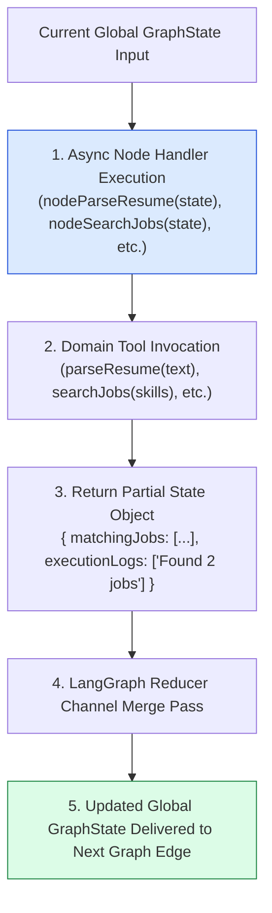
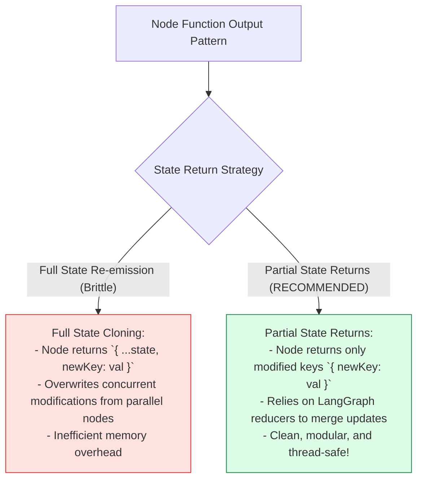
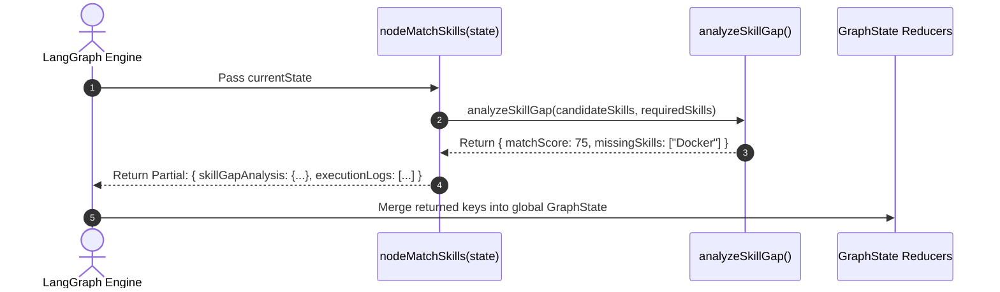

# Module 02: Graph Processing Node Handlers (`src/graph/nodes.js`)

## Overview

In LangGraph state machines, **Graph Processing Nodes** act as discrete execution units in the state graph (DAG). Each node function is an asynchronous handler that receives the current `GraphState` object, performs business logic or invokes domain tools (such as resume parsing, job searching, or email drafting), and returns a **Partial State Update Object** containing only modified keys, which LangGraph's reducers merge cleanly into global state.

Understanding **Node Input-Output Contracts**, **Partial State Mutation Envelopes**, **Domain Tool Invocation Wrappers**, and **Step Log Telemetry** is essential for node engineering.

---

## 1. Node Execution & Reducer Merging Topology



---

## 2. Full State Copying vs. Partial State Updates



### Graph Node Input & Output Contract Reference

| Node Function Name | Domain Tool Invoked | Input State Dependencies | Returned Partial State Object |
| :--- | :--- | :--- | :--- |
| **`nodeParseResume`** | `parseResume(text)` | `state.rawResumeText` | `{ candidateProfile, executionLogs }` |
| **`nodeSearchJobs`** | `searchJobs(skills)` | `state.candidateProfile` | `{ matchingJobs, executionLogs }` |
| **`nodeMatchSkills`** | `analyzeSkillGap(...)` | `candidateProfile`, `matchingJobs` | `{ skillGapAnalysis, executionLogs }` |
| **`nodeGenerateUpskillPlan`**| `suggestUpskilling(...)` | `state.skillGapAnalysis` | `{ upskillPlan, executionLogs }` |
| **`nodeDraftEmail`** | `draftApplicationEmail()` | `candidateProfile`, `matchingJobs` | `{ draftedEmail, executionLogs }` |

---

## 3. Node Execution Sequence



---

## 4. Code Walkthrough (`src/graph/nodes.js`)

```javascript
import { parseResume } from "../tools/resume-parser.js";
import { searchJobs } from "../tools/job-search.js";
import { analyzeSkillGap, suggestUpskilling } from "../tools/skill-matcher.js";
import { draftApplicationEmail } from "../tools/email-drafter.js";

/**
 * Node 1: Parses raw resume text into structured candidate profile
 */
export async function nodeParseResume(state) {
  console.log("⚡ [NODE: parse_resume] Extracting candidate skills & experience...");
  if (!state.rawResumeText) {
    throw new Error("[NODE ERROR: parse_resume] Missing required 'rawResumeText' in state.");
  }

  const profile = await parseResume(state.rawResumeText);

  return {
    candidateProfile: profile,
    executionLogs: [`[parse_resume] Extracted profile for ${profile.name} with ${profile.skills.length} skills.`]
  };
}

/**
 * Node 2: Queries job catalog for matching open positions
 */
export async function nodeSearchJobs(state) {
  console.log("⚡ [NODE: search_jobs] Searching job catalog matching candidate target roles...");
  if (!state.candidateProfile) {
    throw new Error("[NODE ERROR: search_jobs] Missing 'candidateProfile' in state.");
  }

  const { skills, targetRoles } = state.candidateProfile;
  const jobs = searchJobs(skills, targetRoles);

  return {
    matchingJobs: jobs,
    executionLogs: [`[search_jobs] Found ${jobs.length} matching job openings.`]
  };
}

/**
 * Node 3: Performs skill gap analysis against top matched job
 */
export async function nodeMatchSkills(state) {
  console.log("⚡ [NODE: match_skills] Analyzing skill gap matrix...");
  if (!state.matchingJobs || state.matchingJobs.length === 0) {
    throw new Error("[NODE ERROR: match_skills] No matching jobs available to compare.");
  }

  const candidateSkills = state.candidateProfile.skills;
  const topJob = state.matchingJobs[0];
  const gapAnalysis = analyzeSkillGap(candidateSkills, topJob.requiredSkills);

  return {
    skillGapAnalysis: gapAnalysis,
    executionLogs: [`[match_skills] Candidate fit score: ${gapAnalysis.matchScore}% (Missing: ${gapAnalysis.missingSkills.join(", ") || "NONE"})`]
  };
}

/**
 * Node 4: Generates curated learning resources for missing skills
 */
export async function nodeGenerateUpskillPlan(state) {
  console.log("⚡ [NODE: generate_upskill_plan] Compiling recommended learning resources...");
  const missing = state.skillGapAnalysis?.missingSkills || [];
  const plan = suggestUpskilling(missing);

  return {
    upskillPlan: plan,
    executionLogs: [`[generate_upskill_plan] Generated upskilling roadmap for ${missing.length} missing skills.`]
  };
}

/**
 * Node 5: Drafts personalized cold application email to hiring manager
 */
export async function nodeDraftEmail(state) {
  console.log("⚡ [NODE: draft_email] Drafting personalized cold application email...");
  const topJob = state.matchingJobs[0];
  const email = await draftApplicationEmail(state.candidateProfile, topJob);

  return {
    draftedEmail: email,
    executionLogs: [`[draft_email] Successfully generated application email for position '${topJob.title}'.`]
  };
}
```

---

## Key Production Takeaways

1. **Return Only Partial State Updates**: Node functions should return partial state objects containing only the keys they modify, letting LangGraph state reducers update the global state.
2. **Enforce Node Input Validation**: Validate incoming state fields at the start of each node handler to catch missing prerequisite data early.
3. **Decouple Node Handlers from Tool Logic**: Keep graph nodes focused on orchestration while delegating domain work to dedicated tools (`parse-resume.js`, `job-search.js`).
4. **Emit Execution Telemetry**: Include structured log strings in the `executionLogs` partial return to trace execution step details.

