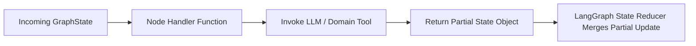

# File 02: State Graph Processing Nodes (`src/graph/nodes.js`)

## Overview
**Graph Nodes** are asynchronous handler functions that accept the current `GraphState`, invoke domain tools or LLMs, and return partial state updates to be merged into the global graph state.

---

## 1. Node Processing Execution Cycle



---

## 2. Graph Node Handlers Implementation (`src/graph/nodes.js`)

```javascript
import { parseResume } from "../tools/resume-parser.js";
import { searchJobs } from "../tools/job-search.js";
import { analyzeSkillGap, suggestUpskilling } from "../tools/skill-matcher.js";
import { draftApplicationEmail } from "../tools/email-drafter.js";

// Node 1: Parse Resume
export async function nodeParseResume(state) {
    console.log("[NODE: parse_resume] Extracting candidate profile...");
    const profile = await parseResume(state.rawResumeText);
    return {
        candidateProfile: profile,
        executionLogs: [`[parse_resume] Extracted skills: ${profile.skills.join(", ")}`]
    };
}

// Node 2: Search Jobs
export async function nodeSearchJobs(state) {
    console.log("[NODE: search_jobs] Searching matching job openings...");
    const { skills, targetRoles } = state.candidateProfile;
    const jobs = searchJobs(skills, targetRoles);
    return {
        matchingJobs: jobs,
        executionLogs: [`[search_jobs] Found ${jobs.length} matching job openings.`]
    };
}

// Node 3: Match Skills
export async function nodeMatchSkills(state) {
    console.log("[NODE: match_skills] Analyzing skill gaps...");
    const candidateSkills = state.candidateProfile.skills;
    const topJob = state.matchingJobs[0];
    const gapAnalysis = analyzeSkillGap(candidateSkills, topJob.requiredSkills);
    return {
        skillGapAnalysis: gapAnalysis,
        executionLogs: [`[match_skills] Matched score: ${gapAnalysis.matchScore}%`]
    };
}

// Node 4: Generate Upskill Plan
export async function nodeGenerateUpskillPlan(state) {
    console.log("[NODE: generate_upskill_plan] Fetching learning resources...");
    const missing = state.skillGapAnalysis.missingSkills;
    const plan = suggestUpskilling(missing);
    return {
        upskillPlan: plan,
        executionLogs: [`[generate_upskill_plan] Generated plan for ${missing.length} missing skills.`]
    };
}

// Node 5: Draft Email
export async function nodeDraftEmail(state) {
    console.log("[NODE: draft_email] Generating cold application email...");
    const email = await draftApplicationEmail(state.candidateProfile, state.matchingJobs[0]);
    return {
        draftedEmail: email,
        executionLogs: [`[draft_email] Successfully drafted application email.`]
    };
}
```

---

## Key Takeaways
1. Nodes return **partial state updates** (only keys that changed), not full state clones.
2. Isolates business logic into modular node handlers.
