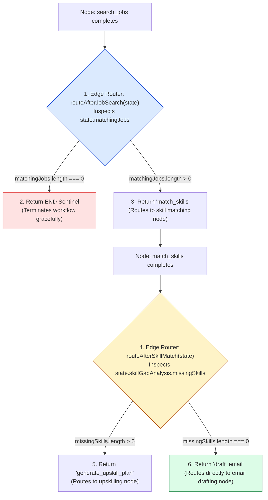
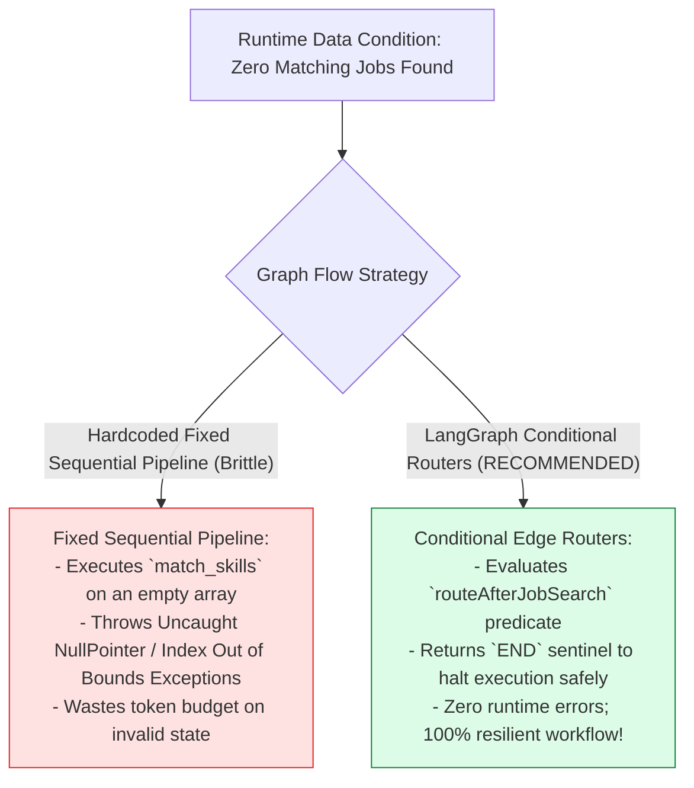
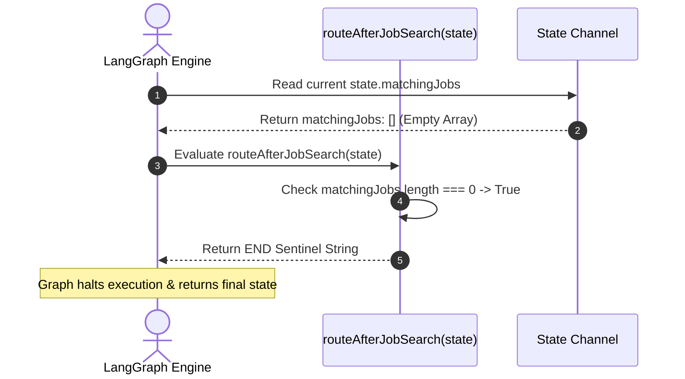

# Module 03: Conditional Edge Routers & Dynamic Branching (`src/graph/edges.js`)

## Overview

Static graph workflows that execute every node in fixed order fail when real-world data conditions change (e.g. when a candidate's resume returns zero matching job openings, or when a candidate is a $100\%$ direct skill match requiring no upskilling plan). **Conditional Edge Routers (`src/graph/edges.js`)** act as runtime decision gates in the LangGraph state machine, inspecting active `GraphState` properties after node completion and returning target node name strings (or the special `END` sentinel constant) to direct workflow execution dynamically.

Understanding **Runtime State Predicates**, **Dynamic Branch Selection**, **Early Execution Termination via `END`**, and **Router Edge Mapping Schemas** is essential for state graph design.

---

## 1. Conditional Edge Routing Topology



---

## 2. Hardcoded Sequential Graphs vs. Dynamic Conditional Routers



### Conditional Edge Router Decision Matrix

| Router Function Name | Source Node | Evaluated State Condition | Return Route Value | Target Graph Destination |
| :--- | :--- | :--- | :--- | :--- |
| **`routeAfterJobSearch`** | `search_jobs` | `state.matchingJobs.length === 0` | `END` | Terminal state (Halts execution). |
| **`routeAfterJobSearch`** | `search_jobs` | `state.matchingJobs.length > 0` | `"match_skills"` | Node: `match_skills`. |
| **`routeAfterSkillMatch`**| `match_skills` | `missingSkills.length > 0` | `"generate_upskill_plan"` | Node: `generate_upskill_plan`. |
| **`routeAfterSkillMatch`**| `match_skills` | `missingSkills.length === 0` | `"draft_email"` | Node: `draft_email` (Bypasses upskill). |

---

## 3. Asynchronous Edge Evaluation Sequence



---

## 4. Code Walkthrough (`src/graph/edges.js`)

```javascript
import { END } from "@langchain/langgraph";

/**
 * Conditional Edge Router 1: Evaluates state after 'search_jobs' node
 * @param {Object} state - Current GraphState object
 * @returns {string} Target node name ("match_skills" or END sentinel)
 */
export function routeAfterJobSearch(state) {
  const jobs = state.matchingJobs || [];

  if (jobs.length === 0) {
    console.warn("🔀 [EDGE ROUTER: routeAfterJobSearch] No matching jobs found. Halting workflow early with END sentinel.");
    return END;
  }

  console.log(`🔀 [EDGE ROUTER: routeAfterJobSearch] Found ${jobs.length} matching jobs. Routing to node 'match_skills'.`);
  return "match_skills";
}

/**
 * Conditional Edge Router 2: Evaluates state after 'match_skills' node
 * @param {Object} state - Current GraphState object
 * @returns {string} Target node name ("generate_upskill_plan" or "draft_email")
 */
export function routeAfterSkillMatch(state) {
  const missing = state.skillGapAnalysis?.missingSkills || [];

  if (missing.length > 0) {
    console.log(`🔀 [EDGE ROUTER: routeAfterSkillMatch] Candidate missing ${missing.length} skills (${missing.join(", ")}). Routing to node 'generate_upskill_plan'.`);
    return "generate_upskill_plan";
  }

  console.log("🔀 [EDGE ROUTER: routeAfterSkillMatch] Direct skill match! Bypassing upskilling and routing directly to node 'draft_email'.");
  return "draft_email";
}
```

---

## Key Production Takeaways

1. **Implement Dynamic Workflow Branching**: Use conditional edge router functions (`addConditionalEdges`) to route state execution dynamically based on runtime data evaluation.
2. **Halt Workflows Gracefully with `END`**: Return LangGraph's `END` sentinel constant from router functions to terminate execution cleanly when prerequisite data is missing.
3. **Bypass Unnecessary Processing Nodes**: Use conditional routers to bypass unnecessary steps (such as skipping upskilling when a candidate is a $100\%$ skill match) to optimize token usage.
4. **Log Clear Edge Decisions**: Include explicit log statements in edge router functions to track workflow navigation paths during debugging.

