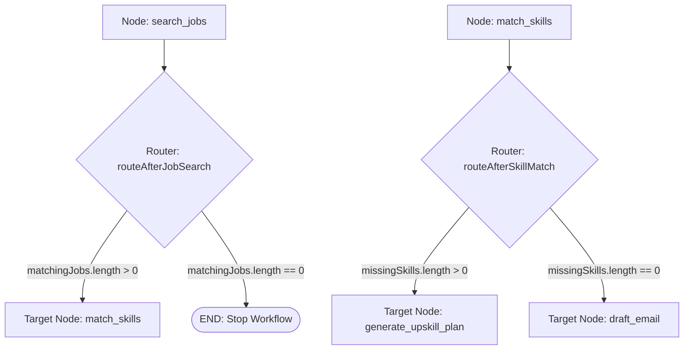

# File 03: Conditional Edge Routers (`src/graph/edges.js`)

## Overview
**Conditional Edge Routers** evaluate runtime state outputs after node executions, returning string target node names to determine dynamic workflow branching.

---

## 1. Conditional Edge Branching Decisions



---

## 2. Edge Routers Implementation (`src/graph/edges.js`)

```javascript
import { END } from "@langchain/langgraph";

// 1. Router after Job Search
export function routeAfterJobSearch(state) {
    if (!state.matchingJobs || state.matchingJobs.length === 0) {
        console.log("[EDGE ROUTER] No matching jobs found. Terminating workflow.");
        return END;
    }
    console.log("[EDGE ROUTER] Jobs found. Routing to 'match_skills'.");
    return "match_skills";
}

// 2. Router after Skill Matching
export function routeAfterSkillMatch(state) {
    const missing = state.skillGapAnalysis?.missingSkills || [];
    if (missing.length > 0) {
        console.log(`[EDGE ROUTER] Detected ${missing.length} missing skills. Routing to 'generate_upskill_plan'.`);
        return "generate_upskill_plan";
    }
    console.log("[EDGE ROUTER] Direct skill fit! Routing directly to 'draft_email'.");
    return "draft_email";
}
```

---

## Key Takeaways
1. Enables **dynamic conditional workflow branching** based on runtime state inspection.
2. Returns `END` to terminate graph execution early when prerequisites fail.
