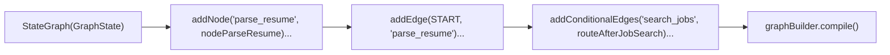

# File 04: State Graph Builder & Compiler (`src/graph/builder.js`)

## Overview
The **State Graph Builder** constructs the LangGraph workflow topology, adding nodes (`addNode`), defining static edges (`addEdge`), registering conditional edges (`addConditionalEdges`), and compiling the state graph into a Runnable graph instance (`compile()`).

---

## 1. Graph Construction Sequence



---

## 2. Graph Builder Implementation (`src/graph/builder.js`)

```javascript
import { StateGraph, START, END } from "@langchain/langgraph";
import { GraphState } from "./state.js";
import {
    nodeParseResume,
    nodeSearchJobs,
    nodeMatchSkills,
    nodeGenerateUpskillPlan,
    nodeDraftEmail
} from "./nodes.js";
import { routeAfterJobSearch, routeAfterSkillMatch } from "./edges.js";

export function buildRecruitmentGraph() {
    const workflow = new StateGraph(GraphState)
        // 1. Register Graph Nodes
        .addNode("parse_resume", nodeParseResume)
        .addNode("search_jobs", nodeSearchJobs)
        .addNode("match_skills", nodeMatchSkills)
        .addNode("generate_upskill_plan", nodeGenerateUpskillPlan)
        .addNode("draft_email", nodeDraftEmail)

        // 2. Register Entry Edge
        .addEdge(START, "parse_resume")
        .addEdge("parse_resume", "search_jobs")

        // 3. Register Conditional Edges
        .addConditionalEdges("search_jobs", routeAfterJobSearch, {
            match_skills: "match_skills",
            [END]: END
        })
        .addConditionalEdges("match_skills", routeAfterSkillMatch, {
            generate_upskill_plan: "generate_upskill_plan",
            draft_email: "draft_email"
        })

        // 4. Register Terminal Edges
        .addEdge("generate_upskill_plan", "draft_email")
        .addEdge("draft_email", END);

    // 5. Compile Runnable Graph
    return workflow.compile();
}
```

---

## Key Takeaways
1. **`workflow.compile()`** validates edge connections and returns an executable runnable graph.
2. Combines static sequence edges (`addEdge`) with dynamic branching edges (`addConditionalEdges`).
