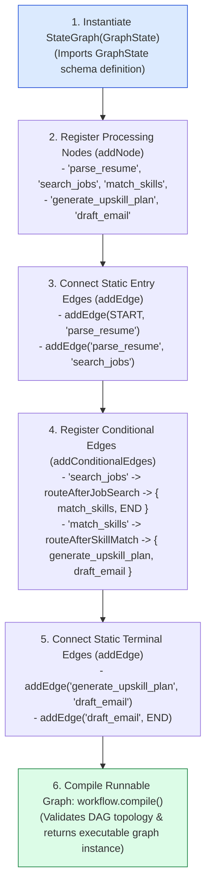
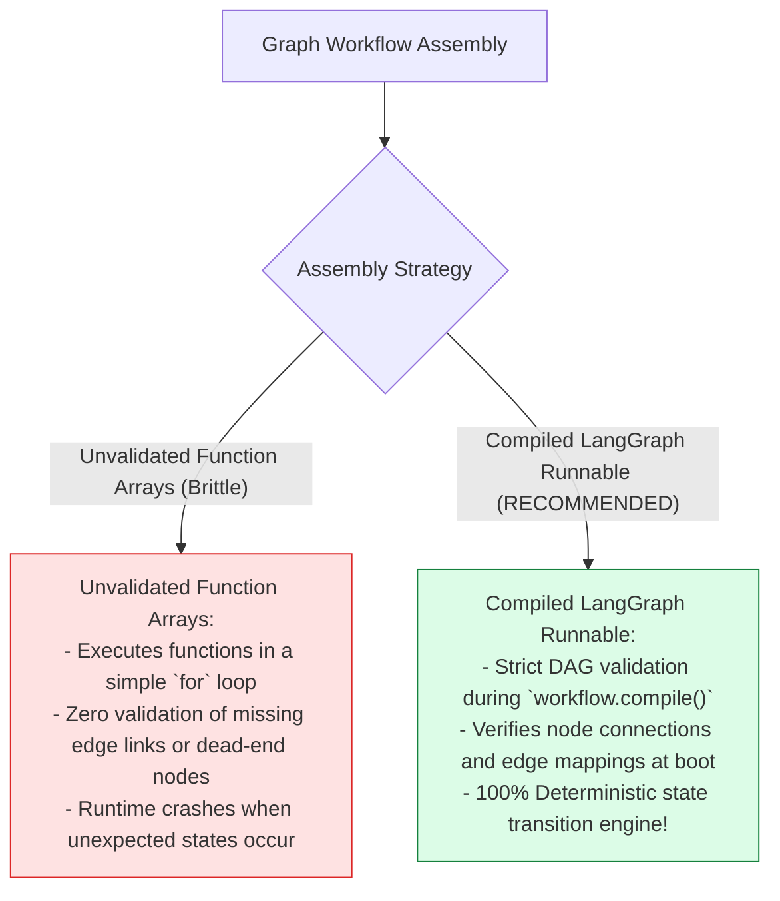
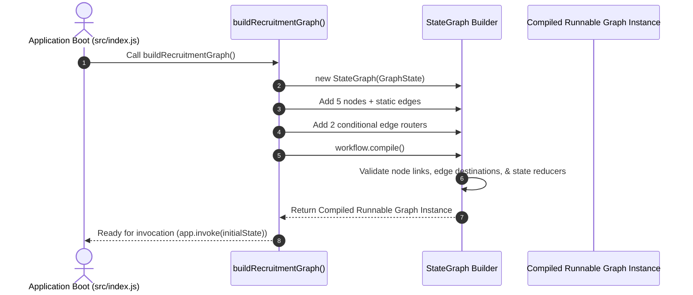

# Module 04: State Graph Builder & Graph Compilation (`src/graph/builder.js`)

## Overview

A complex state machine must assemble discrete processing nodes, static entry/terminal edges, and conditional routers into a unified, validated Directed Acyclic Graph (DAG). The **State Graph Builder (`src/graph/builder.js`)** initializes the LangGraph `StateGraph(GraphState)`, registers nodes (`addNode`), defines static flow paths (`addEdge`), configures conditional edge routers (`addConditionalEdges`), and compiles the graph via **`workflow.compile()`** into an executable Runnable Graph instance.

Understanding **`StateGraph(GraphState)` Initialization**, **Static Edge Wiring (`START` / `END`)**, **Conditional Edge Routing Maps**, and **Graph Compilation Validation** is essential for LangGraph assembly.

---

## 1. Graph Construction & Compilation Topology



---

## 2. Unvalidated Script Arrays vs. Compiled StateGraph Runnable



### StateGraph Assembly & Edge Registration Specification

| Assembly API Method | Parameter Arguments | Purpose in Graph Topology |
| :--- | :--- | :--- |
| **`new StateGraph(GraphState)`** | `GraphState` | Instantiates graph builder with shared state channels. |
| **`addNode(name, handler)`** | `"parse_resume"`, `nodeParseResume` | Registers an async node processing handler function. |
| **`addEdge(source, target)`** | `START`, `"parse_resume"` | Registers a static, deterministic state edge transition. |
| **`addConditionalEdges(src, fn, map)`**| `"search_jobs"`, `routeAfterJobSearch`, `{...}` | Registers runtime conditional router with edge mapping dictionary. |
| **`workflow.compile()`** | None | Validates DAG topology and returns compiled Runnable graph. |

---

## 3. Asynchronous Graph Compilation Sequence



---

## 4. Code Walkthrough (`src/graph/builder.js`)

```javascript
import { StateGraph, START, END } from "@langchain/langgraph";
import { GraphState } from "./state.js";
import {
  nodeParseResume,
  nodeSearchJobs,
  nodeMatchSkills,
  nodeGenerateUpskillPlan,
  nodeDraftEmail
} from "./nodes.js";
import { routeAfterJobSearch, routeAfterSkillMatch } from "./edges.js";

/**
 * Builds and compiles the Karigar Flow Recruitment StateGraph workflow
 * @returns {CompiledStateGraph} Executable compiled LangGraph instance
 */
export function buildRecruitmentGraph() {
  console.log("⚡ [GRAPH BUILDER] Constructing recruitment workflow StateGraph...");

  const workflow = new StateGraph(GraphState)
    // 1. Register Processing Nodes
    .addNode("parse_resume", nodeParseResume)
    .addNode("search_jobs", nodeSearchJobs)
    .addNode("match_skills", nodeMatchSkills)
    .addNode("generate_upskill_plan", nodeGenerateUpskillPlan)
    .addNode("draft_email", nodeDraftEmail)

    // 2. Register Entry Static Edges
    .addEdge(START, "parse_resume")
    .addEdge("parse_resume", "search_jobs")

    // 3. Register Conditional Edge Routers with Route Mapping Dictionaries
    .addConditionalEdges("search_jobs", routeAfterJobSearch, {
      match_skills: "match_skills",
      [END]: END
    })
    .addConditionalEdges("match_skills", routeAfterSkillMatch, {
      generate_upskill_plan: "generate_upskill_plan",
      draft_email: "draft_email"
    })

    // 4. Register Terminal Static Edges
    .addEdge("generate_upskill_plan", "draft_email")
    .addEdge("draft_email", END);

  console.log("✅ [GRAPH BUILDER] Graph topology assembled. Compiling Runnable graph...");

  // 5. Compile Runnable Graph Instance
  const app = workflow.compile();
  return app;
}

// Execution Verification Example
const app = buildRecruitmentGraph();
console.log("Compiled Karigar Flow StateGraph successfully.");
```

---

## Key Production Takeaways

1. **Construct Graphs via `StateGraph(GraphState)`**: Pass the `GraphState` schema annotation to `StateGraph` to ensure every registered node and reducer adheres to shared state typing.
2. **Explicity Map Conditional Routes**: Supply an explicit route mapping dictionary (`{ match_skills: "match_skills", [END]: END }`) to `addConditionalEdges` for static analysis validation.
3. **Compile Once at Startup**: Call `workflow.compile()` during application startup to compile the graph into an immutable Runnable instance before handling requests.
4. **Use Standard Sentinel Constants**: Connect workflow entry points using `START` and terminal states using `END` from `@langchain/langgraph` to follow LangGraph standards.


## Learn from the implementation

Use the matching source file as an executable example, not just something to copy. Before running it, state in your own words what data enters the module, what it returns, and which values it changes. Then trace one realistic request from the caller through each function.

Pay special attention to these questions:

- **Data flow:** Which object, array, string, or state value moves between functions? What shape must it have?
- **Control flow:** Which branch, loop, early return, or retry changes the outcome? What condition selects it?
- **Async boundaries:** Where does the code wait for an LLM, database, network, file system, or tool? What should happen if that operation rejects or returns no result?
- **Side effects:** Which lines log information, make an external request, store data, or mutate in-memory state? Keep those distinct from pure calculations.
- **Production limits:** Which assumptions are only safe for a tutorial—for example, in-memory storage, fixed thresholds, approximate token counts, mock data, or a hard-coded batch size?

A useful practice is to change one input at a time and predict the result before executing it. If you can explain why the output changed, when the module should be used, and one way it could fail, you understand the concept rather than only the syntax.
