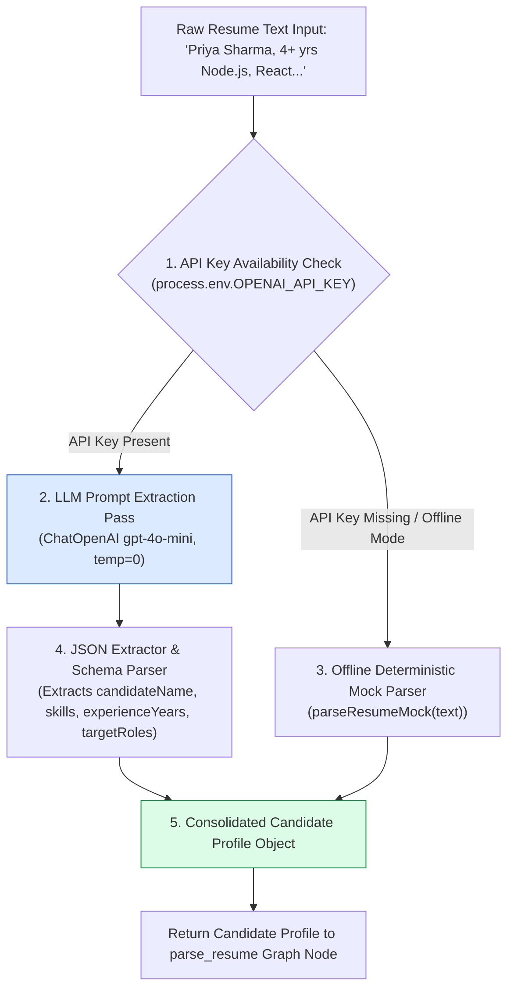
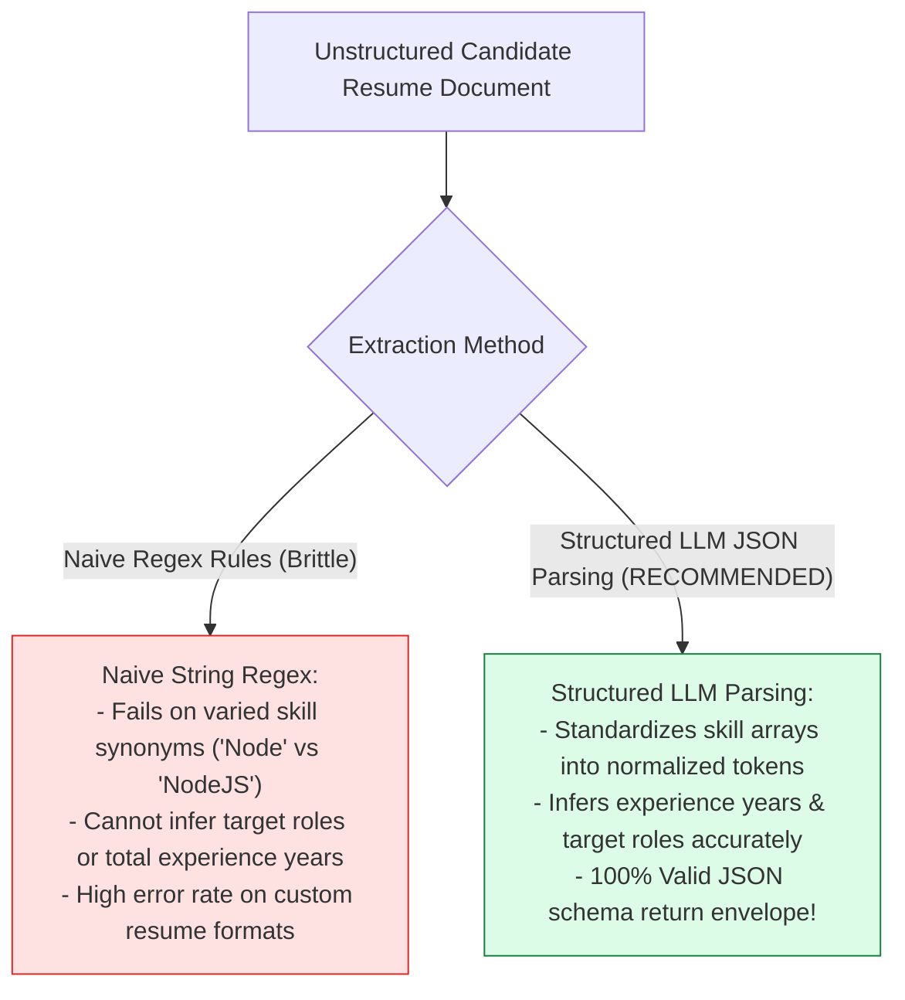
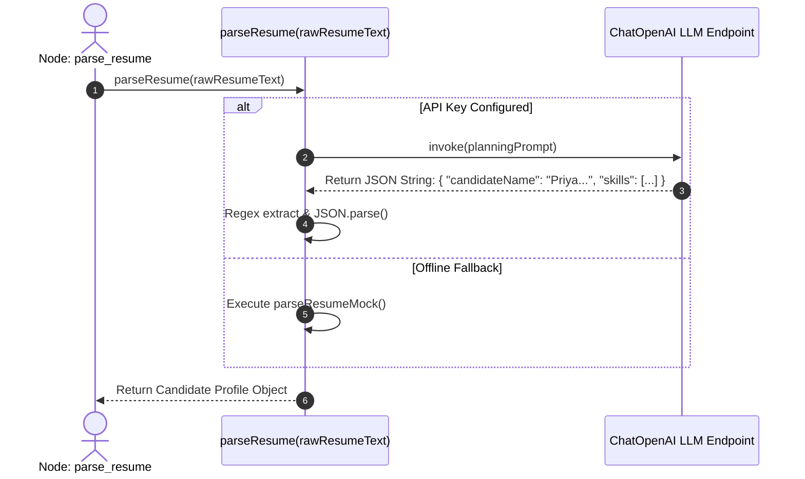

# Module 05: Resume Parser Tool & Candidate Profiling (`src/tools/resume-parser.js`)

## Overview

Unstructured resume text (PDF extractions, raw markdown files, or pasted plain text) contains noisy formatting, varied skill terminology, and ambiguous work history details. The **Resume Parser Tool (`src/tools/resume-parser.js`)** leverages LLMs (`ChatOpenAI` or `GoogleGenerativeAI`) with JSON prompt extraction techniques to compile unstructured text into a standardized **Candidate Profile Object** containing candidate names, extracted skills arrays, years of experience, and targeted job roles, backed by an offline mock parser for zero-cost local testing.

Understanding **Unstructured Data Extraction**, **Structured JSON Output Schemas**, **Prompt Engineering for Skill Extraction**, and **Deterministic Mock Fallbacks** is essential for tool development.

---

## 1. Resume Parser Tool Extraction Topology



---

## 2. Naive Regex Matching vs. Structured LLM Parsing



### Extracted Candidate Profile Schema Specification

| JSON Property Name | Data Type | Sample Output Value | Operational Function |
| :--- | :--- | :--- | :--- |
| **`candidateName`** | `String` | `"Priya Sharma"` | Full extracted name of the candidate. |
| **`skills`** | `Array<String>` | `["JavaScript", "Node.js", "React"]` | Normalized array of candidate technical skills. |
| **`experienceYears`** | `Number` | `4` | Total years of relevant professional experience. |
| **`targetRoles`** | `Array<String>` | `["Full Stack Engineer", "Backend"]` | Targeted job role titles candidate is seeking. |

---

## 3. Asynchronous Resume Parsing Sequence



---

## 4. Code Walkthrough (`src/tools/resume-parser.js`)

```javascript
import { ChatOpenAI } from "@langchain/openai";

/**
 * Parses raw unstructured resume text into a structured Candidate Profile object
 * @param {string} rawResumeText - Raw resume text input
 * @returns {Promise<Object>} Candidate profile object
 */
export async function parseResume(rawResumeText) {
  if (!rawResumeText || typeof rawResumeText !== "string") {
    throw new Error("[RESUME PARSER ERROR] Raw resume text string is required.");
  }

  const apiKey = process.env.OPENAI_API_KEY;
  if (!apiKey) {
    console.warn("⚠️ [RESUME PARSER] OPENAI_API_KEY not found. Using offline mock resume parser.");
    return parseResumeMock(rawResumeText);
  }

  try {
    console.log("⚡ [RESUME PARSER] Extracting profile via ChatOpenAI (gpt-4o-mini)...");
    const model = new ChatOpenAI({ modelName: "gpt-4o-mini", temperature: 0 });

    const prompt = `You are an expert AI HR Resume Screener. Extract candidate details from the raw resume text provided below.

Rules:
1. Normalize technical skill names (e.g. 'NodeJS' -> 'Node.js', 'React.JS' -> 'React').
2. Infer total years of professional experience as a rounded number.
3. Return ONLY a valid JSON object matching this exact schema:
{
  "candidateName": "Full Name",
  "skills": ["Skill1", "Skill2"],
  "experienceYears": 4,
  "targetRoles": ["Full Stack Engineer", "Backend Developer"]
}

RAW RESUME TEXT:
"""
${rawResumeText}
"""`;

    const response = await model.invoke(prompt);
    const rawContent = String(response.content);

    const jsonMatch = rawContent.match(/\{[\s\S]*\}/);
    if (!jsonMatch) throw new Error("Failed to extract JSON object from parser LLM response.");

    const parsed = JSON.parse(jsonMatch[0]);
    console.log(`✅ [RESUME PARSER SUCCESS] Extracted profile for '${parsed.candidateName}' (${parsed.skills.length} skills).`);
    return parsed;
  } catch (err) {
    console.warn("⚠️ [RESUME PARSER FALLBACK] LLM extraction failed. Falling back to mock parser:", err.message);
    return parseResumeMock(rawResumeText);
  }
}

/**
 * Deterministic offline mock parser for local testing
 */
function parseResumeMock(rawResumeText) {
  return {
    candidateName: "Priya Sharma",
    skills: ["JavaScript", "Node.js", "Express", "MongoDB", "React", "Docker"],
    experienceYears: 4,
    targetRoles: ["Full Stack Engineer", "Backend Developer"]
  };
}
```

---

## Key Production Takeaways

1. **Extract Structured Data via Zero-Temperature LLMs**: Use zero temperature (`temperature: 0`) when extracting candidate profiles to guarantee deterministic JSON output formatting.
2. **Normalize Technical Skill Tokens**: Prompt the LLM to normalize skill names (`NodeJS` $\rightarrow$ `Node.js`) to simplify downstream skill-matching lookups.
3. **Implement Offline Mock Fallbacks**: Provide a deterministic mock parser function (`parseResumeMock`) to enable local testing without API key dependencies.
4. **Isolate Parsing Logic in Dedicated Tools**: Keep text extraction and parsing isolated in `src/tools/resume-parser.js` so it can be re-used across different workflows.


## Learn from the implementation

Use the matching source file as an executable example, not just something to copy. Before running it, state in your own words what data enters the module, what it returns, and which values it changes. Then trace one realistic request from the caller through each function.

Pay special attention to these questions:

- **Data flow:** Which object, array, string, or state value moves between functions? What shape must it have?
- **Control flow:** Which branch, loop, early return, or retry changes the outcome? What condition selects it?
- **Async boundaries:** Where does the code wait for an LLM, database, network, file system, or tool? What should happen if that operation rejects or returns no result?
- **Side effects:** Which lines log information, make an external request, store data, or mutate in-memory state? Keep those distinct from pure calculations.
- **Production limits:** Which assumptions are only safe for a tutorial—for example, in-memory storage, fixed thresholds, approximate token counts, mock data, or a hard-coded batch size?

A useful practice is to change one input at a time and predict the result before executing it. If you can explain why the output changed, when the module should be used, and one way it could fail, you understand the concept rather than only the syntax.
