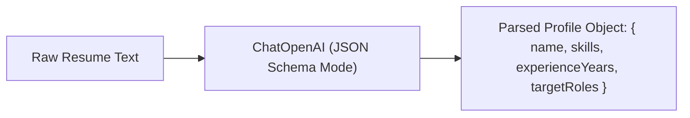

# File 05: Resume Parser Tool (`src/tools/resume-parser.js`)

## Overview
The **Resume Parser Tool** uses LangChain's `ChatOpenAI` model to extract structured candidate profiles (name, skills array, years of experience, target job roles) from raw unstructured resume text.

---

## 1. Resume Parsing Pipeline



---

## 2. Resume Parser Implementation (`src/tools/resume-parser.js`)

```javascript
import { ChatOpenAI } from "@langchain/openai";

export async function parseResume(rawResumeText) {
    const apiKey = process.env.OPENAI_API_KEY;
    if (!apiKey) {
        return parseResumeMock(rawResumeText);
    }

    const model = new ChatOpenAI({ modelName: "gpt-4o-mini", temperature: 0 });

    const prompt = `
Extract candidate details from the resume below.
Return JSON matching schema:
{
  "candidateName": "string",
  "skills": ["string"],
  "experienceYears": number,
  "targetRoles": ["string"]
}

RESUME TEXT:
${rawResumeText}`;

    const response = await model.invoke(prompt);
    const match = response.content.match(/\{[\s\S]*\}/);
    return JSON.parse(match[0]);
}

function parseResumeMock(rawResumeText) {
    // Deterministic offline mock parser
    return {
        candidateName: "Priya Sharma",
        skills: ["JavaScript", "Node.js", "Express", "MongoDB", "React"],
        experienceYears: 4,
        targetRoles: ["Full Stack Engineer", "Backend Developer"]
    };
}
```

---

## Key Takeaways
1. Transforms unstructured resume text into standardized JSON schema objects.
2. Includes offline mock fallback for local testing without API keys.
