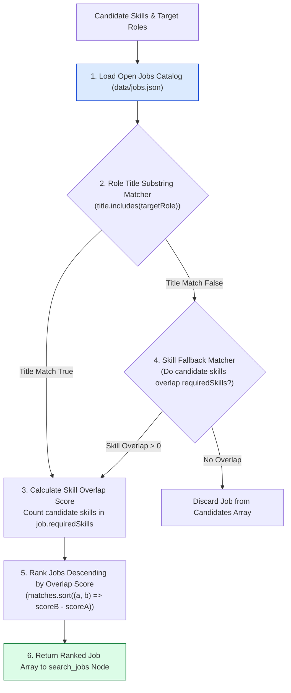
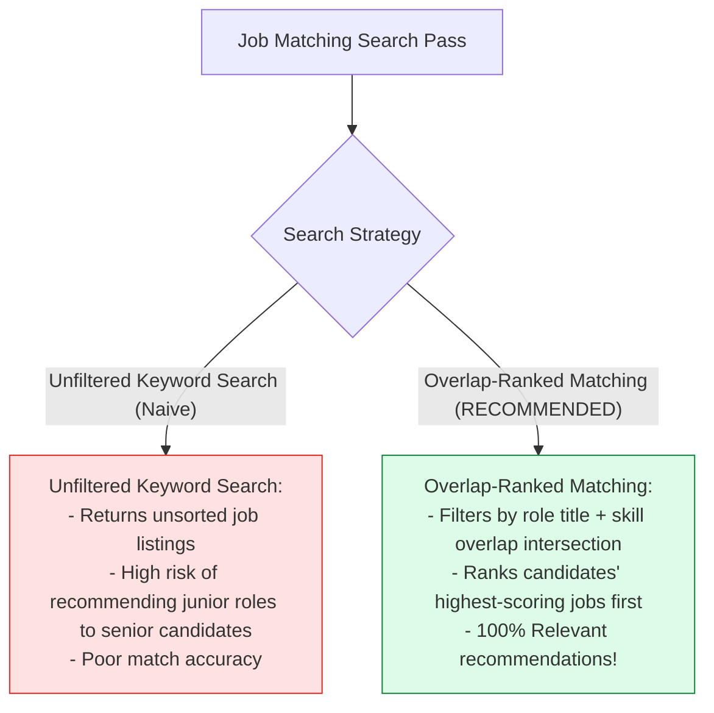
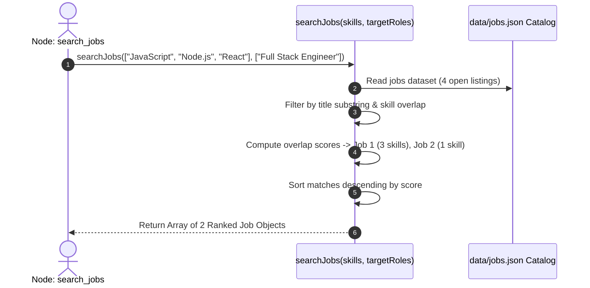

# Module 06: Job Search Tool & Catalog Matching (`src/tools/job-search.js`)

## Overview

After extracting a candidate's technical skills and target roles, the workflow must query open job positions to find suitable matches. The **Job Search Tool (`src/tools/job-search.js`)** queries an enterprise job openings catalog (`data/jobs.json`), executing a **Dual-Filter Matching & Overlap Ranking Algorithm** that filters openings by role title compatibility and ranks matches based on candidate skill overlap scores.

Understanding **Job Catalog JSON Schemas**, **Role Title Substring Matching**, **Skill Intersection Overlap Scoring**, and **Sorted Result Envelopes** is essential for matching engines.

---

## 1. Job Search Matching Topology



---

## 2. Unfiltered Keyword Search vs. Overlap-Ranked Matching



### Job Catalog Item JSON Schema Reference

| Property Name | Data Type | Sample Catalog Value | Technical Purpose |
| :--- | :--- | :--- | :--- |
| **`id`** | `String` | `"job_101"` | Unique job opening identifier. |
| **`title`** | `String` | `"Senior Full Stack Engineer"` | Official job opening title. |
| **`company`** | `String` | `"Acme Tech Solutions"` | Hiring organization name. |
| **`requiredSkills`** | `Array<String>` | `["Node.js", "React", "Docker"]` | Array of mandatory technical skills. |
| **`experienceYears`**| `Number` | `3` | Minimum years of experience required. |

---

## 3. Asynchronous Job Search Sequence



---

## 4. Code Walkthrough (`src/tools/job-search.js`)

```javascript
import fs from "fs";
import path from "path";

// Load static job catalog JSON
const jobsFilePath = path.join(process.cwd(), "agentic-ai-notes/05-karigar-flow/data/jobs.json");

/**
 * Searches and ranks job catalog openings matching candidate skills and target roles
 * @param {Array<string>} candidateSkills - Candidate extracted skill tokens
 * @param {Array<string>} targetRoles - Candidate target job role titles
 * @returns {Array<Object>} Ranked array of matched job objects
 */
export function searchJobs(candidateSkills = [], targetRoles = []) {
  if (!Array.isArray(candidateSkills) || !Array.isArray(targetRoles)) {
    throw new Error("[JOB SEARCH ERROR] Candidate skills and target roles must be arrays.");
  }

  // Read job catalog dataset
  let jobsCatalog = [];
  try {
    const rawData = fs.readFileSync(jobsFilePath, "utf-8");
    jobsCatalog = JSON.parse(rawData);
  } catch (err) {
    console.warn("⚠️ [JOB SEARCH] Could not read jobs.json from disk. Using fallback in-memory catalog.");
    jobsCatalog = getFallbackJobsCatalog();
  }

  const skillsLower = candidateSkills.map((s) => String(s).toLowerCase());
  const rolesLower = targetRoles.map((r) => String(r).toLowerCase());

  console.log(`🔍 [JOB SEARCH] Searching catalog (${jobsCatalog.length} total listings) for roles: [${targetRoles.join(", ")}]...`);

  // Step 1: Filter jobs matching title or having skill overlap
  const matchedJobs = jobsCatalog.filter((job) => {
    const titleMatch = rolesLower.some((role) => job.title.toLowerCase().includes(role));
    const skillMatch = job.requiredSkills.some((req) => skillsLower.includes(req.toLowerCase()));
    return titleMatch || skillMatch;
  });

  // Step 2: Calculate skill overlap score & rank descending
  matchedJobs.sort((a, b) => {
    const scoreA = a.requiredSkills.filter((s) => skillsLower.includes(s.toLowerCase())).length;
    const scoreB = b.requiredSkills.filter((s) => skillsLower.includes(s.toLowerCase())).length;
    return scoreB - scoreA;
  });

  console.log(`✅ [JOB SEARCH SUCCESS] Found ${matchedJobs.length} matching job openings.`);
  return matchedJobs;
}

/**
 * In-memory fallback catalog for offline testing
 */
function getFallbackJobsCatalog() {
  return [
    {
      id: "job_101",
      title: "Senior Full Stack Engineer",
      company: "Acme Tech",
      location: "Remote",
      requiredSkills: ["Node.js", "React", "MongoDB", "Docker", "TypeScript"],
      experienceYears: 4
    },
    {
      id: "job_102",
      title: "Backend Developer",
      company: "CloudScale Inc",
      location: "Bengaluru",
      requiredSkills: ["Node.js", "Express", "MongoDB", "PostgreSQL"],
      experienceYears: 3
    }
  ];
}
```

---

## Key Production Takeaways

1. **Rank Results via Skill Overlap Intersections**: Calculate the intersection of candidate skills and job requirements to rank job openings descending by relevance.
2. **Support Flexible Substring Role Matching**: Use lowercase substring checking (`title.toLowerCase().includes(role)`) to match varied job title formats.
3. **Handle File System I/O Resiliently**: Fall back to in-memory datasets (`getFallbackJobsCatalog`) if external catalog files cannot be read.
4. **Isolate Search Logic in Pure Functions**: Implement `searchJobs` as a synchronous pure function to keep execution predictable and easy to test.


## Learn from the implementation

Use the matching source file as an executable example, not just something to copy. Before running it, state in your own words what data enters the module, what it returns, and which values it changes. Then trace one realistic request from the caller through each function.

Pay special attention to these questions:

- **Data flow:** Which object, array, string, or state value moves between functions? What shape must it have?
- **Control flow:** Which branch, loop, early return, or retry changes the outcome? What condition selects it?
- **Async boundaries:** Where does the code wait for an LLM, database, network, file system, or tool? What should happen if that operation rejects or returns no result?
- **Side effects:** Which lines log information, make an external request, store data, or mutate in-memory state? Keep those distinct from pure calculations.
- **Production limits:** Which assumptions are only safe for a tutorial—for example, in-memory storage, fixed thresholds, approximate token counts, mock data, or a hard-coded batch size?

A useful practice is to change one input at a time and predict the result before executing it. If you can explain why the output changed, when the module should be used, and one way it could fail, you understand the concept rather than only the syntax.
