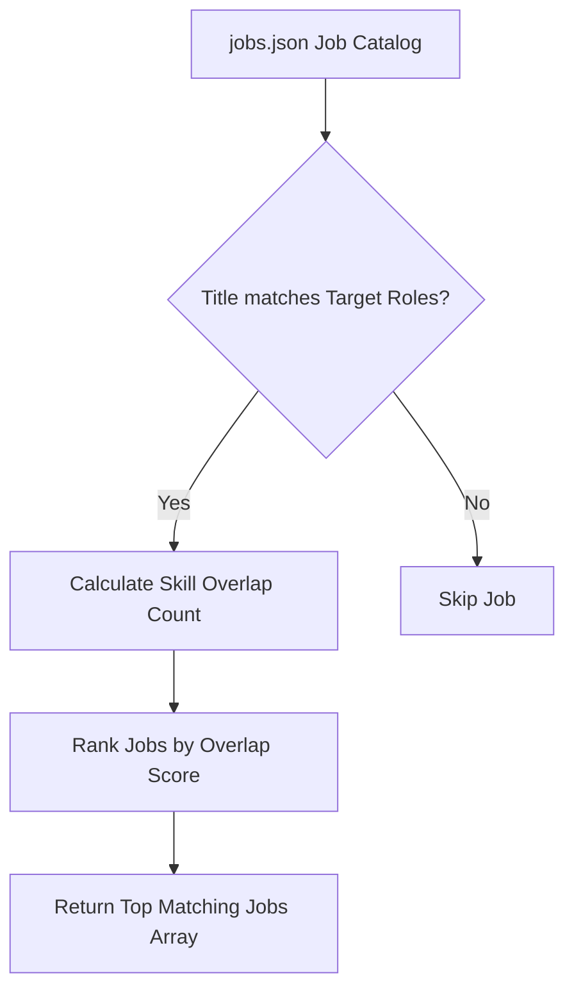

# File 06: Job Search Tool (`src/tools/job-search.js`)

## Overview
The **Job Search Tool** queries an active job openings catalog (`data/jobs.json`), filtering for role titles and matching required skills against the candidate's target job roles.

---

## 1. Job Matching Algorithm



---

## 2. Job Search Implementation (`src/tools/job-search.js`)

```javascript
import jobsData from "../data/jobs.json" assert { type: "json" };

export function searchJobs(candidateSkills, targetRoles) {
    const skillsLower = candidateSkills.map(s => s.toLowerCase());
    const rolesLower = targetRoles.map(r => r.toLowerCase());

    const matches = jobsData.filter(job => {
        const titleMatch = rolesLower.some(role => job.title.toLowerCase().includes(role));
        const skillMatch = job.requiredSkills.some(req => skillsLower.includes(req.toLowerCase()));
        return titleMatch || skillMatch;
    });

    // Score jobs by skill overlap count
    matches.sort((a, b) => {
        const scoreA = a.requiredSkills.filter(s => skillsLower.includes(s.toLowerCase())).length;
        const scoreB = b.requiredSkills.filter(s => skillsLower.includes(s.toLowerCase())).length;
        return scoreB - scoreA;
    });

    return matches;
}
```

---

## Key Takeaways
1. Scores job openings based on candidate skill overlap count.
2. Serves as step 2 in the recruitment workflow pipeline.
