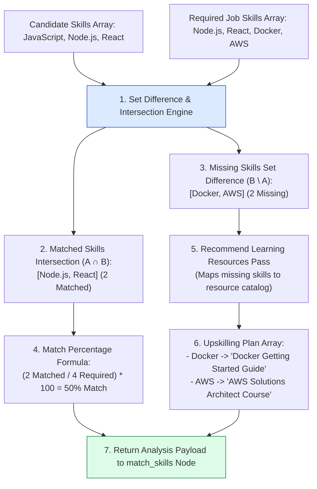
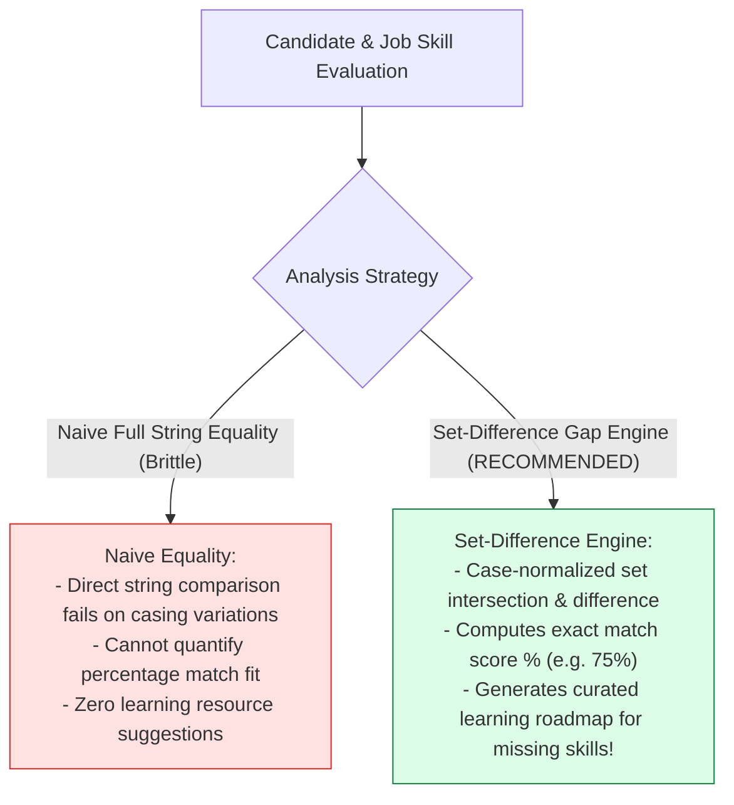
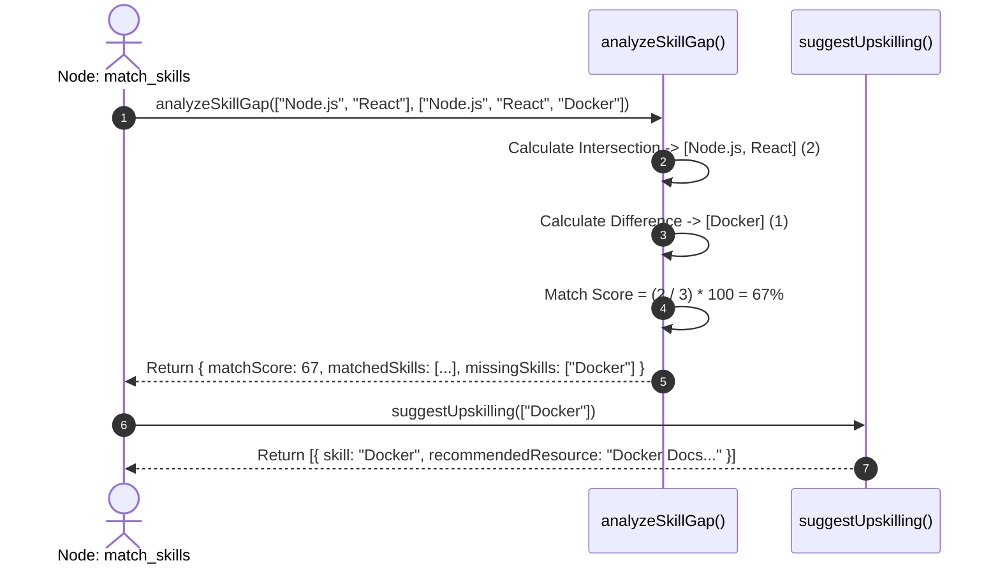

# Module 07: Skill Matcher & Gap Analysis Engine (`src/tools/skill-matcher.js`)

## Overview

Quantifying candidate job fit requires set-theoretic comparisons between a candidate's verified technical skills and a position's mandatory skill requirements. The **Skill Matcher Tool (`src/tools/skill-matcher.js`)** performs deterministic **Set-Difference Gap Analysis** to compute candidate fit percentages and generates a **Curated Upskilling Recommendation Roadmap** for missing technical skills.

Understanding **Set Intersection ($\cap$) & Difference ($\setminus$) Operators**, **Percentage Match Score Formulas**, **Upskilling Catalog Mappings**, and **Resource Enrichment Envelopes** is essential for assessment tools.

---

## 1. Skill Gap Analysis & Upskilling Topology



---

## 2. Skill Gap Analysis Mathematical Model

The candidate fit match percentage score ($\text{Score}_{\text{fit}}$) is calculated using set intersection operations over candidate skill set $A$ and required job skill set $B$:

$$\text{Match Score (\%)} = \left( \frac{|A \cap B|}{|B|} \right) \times 100$$

Where the missing skill gap set $G$ is determined by set difference:

$$G = B \setminus A = \{ x \in B \mid x \notin A \}$$

---

## 3. Naive String Matching vs. Set-Difference Gap Analysis



### Skill Gap Analysis Output Schema Specification

| Property Name | Data Type | Sample Output Value | Operational Function |
| :--- | :--- | :--- | :--- |
| **`matchScore`** | `Number` | `75` | Calculated candidate fit percentage score ($0-100\%$). |
| **`matchedSkills`** | `Array<String>` | `["Node.js", "React"]` | Candidate skills that satisfy job requirements. |
| **`missingSkills`** | `Array<String>` | `["Docker"]` | Missing skills required by the target job. |
| **`upskillPlan`** | `Array<Object>` | `[ { skill: "Docker", recommendedResource: "..." } ]` | Curated learning resource recommendations. |

---

## 4. Asynchronous Skill Matcher Execution Sequence



---

## 5. Code Walkthrough (`src/tools/skill-matcher.js`)

```javascript
/**
 * Performs set-difference skill gap analysis between candidate skills and job requirements
 * @param {Array<string>} candidateSkills - Skills extracted from candidate resume
 * @param {Array<string>} requiredSkills - Skills required by the target job position
 * @returns {Object} Skill gap analysis results (matchScore, matchedSkills, missingSkills)
 */
export function analyzeSkillGap(candidateSkills = [], requiredSkills = []) {
  if (!Array.isArray(candidateSkills) || !Array.isArray(requiredSkills)) {
    throw new Error("[SKILL MATCHER ERROR] Candidate skills and required skills must be arrays.");
  }

  if (requiredSkills.length === 0) {
    return { matchScore: 100, matchedSkills: [...candidateSkills], missingSkills: [] };
  }

  const candidateLower = candidateSkills.map((s) => String(s).toLowerCase().trim());
  const matchedSkills = [];
  const missingSkills = [];

  for (const req of requiredSkills) {
    const reqLower = String(req).toLowerCase().trim();
    if (candidateLower.includes(reqLower)) {
      matchedSkills.push(req);
    } else {
      missingSkills.push(req);
    }
  }

  const matchScore = Math.round((matchedSkills.length / requiredSkills.length) * 100);

  console.log(`🧮 [SKILL MATCHER] Evaluated ${requiredSkills.length} skills: ${matchedSkills.length} Matched (${matchScore}%), ${missingSkills.length} Missing.`);

  return {
    matchScore,
    matchedSkills,
    missingSkills
  };
}

/**
 * Maps missing candidate skills to curated learning resources
 * @param {Array<string>} missingSkills - Array of missing skill names
 * @returns {Array<Object>} Array of recommended resource objects
 */
export function suggestUpskilling(missingSkills = []) {
  const resourceCatalog = {
    react: "React Official Docs (react.dev) + Modern React Guide",
    typescript: "TypeScript Handbook + Matt Pocock Pro Tutorials",
    "node.js": "Node.js Architecture & Performance Guide",
    docker: "Docker & Containerization Fundamentals (Docker Docs)",
    aws: "AWS Certified Developer Learning Path",
    mongodb: "MongoDB University Developer Certification",
    postgresql: "PostgreSQL High Performance Query Tuning Guide"
  };

  console.log(`📚 [UPSKILL SUGGESTION] Compiling upskilling plan for ${missingSkills.length} missing skills...`);

  return missingSkills.map((skill) => {
    const skillKey = String(skill).toLowerCase().trim();
    const recommendedResource = resourceCatalog[skillKey] || `Official Documentation and Core Tutorials for ${skill}`;

    return {
      skill,
      recommendedResource
    };
  });
}
```

---

## Key Production Takeaways

1. **Quantify Candidate Fit via Match Percentages**: Use the set-intersection formula $\left(\frac{|A \cap B|}{|B|}\right) \times 100$ to compute candidate fit scores ($0-100\%$).
2. **Normalize Skill Tokens Pre-Comparison**: Convert skill strings to lowercase (`toLowerCase().trim()`) before set evaluation to ensure accurate matching.
3. **Map Missing Skills to Curated Learning Paths**: Maintain a curated learning resource mapping (`resourceCatalog`) to auto-generate personalized upskilling plans.
4. **Pure Synchronous Function Design**: Keep `analyzeSkillGap` and `suggestUpskilling` as pure synchronous functions for fast sub-millisecond execution and easy unit testing.


## Learn from the implementation

Use the matching source file as an executable example, not just something to copy. Before running it, state in your own words what data enters the module, what it returns, and which values it changes. Then trace one realistic request from the caller through each function.

Pay special attention to these questions:

- **Data flow:** Which object, array, string, or state value moves between functions? What shape must it have?
- **Control flow:** Which branch, loop, early return, or retry changes the outcome? What condition selects it?
- **Async boundaries:** Where does the code wait for an LLM, database, network, file system, or tool? What should happen if that operation rejects or returns no result?
- **Side effects:** Which lines log information, make an external request, store data, or mutate in-memory state? Keep those distinct from pure calculations.
- **Production limits:** Which assumptions are only safe for a tutorial—for example, in-memory storage, fixed thresholds, approximate token counts, mock data, or a hard-coded batch size?

A useful practice is to change one input at a time and predict the result before executing it. If you can explain why the output changed, when the module should be used, and one way it could fail, you understand the concept rather than only the syntax.
