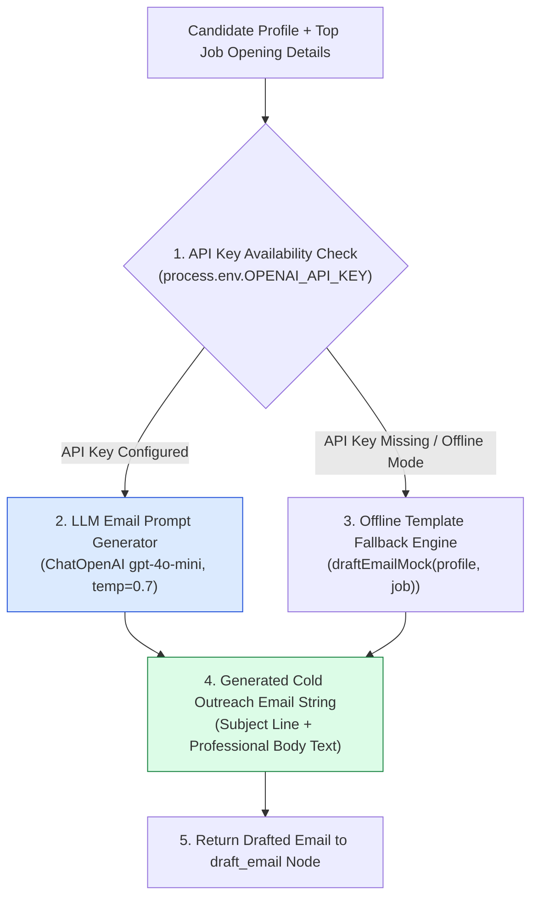
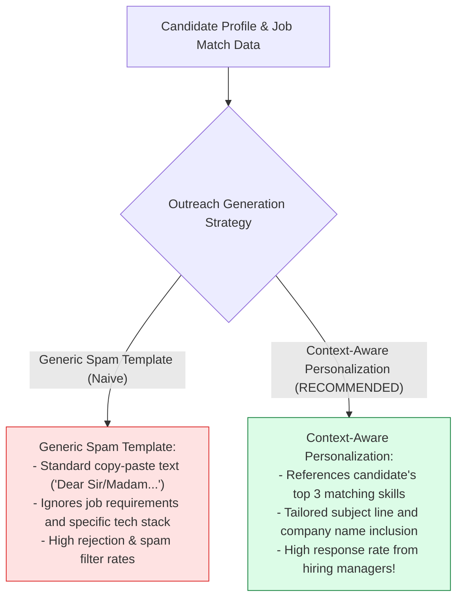
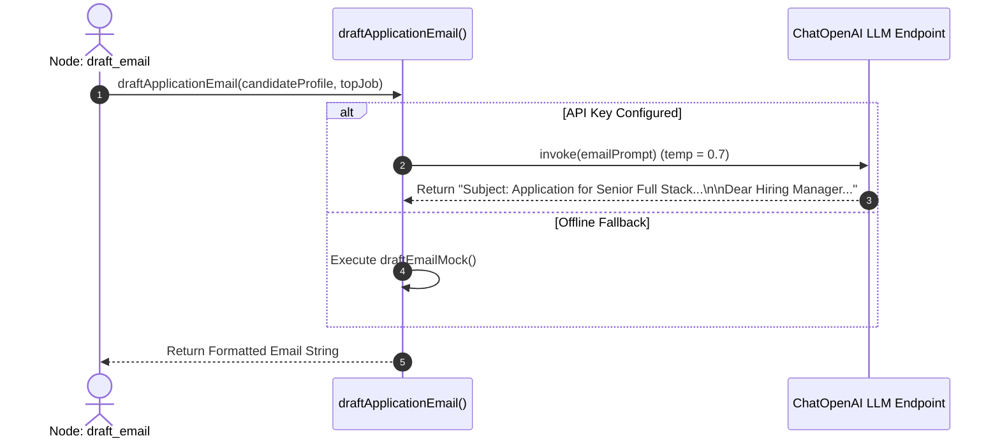

# Module 08: Cold Email Drafter Tool & Outreach Generation (`src/tools/email-drafter.js`)

## Overview

Sending generic, automated outreach emails results in low candidate response rates from hiring managers. The **Cold Email Drafter Tool (`src/tools/email-drafter.js`)** uses LLMs (`ChatOpenAI` with `temperature: 0.7`) to generate tailored, professional job application emails referencing a candidate's specific background, core technical stack, and target job opening details, supported by a template-driven offline mock fallback.

Understanding **Personalized Prompt Composition**, **Temperature Tuning for Creativity ($\text{temp}=0.7$)**, **Subject Line & Body Formatting**, and **Template Fallback Engines** is essential for communication tools.

---

## 1. Cold Email Drafter Tool Topology



---

## 2. Generic Spam Templates vs. Context-Aware Personalization



### Email Generator Parameter Reference

| Input Variable Key | Source Data Channel | Sample Input Value | Function in Email Prompt |
| :--- | :--- | :--- | :--- |
| **`candidateName`** | `state.candidateProfile` | `"Priya Sharma"` | Signature line & candidate identity. |
| **`skills`** | `state.candidateProfile` | `["Node.js", "React", "Docker"]` | Highlighted technical core stack. |
| **`experienceYears`**| `state.candidateProfile` | `4` | Experience context highlight in body text. |
| **`title`** | `state.matchingJobs[0]` | `"Senior Full Stack Engineer"` | Target position title in subject line. |
| **`company`** | `state.matchingJobs[0]` | `"Acme Tech Solutions"` | Company name in greeting and body text. |

---

## 3. Asynchronous Email Drafting Sequence



---

## 4. Code Walkthrough (`src/tools/email-drafter.js`)

```javascript
import { ChatOpenAI } from "@langchain/openai";

/**
 * Generates a personalized cold application email for a target job opening
 * @param {Object} candidateProfile - Extracted candidate profile object
 * @param {Object} jobDetails - Target job opening details object
 * @returns {Promise<string>} Formatted cold application email string
 */
export async function draftApplicationEmail(candidateProfile, jobDetails) {
  if (!candidateProfile || !jobDetails) {
    throw new Error("[EMAIL DRAFTER ERROR] Candidate profile and job details are required.");
  }

  const apiKey = process.env.OPENAI_API_KEY;
  if (!apiKey) {
    console.warn("⚠️ [EMAIL DRAFTER] OPENAI_API_KEY not found. Using offline template mock email generator.");
    return draftEmailMock(candidateProfile, jobDetails);
  }

  try {
    console.log(`⚡ [EMAIL DRAFTER] Generating personalized cold email for '${jobDetails.title}' at '${jobDetails.company}'...`);

    const model = new ChatOpenAI({ modelName: "gpt-4o-mini", temperature: 0.7 });

    const topSkills = candidateProfile.skills.slice(0, 4).join(", ");

    const prompt = `You are a professional Executive Career Coach. Write a concise, compelling cold job application email from candidate ${candidateProfile.candidateName} for the position of ${jobDetails.title} at ${jobDetails.company}.

CANDIDATE DETAILS:
- Name: ${candidateProfile.candidateName}
- Core Skills: ${topSkills}
- Years of Experience: ${candidateProfile.experienceYears}

JOB DETAILS:
- Title: ${jobDetails.title}
- Company: ${jobDetails.company}
- Location: ${jobDetails.location || "Remote"}

Formatting Rules:
1. Include a strong, professional Subject Line at the top.
2. Keep the email body professional, under 150 words.
3. Express enthusiasm and highlight the candidate's top matching skills.`;

    const response = await model.invoke(prompt);
    const emailText = String(response.content).trim();

    console.log("✅ [EMAIL DRAFTER SUCCESS] Successfully generated cold application email.");
    return emailText;
  } catch (err) {
    console.warn("⚠️ [EMAIL DRAFTER FALLBACK] LLM call failed. Falling back to mock email template:", err.message);
    return draftEmailMock(candidateProfile, jobDetails);
  }
}

/**
 * Deterministic offline email template generator
 */
function draftEmailMock(candidateProfile, jobDetails) {
  const topSkills = candidateProfile.skills.slice(0, 3).join(", ");

  return `Subject: Application for ${jobDetails.title} - ${candidateProfile.candidateName}

Dear Hiring Manager at ${jobDetails.company},

I am writing to express my enthusiastic interest in the ${jobDetails.title} opening at ${jobDetails.company}.

With over ${candidateProfile.experienceYears} years of hands-on experience specializing in ${topSkills}, I have successfully built scalable backend microservices and modern frontend web applications. I am confident my technical skill set aligns directly with your team's engineering goals.

Thank you for your time and consideration. I welcome the opportunity to discuss how my background fits your team's upcoming projects.

Best regards,
${candidateProfile.candidateName}
Email: candidate@example.com`;
}
```

---

## Key Production Takeaways

1. **Tune LLM Temperature for Professional Natural Writing**: Use `temperature: 0.7` when generating outreach emails to allow creative expression while maintaining a professional tone.
2. **Inject Candidate Core Skills**: Explicitly inject top matching skills into the prompt (`topSkills`) so the draft highlights exact candidate strengths.
3. **Format Subject Lines and Bodies**: Require the LLM to output both a subject line and a structured email body for ready-to-send outreach emails.
4. **Implement Deterministic Template Fallbacks**: Provide template fallback generators (`draftEmailMock`) to ensure workflow execution completes even when offline.

