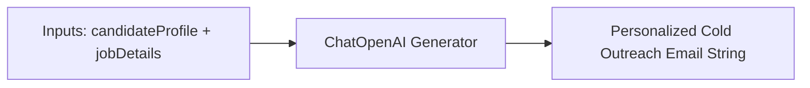

# File 08: Cold Email Drafter Tool (`src/tools/email-drafter.js`)

## Overview
The **Cold Email Drafter Tool** generates professional, personalized application outreach emails referencing the candidate's core background and the hiring company's job requirements.

---

## 1. Email Generation Flow



---

## 2. Email Drafter Implementation (`src/tools/email-drafter.js`)

```javascript
import { ChatOpenAI } from "@langchain/openai";

export async function draftApplicationEmail(candidateProfile, jobDetails) {
    const apiKey = process.env.OPENAI_API_KEY;
    if (!apiKey) {
        return draftEmailMock(candidateProfile, jobDetails);
    }

    const model = new ChatOpenAI({ modelName: "gpt-4o-mini", temperature: 0.7 });

    const prompt = `
Draft a concise, professional cold email from candidate ${candidateProfile.candidateName} applying for the ${jobDetails.title} position at ${jobDetails.company}.

Candidate Skills: ${candidateProfile.skills.join(", ")}
Years Experience: ${candidateProfile.experienceYears}

Format: Include Subject Line and Body text.`;

    const response = await model.invoke(prompt);
    return response.content;
}

function draftEmailMock(candidateProfile, jobDetails) {
    return `Subject: Application for ${jobDetails.title} - ${candidateProfile.candidateName}

Dear Hiring Manager at ${jobDetails.company},

I am writing to express my strong interest in the ${jobDetails.title} position. With over ${candidateProfile.experienceYears} years of experience in ${candidateProfile.skills.slice(0, 3).join(", ")}, I am confident in my ability to contribute immediately to your team.

Best regards,
${candidateProfile.candidateName}`;
}
```

---

## Key Takeaways
1. Personalizes cold outreach emails to candidate profile and target job.
2. Supports offline mock fallback generation.
