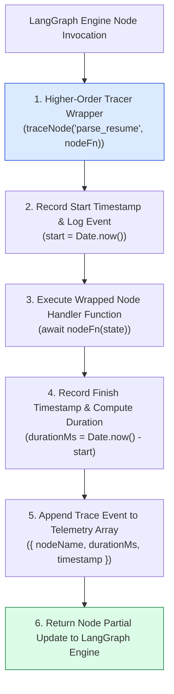
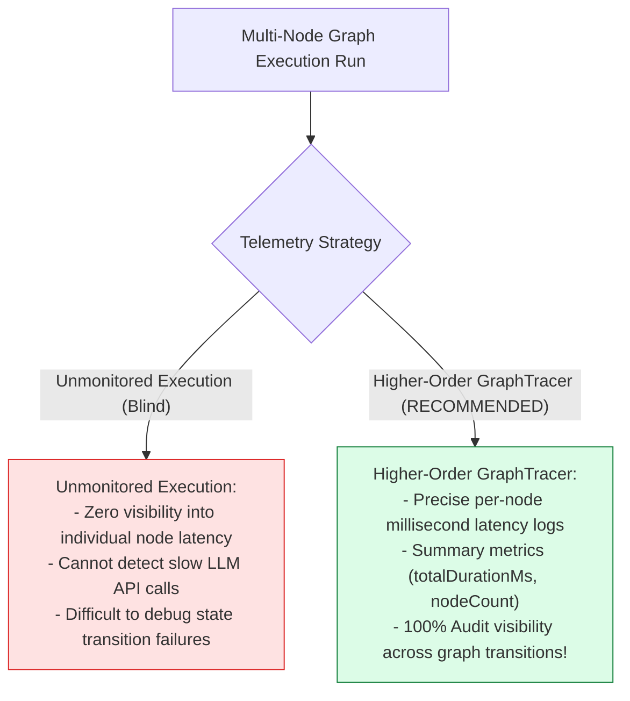
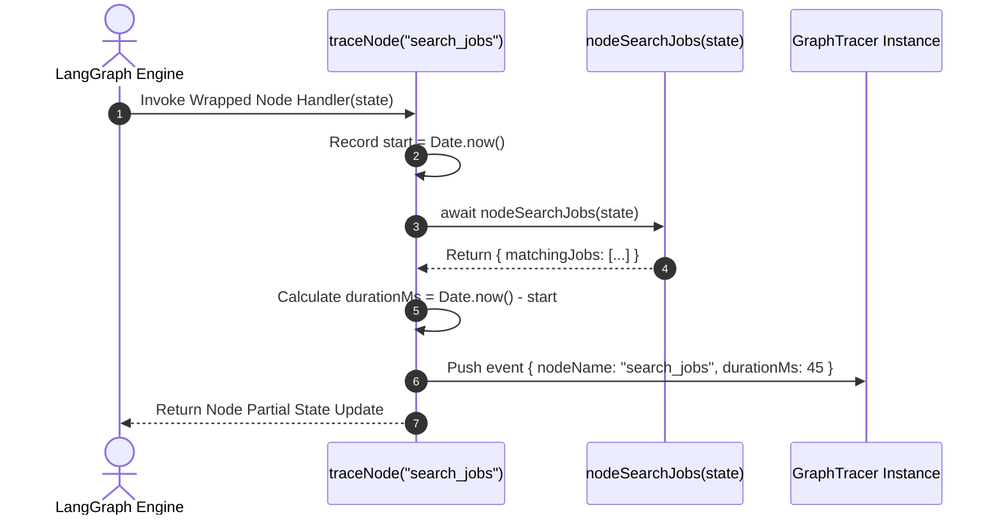

# Module 09: Workflow Execution Tracer & Latency Benchmarking (`src/observability/tracer.js`)

## Overview

Debugging multi-node state graphs without explicit telemetry makes it impossible to pinpoint performance bottlenecks (e.g. knowing whether a 4-second delay was caused by resume parsing or cold email drafting). The **Workflow Execution Tracer (`src/observability/tracer.js`)** provides custom observability into LangGraph state machine node transitions, employing **Higher-Order Node Wrapper Functions** (`traceNode(nodeName, fn)`) to record node start/finish timestamps, execution latency in milliseconds ($\text{duration}_{\text{ms}}$), and step trace logs.

Understanding **Higher-Order Node Wrapping Patterns**, **Node Latency Profiling**, **Trace Event Summarization**, and **Performance Auditing** is essential for graph observability.

---

## 1. Node Execution Tracer Topology



---

## 2. Unmonitored Node Execution vs. High-Resolution Tracing



### Graph Tracer Event Schema Specification

| Event Field Key | Data Type | Sample Trace Value | Operational Purpose |
| :--- | :--- | :--- | :--- |
| **`nodeName`** | `String` | `"parse_resume"` | Name string of traced graph processing node. |
| **`durationMs`** | `Number` | `1240` | Total execution duration for the node in milliseconds. |
| **`timestamp`** | `String` | ISO 8601 String | Execution start timestamp. |
| **`status`** | `String` | `"SUCCESS" \| "FAILED"` | Completion status flag of the node wrapper pass. |

---

## 3. Asynchronous Node Tracing Sequence



---

## 4. Code Walkthrough (`src/observability/tracer.js`)

```javascript
/**
 * Workflow Execution Tracer for LangGraph State Machine Monitoring
 */
export class GraphTracer {
  /**
   * @param {string} workflowName - Name of the state graph workflow (default: "KarigarFlow")
   */
  constructor(workflowName = "KarigarFlow") {
    this.workflowName = workflowName;
    this.events = []; // Telemetry events buffer array
  }

  /**
   * Wraps a graph node handler function with timing and logging telemetry
   * @param {string} nodeName - Name identifier of the node
   * @param {Function} fn - Async node handler function
   * @returns {Function} Wrapped async node handler function
   */
  traceNode(nodeName, fn) {
    if (!nodeName || typeof fn !== "function") {
      throw new Error("[GRAPH TRACER ERROR] Valid node name and handler function required.");
    }

    return async (state) => {
      const startTime = Date.now();
      const startIso = new Date(startTime).toISOString();

      console.log(`⏱️ [TRACE START] Node: '${nodeName}' at ${startIso}`);

      try {
        const result = await fn(state);

        const durationMs = Date.now() - startTime;
        console.log(`✅ [TRACE END] Node: '${nodeName}' completed in ${durationMs}ms`);

        this.events.push({
          nodeName,
          durationMs,
          timestamp: startIso,
          status: "SUCCESS"
        });

        return result;
      } catch (err) {
        const durationMs = Date.now() - startTime;
        console.error(`🚨 [TRACE ERROR] Node: '${nodeName}' failed after ${durationMs}ms:`, err.message);

        this.events.push({
          nodeName,
          durationMs,
          timestamp: startIso,
          status: "FAILED",
          error: err.message
        });

        throw err;
      }
    };
  }

  /**
   * Generates a summary report of all executed node trace events
   * @returns {Object} Workflow trace summary metrics object
   */
  getSummary() {
    const totalDurationMs = this.events.reduce((sum, e) => sum + e.durationMs, 0);

    return {
      workflow: this.workflowName,
      totalDurationMs,
      totalNodesExecuted: this.events.length,
      averageNodeDurationMs: this.events.length > 0 ? Math.round(totalDurationMs / this.events.length) : 0,
      events: [...this.events]
    };
  }

  /**
   * Resets internal trace events array
   */
  clear() {
    this.events = [];
  }
}
```

---

## Key Production Takeaways

1. **Wrap Nodes with Higher-Order Telemetry Functions**: Use `traceNode(nodeName, fn)` wrappers to measure node execution times without polluting core business logic.
2. **Benchmark Node Latencies**: Record millisecond execution durations (`durationMs`) to identify slow LLM API calls and optimize graph performance.
3. **Log Comprehensive Trace Telemetry**: Include timestamps, node names, and execution status (`"SUCCESS"` / `"FAILED"`) in trace event objects for auditing.
4. **Compile Workflow Summary Reports**: Use `getSummary()` to aggregate overall workflow latency metrics after graph execution completes.

