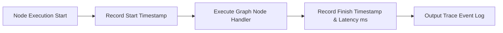

# File 09: Workflow Execution Tracer (`src/observability/tracer.js`)

## Overview
The **Workflow Execution Tracer** provides custom observability into LangGraph state graph node transitions, recording node entry/exit timestamps, execution latency, and state mutations.

---

## 1. Node Execution Tracing Flow



---

## 2. Tracer Implementation (`src/observability/tracer.js`)

```javascript
export class GraphTracer {
    constructor(workflowName = "KarigarFlow") {
        this.workflowName = workflowName;
        this.events = [];
    }

    traceNode(nodeName, fn) {
        return async (state) => {
            const start = Date.now();
            console.log(`[TRACE START] Node: '${nodeName}' at ${new Date(start).toISOString()}`);
            
            const result = await fn(state);
            
            const duration = Date.now() - start;
            console.log(`[TRACE END] Node: '${nodeName}' completed in ${duration}ms`);
            
            this.events.push({
                nodeName,
                durationMs: duration,
                timestamp: start
            });

            return result;
        };
    }

    getSummary() {
        const totalDuration = this.events.reduce((sum, e) => sum + e.durationMs, 0);
        return {
            workflow: this.workflowName,
            totalDurationMs: totalDuration,
            nodeCount: this.events.length,
            events: this.events
        };
    }
}
```

---

## Key Takeaways
1. Measures graph node execution latency.
2. Provides execution trace logs for performance auditing.
