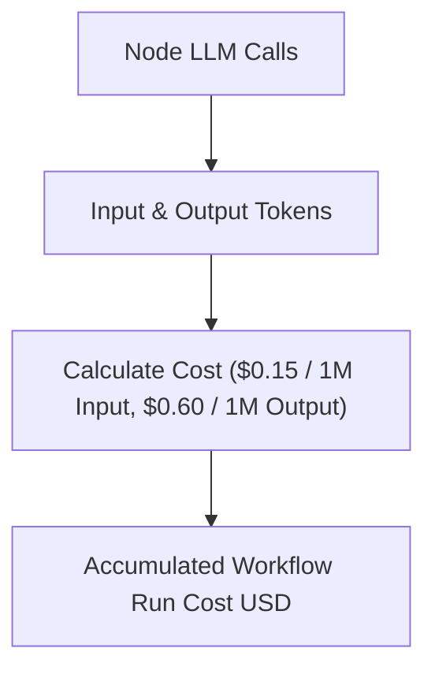

# File 10: Token & Cost Accounting (`src/observability/cost-tracker.js`)

## Overview
The **Cost Accounting Manager** tracks accumulated LLM token consumption across all LangGraph nodes in a workflow execution run.

---

## 1. Token Cost Accounting Model



---

## 2. Cost Tracker Implementation (`src/observability/cost-tracker.js`)

```javascript
export class GraphCostTracker {
    constructor(modelName = "gpt-4o-mini") {
        this.modelName = modelName;
        this.totalInputTokens = 0;
        this.totalOutputTokens = 0;
    }

    recordLLMCall(inputTokens, outputTokens) {
        this.totalInputTokens += inputTokens;
        this.totalOutputTokens += outputTokens;
    }

    getReport() {
        // Pricing per 1M Tokens (gpt-4o-mini rates)
        const rates = { input: 0.15, output: 0.60 };
        const inputCost = (this.totalInputTokens / 1_000_000) * rates.input;
        const outputCost = (this.totalOutputTokens / 1_000_000) * rates.output;
        const totalCost = inputCost + outputCost;

        return {
            model: this.modelName,
            totalInputTokens: this.totalInputTokens,
            totalOutputTokens: this.totalOutputTokens,
            totalCostUSD: totalCost.toFixed(6)
        };
    }
}
```

---

## Key Takeaways
1. Monitors financial expenditure for multi-node LLM workflow graph runs.
2. Tracks input vs output token split.
