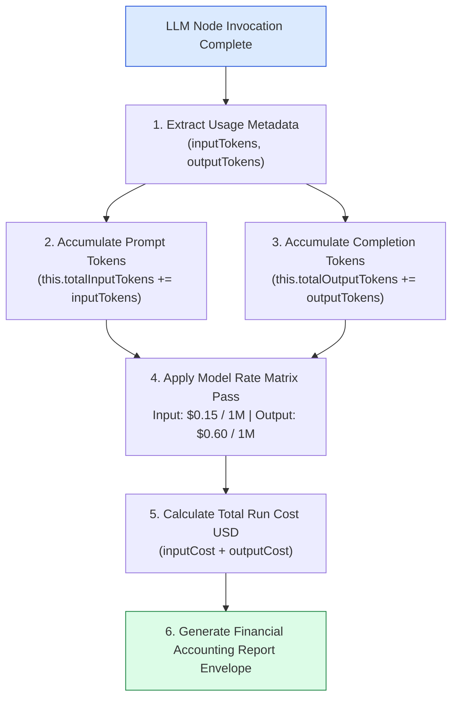
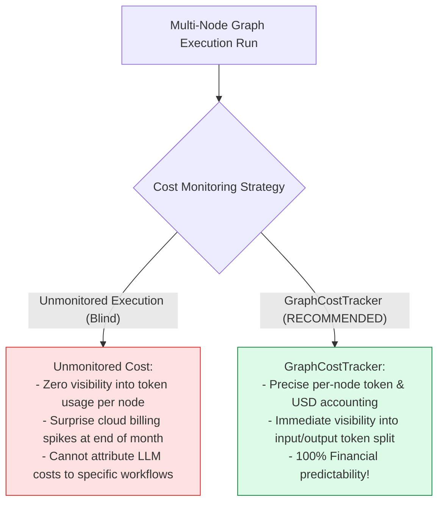
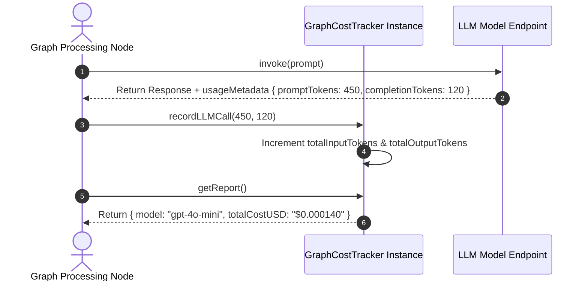

# Module 10: Token Cost Accounting & Financial Metrics (`src/observability/cost-tracker.js`)

## Overview

In multi-node graph workflows (where nodes like `parse_resume` and `draft_email` make separate LLM calls), tracking token usage is necessary to avoid cost overruns. The **Graph Cost Tracker (`src/observability/cost-tracker.js`)** tracks input (prompt) and output (completion) token counts across all graph nodes, applying LLM pricing rate matrices ($\$0.15$ per 1M input tokens, $\$0.60$ per 1M output tokens for `gpt-4o-mini`) to compute precise financial cost reports in USD.

Understanding **Input/Output Token Decomposition**, **LLM Pricing Rate Matrices**, **Accumulated Financial Accounting**, and **Cost Reporting Envelopes** is essential for cloud operations.

---

## 1. Token Cost Accounting Topology



---

## 2. Unmonitored LLM Workflows vs. Cost Accounting



### Model Pricing Rate Reference Matrix (per 1 Million Tokens)

| Model Identifier | Input Token Rate (USD) | Output Token Rate (USD) | Standard Use Case |
| :--- | :--- | :--- | :--- |
| **`gpt-4o-mini`** | $\$0.15$ / 1M | $\$0.60$ / 1M | Fast, cost-efficient structured node parsing. |
| **`gpt-4o`** | $\$2.50$ / 1M | $\$10.00$ / 1M | Complex reasoning & multi-step planning nodes. |
| **`gemini-1.5-flash`** | $\$0.075$ / 1M | $\$0.30$ / 1M | High-volume lightweight text processing. |

---

## 3. Asynchronous Cost Tracking Sequence



---

## 4. Code Walkthrough (`src/observability/cost-tracker.js`)

```javascript
/**
 * Token & Financial Cost Accounting Manager for LangGraph Workflows
 */
export class GraphCostTracker {
  /**
   * @param {string} modelName - LLM model identifier string (default: "gpt-4o-mini")
   */
  constructor(modelName = "gpt-4o-mini") {
    this.modelName = modelName;
    this.totalInputTokens = 0;
    this.totalOutputTokens = 0;
    this.rates = this._getModelRates(modelName);
  }

  /**
   * Returns token pricing rates per 1,000,000 tokens for target model
   */
  _getModelRates(modelName) {
    const rateMatrix = {
      "gpt-4o-mini": { input: 0.15, output: 0.60 },
      "gpt-4o": { input: 2.50, output: 10.00 },
      "gemini-1.5-flash": { input: 0.075, output: 0.30 }
    };

    return rateMatrix[modelName] || rateMatrix["gpt-4o-mini"];
  }

  /**
   * Records prompt and completion token counts from an LLM node invocation
   * @param {number} inputTokens - Prompt tokens consumed
   * @param {number} outputTokens - Completion tokens generated
   */
  recordLLMCall(inputTokens = 0, outputTokens = 0) {
    this.totalInputTokens += Number(inputTokens);
    this.totalOutputTokens += Number(outputTokens);

    console.log(`📊 [COST TRACKER] Recorded LLM Call: +${inputTokens} input, +${outputTokens} output tokens.`);
  }

  /**
   * Computes accumulated token counts and total USD cost
   * @returns {Object} Financial accounting report object
   */
  getReport() {
    const inputCost = (this.totalInputTokens / 1_000_000) * this.rates.input;
    const outputCost = (this.totalOutputTokens / 1_000_000) * this.rates.output;
    const totalCostUSD = inputCost + outputCost;

    const report = {
      model: this.modelName,
      totalInputTokens: this.totalInputTokens,
      totalOutputTokens: this.totalOutputTokens,
      totalTokens: this.totalInputTokens + this.totalOutputTokens,
      inputCostUSD: inputCost.toFixed(6),
      outputCostUSD: outputCost.toFixed(6),
      totalCostUSD: totalCostUSD.toFixed(6)
    };

    console.log(`💵 [COST REPORT] Model: ${report.model} | Total Tokens: ${report.totalTokens} | Total Cost: $${report.totalCostUSD} USD`);
    return report;
  }

  /**
   * Resets internal token counters
   */
  clear() {
    this.totalInputTokens = 0;
    this.totalOutputTokens = 0;
  }
}
```

---

## Key Production Takeaways

1. **Track Prompt vs Completion Token Splits**: Separately record input tokens and output tokens since LLM providers bill completions at higher rates than inputs.
2. **Apply Model-Specific Rate Matrices**: Maintain pricing rate matrices for targeted models (`gpt-4o-mini`, `gemini-1.5-flash`) to compute financial costs in USD.
3. **Report Financial Metrics per Workflow Run**: Use `getReport()` to return granular token usage and cost figures (`$0.000140 USD`) at the conclusion of each graph run.
4. **Isolate Accounting from Graph Nodes**: Maintain a dedicated `GraphCostTracker` class to keep financial tracking decoupled from workflow node logic.

