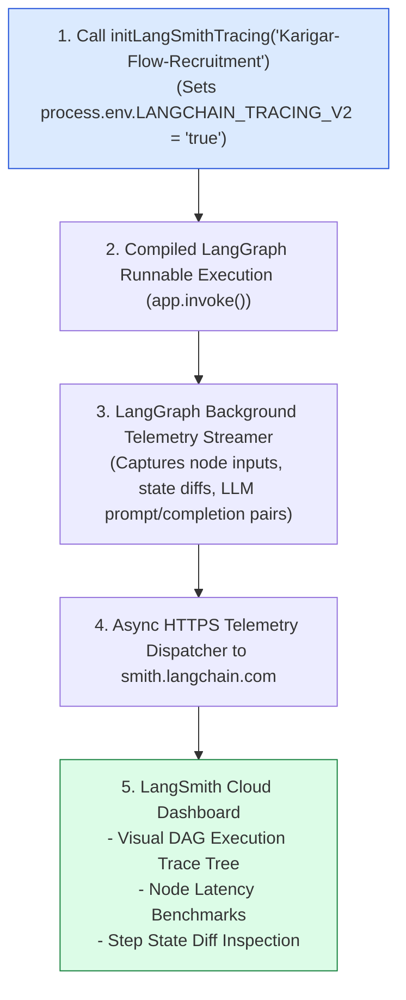
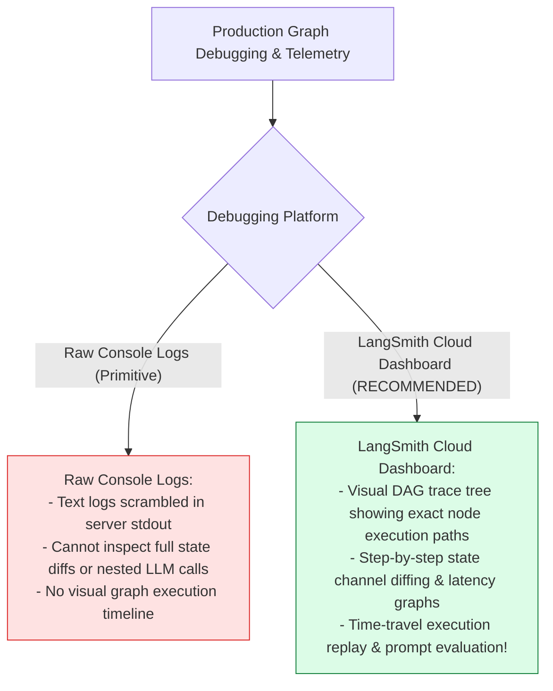
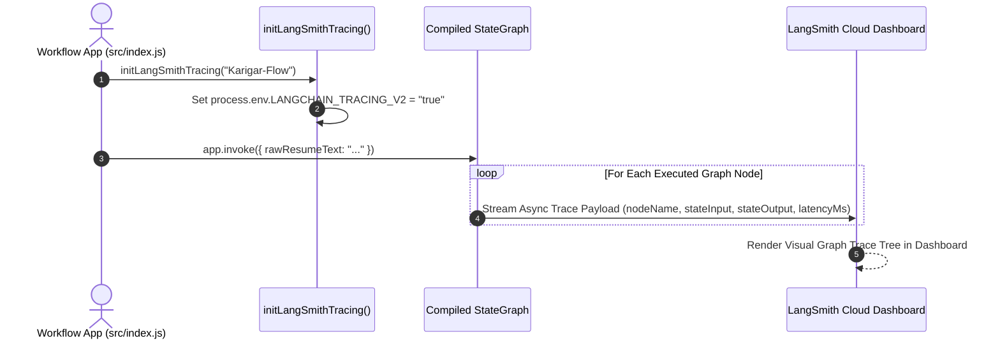

# Module 11: LangSmith Cloud Tracing & Visual Observability (`src/observability/langsmith.js`)

## Overview

Debugging complex multi-node state graphs in production requires visual trace inspection, step-by-step state diffing, and latency profiling across all graph transitions. **LangSmith** is LangChain's platform for LLM and agent observability. By initializing project parameters (`LANGCHAIN_TRACING_V2="true"`, `LANGCHAIN_PROJECT="Karigar-Flow-Recruitment"`), LangGraph automatically streams background telemetry for state transitions, node inputs/outputs, and LLM call tokens directly to the **LangSmith Cloud Dashboard (`smith.langchain.com`)** without modifying graph node source code.

Understanding **Automatic LangChain Telemetry Streams**, **LangSmith Environment Configuration**, **Time-Travel State Inspection**, and **Production Debugging** is essential for graph operations.

---

## 1. LangSmith Telemetry Architecture Topology



---

## 2. Console Logs vs. LangSmith Cloud Tracing Dashboard



### LangSmith Environment Variable Specification

| Environment Variable | Required Value | Operational Purpose |
| :--- | :--- | :--- |
| **`LANGCHAIN_TRACING_V2`** | `"true"` | Enables automatic background telemetry collection in LangChain/LangGraph. |
| **`LANGCHAIN_API_KEY`** | `"lsv2_pt_..."` | User API secret key for authenticating with LangSmith Cloud. |
| **`LANGCHAIN_PROJECT`** | `"Karigar-Flow-Recruitment"`| Target project name grouping workflow trace logs in the cloud dashboard. |
| **`LANGCHAIN_ENDPOINT`** | `"https://api.smith.langchain.com"` | Endpoint URL for LangSmith API services. |

---

## 3. Asynchronous Telemetry Streaming Sequence



---

## 4. Code Walkthrough (`src/observability/langsmith.js`)

```javascript
/**
 * LangSmith Cloud Tracing & Telemetry Initializer
 * Configures automatic background telemetry streaming for LangGraph
 * @param {string} project - Target LangSmith project name (default: "Karigar-Flow-Recruitment")
 * @returns {boolean} True if tracing was successfully enabled
 */
export function initLangSmithTracing(project = "Karigar-Flow-Recruitment") {
  const apiKey = process.env.LANGCHAIN_API_KEY;

  if (!apiKey) {
    console.warn("⚠️ [LANGSMITH] LANGCHAIN_API_KEY not found in environment. Automatic cloud tracing disabled.");
    return false;
  }

  process.env.LANGCHAIN_TRACING_V2 = "true";
  process.env.LANGCHAIN_API_KEY = apiKey;
  process.env.LANGCHAIN_PROJECT = project;
  process.env.LANGCHAIN_ENDPOINT = process.env.LANGCHAIN_ENDPOINT || "https://api.smith.langchain.com";

  console.log(`🌐 [LANGSMITH] Automatic cloud tracing ENABLED for project '${project}'.`);
  console.log(`🌐 [LANGSMITH] View visual graph execution traces at: https://smith.langchain.com`);
  return true;
}

// Execution Verification Example
initLangSmithTracing();
```

---

## Key Production Takeaways

1. **Enable Automatic Cloud Tracing Zero-Code**: Setting `LANGCHAIN_TRACING_V2="true"` enables background telemetry streaming for `@langchain/langgraph` without adding trace calls to node code.
2. **Group Workflows by Project**: Use `LANGCHAIN_PROJECT` to organize related graph trace executions in the LangSmith dashboard.
3. **Inspect Step-by-Step State Diffs**: Use the LangSmith visual tree to inspect state channel modifications (`candidateProfile`, `matchingJobs`) at each step of graph execution.
4. **Graceful Fallback When API Key Missing**: Ensure `initLangSmithTracing()` checks for `LANGCHAIN_API_KEY` and logs a warning rather than throwing an exception if the key is not set.


## Learn from the implementation

Use the matching source file as an executable example, not just something to copy. Before running it, state in your own words what data enters the module, what it returns, and which values it changes. Then trace one realistic request from the caller through each function.

Pay special attention to these questions:

- **Data flow:** Which object, array, string, or state value moves between functions? What shape must it have?
- **Control flow:** Which branch, loop, early return, or retry changes the outcome? What condition selects it?
- **Async boundaries:** Where does the code wait for an LLM, database, network, file system, or tool? What should happen if that operation rejects or returns no result?
- **Side effects:** Which lines log information, make an external request, store data, or mutate in-memory state? Keep those distinct from pure calculations.
- **Production limits:** Which assumptions are only safe for a tutorial—for example, in-memory storage, fixed thresholds, approximate token counts, mock data, or a hard-coded batch size?

A useful practice is to change one input at a time and predict the result before executing it. If you can explain why the output changed, when the module should be used, and one way it could fail, you understand the concept rather than only the syntax.
