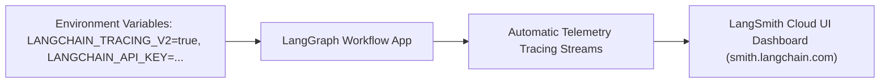

# File 11: LangSmith Tracing Integration (`src/observability/langsmith.js`)

## Overview
**LangSmith** is LangChain's production observability platform. Configuring LangSmith environment variables enables automatic background tracing of all LangGraph state machine node executions.

---

## 1. LangSmith Environment Configuration Architecture



---

## 2. LangSmith Integration Implementation (`src/observability/langsmith.js`)

```javascript
export function initLangSmithTracing(project = "Karigar-Flow-Recruitment") {
    const apiKey = process.env.LANGCHAIN_API_KEY;
    if (!apiKey) {
        console.log("[LangSmith] API key not found. Tracing disabled.");
        return false;
    }

    process.env.LANGCHAIN_TRACING_V2 = "true";
    process.env.LANGCHAIN_API_KEY = apiKey;
    process.env.LANGCHAIN_PROJECT = project;

    console.log(`[LangSmith] Enabled automatic tracing for project '${project}'`);
    console.log(`[LangSmith] View traces at: https://smith.langchain.com`);
    return true;
}
```

---

## Key Takeaways
1. Enables automatic cloud tracing without modifying graph node handler code.
2. Captures full state inputs, node transitions, and LLM outputs in the LangSmith dashboard.
