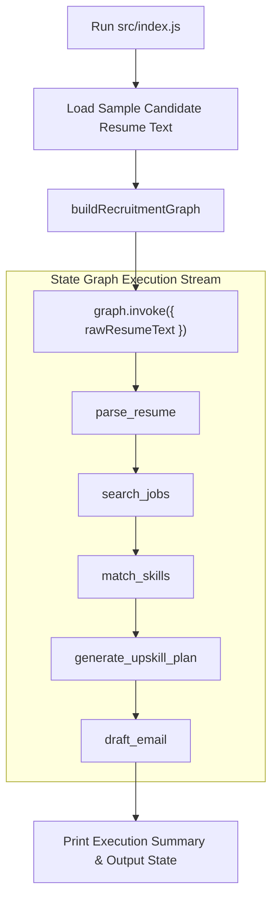

# File 12: Main Workflow Orchestrator (`src/index.js`)

## Overview
**`src/index.js`** is the main entry point for Karigar Flow, instantiating the compiled LangGraph recruitment workflow, passing raw candidate resume text, streaming state transitions through the graph nodes, and outputting the final matched jobs, upskilling plan, and cold application email.

---

## 1. Main Entry Execution Flow



---

## 2. Main Runner Implementation (`src/index.js`)

```javascript
import { buildRecruitmentGraph } from "./graph/builder.js";
import { initLangSmithTracing } from "./observability/langsmith.js";

// Initialize optional LangSmith tracing
initLangSmithTracing("Karigar-Flow-Recruitment");

const sampleResumeText = `
Priya Sharma
Senior Software Engineer - Bengaluru, India

Summary:
Full Stack Developer with 4 years of experience building scalable web applications using JavaScript, Node.js, Express, and React. Experienced in REST API design, MongoDB, and frontend state management.

Skills: JavaScript, Node.js, Express, MongoDB, React, Git, HTML, CSS
Experience: 4 years
Target Roles: Full Stack Engineer, Backend Developer
`;

async function main() {
    console.log("=== STARTING KARIGAR FLOW RECRUITMENT WORKFLOW ===");

    // 1. Compile Graph
    const graph = buildRecruitmentGraph();

    // 2. Invoke Graph Execution
    const finalState = await graph.invoke({
        rawResumeText: sampleResumeText
    });

    console.log("\n=== WORKFLOW EXECUTION COMPLETE ===");
    console.log("Candidate Name:  ", finalState.candidateProfile.candidateName);
    console.log("Jobs Found:      ", finalState.matchingJobs.length);
    console.log("Match Score:     ", finalState.skillGapAnalysis.matchScore + "%");
    console.log("Missing Skills:  ", finalState.skillGapAnalysis.missingSkills.join(", "));
    console.log("Upskill Plan:    ", finalState.upskillPlan.length, "resources recommended");
    console.log("\n--- DRAFTED COLD EMAIL ---");
    console.log(finalState.draftedEmail);
}

main().catch(console.error);
```

---

## Key Takeaways
1. Demonstrates end-to-end execution of a multi-node LangGraph state machine.
2. Invokes graph execution with simple `graph.invoke(initialState)`.
