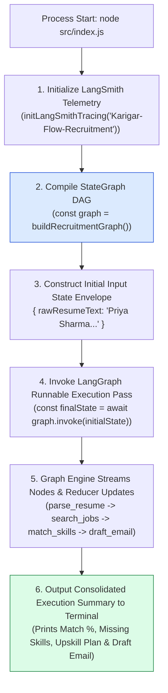
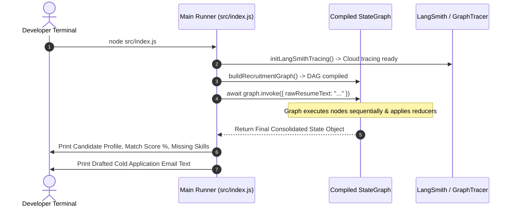

# Module 12: Main Workflow Orchestrator & CLI Runner (`src/index.js`)

## Overview

The **Main Workflow Orchestrator (`src/index.js`)** is the primary execution entry point for Karigar Flow. On process launch, it initializes optional **LangSmith Cloud Tracing**, calls `buildRecruitmentGraph()` to compile the state graph DAG, constructs the initial state input payload containing raw candidate resume text, triggers graph execution via **`graph.invoke(initialState)`**, and streams state transitions through nodes until printing a consolidated recruitment summary report to stdout.

Understanding **Workflow Invocation Lifecycles (`graph.invoke()`)**, **Initial State Channel Construction**, **Execution Output Deconstruction**, and **Terminal Summary Telemetry** is essential for workflow deployment.

---

## 1. Application Runner Orchestration Topology



---

## 2. End-to-End Workflow Execution Lifecycle Sequence



---

## 3. Terminal Execution Output Envelope Matrix

| Summary Metric | Source State Channel | Sample Output Value | Operational Function |
| :--- | :--- | :--- | :--- |
| **Candidate Name** | `finalState.candidateProfile` | `"Priya Sharma"` | Identity of evaluated candidate. |
| **Matched Jobs Count** | `finalState.matchingJobs` | `2 Jobs Found` | Total matching openings found in catalog. |
| **Candidate Match %** | `finalState.skillGapAnalysis` | `75% Fit` | Quantified candidate fit score percentage. |
| **Missing Skills** | `finalState.skillGapAnalysis` | `["Docker", "AWS"]` | Missing skills identified by set difference. |
| **Recommended Upskills**| `finalState.upskillPlan` | `2 Resources` | Curated learning resource count. |
| **Drafted Application Email**| `finalState.draftedEmail` | `"Subject: Application..."` | Final customized outreach email text. |

---

## 4. Code Walkthrough (`src/index.js`)

```javascript
import { buildRecruitmentGraph } from "./graph/builder.js";
import { initLangSmithTracing } from "./observability/langsmith.js";

// Step 1: Initialize optional LangSmith Cloud Tracing
initLangSmithTracing("Karigar-Flow-Recruitment");

// Sample candidate resume fixture text
const sampleResumeText = `
Priya Sharma
Senior Software Engineer - Bengaluru, India

Summary:
Full Stack Developer with 4 years of hands-on experience building scalable web applications using JavaScript, Node.js, Express, and React. Experienced in REST API design, MongoDB collections, and frontend state management.

Skills: JavaScript, Node.js, Express, MongoDB, React, Git, HTML, CSS
Experience: 4 years
Target Roles: Full Stack Engineer, Backend Developer
`;

/**
 * Main application execution runner
 */
async function main() {
  console.log("=================================================");
  console.log("🚀 [STARTING KARIGAR FLOW RECRUITMENT WORKFLOW]");
  console.log("=================================================\n");

  const startTime = Date.now();

  // 1. Compile LangGraph State Machine
  const graph = buildRecruitmentGraph();

  // 2. Invoke Graph Execution with Initial State Object
  console.log("⚡ [GRAPH RUNNER] Invoking state graph with raw resume text input...");
  const finalState = await graph.invoke({
    rawResumeText: sampleResumeText
  });

  const durationMs = Date.now() - startTime;

  // 3. Print Consolidated Summary Report
  console.log("\n=================================================");
  console.log("🎉 [WORKFLOW EXECUTION COMPLETE]");
  console.log(`⏱️ Total Latency: ${durationMs}ms`);
  console.log("=================================================");
  console.log(`Candidate Name:   ${finalState.candidateProfile?.candidateName || "N/A"}`);
  console.log(`Matching Jobs:    ${finalState.matchingJobs?.length || 0} openings found`);
  console.log(`Fit Score:        ${finalState.skillGapAnalysis?.matchScore || 0}%`);
  console.log(`Missing Skills:   ${finalState.skillGapAnalysis?.missingSkills?.join(", ") || "NONE"}`);
  console.log(`Upskill Plan:     ${finalState.upskillPlan?.length || 0} learning resources recommended`);

  console.log("\n-------------------------------------------------");
  console.log("📜 [DRAFTED COLD APPLICATION EMAIL]");
  console.log("-------------------------------------------------");
  console.log(finalState.draftedEmail);
  console.log("-------------------------------------------------\n");
}

main().catch((err) => {
  console.error("🚨 [MAIN RUNNER ERROR] Uncaught graph execution failure:", err);
  process.exit(1);
});
```

---

## Key Production Takeaways

1. **Invoke Graphs via `graph.invoke(initialState)`**: Pass the initial input state envelope (`{ rawResumeText }`) to `graph.invoke()` to execute compiled LangGraph state machines.
2. **Deconstruct Final State Objects**: Access output properties directly from the returned `finalState` object (`finalState.candidateProfile`, `finalState.draftedEmail`).
3. **Initialize Tracing Before Graph Building**: Call `initLangSmithTracing()` at the start of `src/index.js` to ensure telemetry is configured before state machine compilation.
4. **Log Clean Execution Summaries**: Print a formatted summary report to stdout for operational verification and easy debugging.

