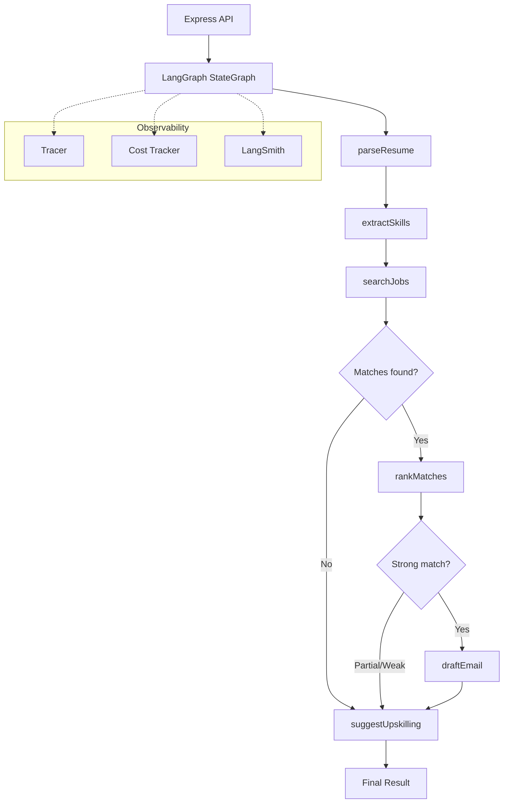
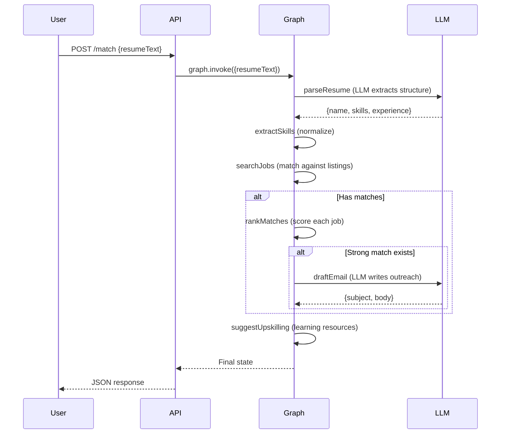

# 05 - KarigarConnect Flow

**Client:** KarigarConnect, Delhi — recruitment platform with multi-step job matching workflow.

**Tech:** OpenAI, LangGraph.js, Express, MongoDB

## Architecture



## How the Graph Flows



## Setup

```bash
cp .env.example .env
# Add your OPENAI_API_KEY
npm install
npm run dev
```

## API

```bash
# Match a resume by ID (uses sample data)
curl -X POST http://localhost:3005/match \
  -H "Content-Type: application/json" \
  -d '{"resumeId": "RES-001"}'

# Match with raw resume text
curl -X POST http://localhost:3005/match \
  -H "Content-Type: application/json" \
  -d '{"resumeText": "Priya, 3 years React and Node.js developer in Delhi. Skills: react, node.js, javascript, css, mongodb."}'

# List available sample resumes
curl http://localhost:3005/resumes

# Health check
curl http://localhost:3005/health
```

## File Structure

```
src/
  index.js                — Express server
  graph/
    state.js              — LangGraph Annotation (shared state)
    nodes.js              — Graph nodes (parse, extract, search, rank, email)
    edges.js              — Conditional routing logic
    builder.js            — Build and compile the StateGraph
  tools/
    resume-parser.js      — LLM-powered resume extraction
    job-search.js         — Search job listings
    skill-matcher.js      — Score skill overlap
    email-drafter.js      — LLM-powered email drafting
  observability/
    tracer.js             — Log each node with timing
    cost-tracker.js       — Track tokens and cost
    langsmith.js          — LangSmith integration
  data/
    jobs.json             — Sample job listings
    resumes.json          — Sample resumes
```

## Key Concepts

- **StateGraph**: Define nodes + edges. State flows through each node and gets updated.
- **Annotation**: LangGraph's way to define typed state with reducers.
- **Conditional Edges**: Route to different nodes based on state (matches found? strong match?).
- **Observability**: Trace every node execution — duration, tokens, cost.
- **LangSmith**: Optional cloud tracing for production debugging.


## Learning path

Read the numbered module notes in order before changing the application. Each note explains one responsibility and points to the matching implementation. For each module, follow one input through the code, identify its output and side effects, then run a small example. This builds understanding of the system boundaries before you combine them.
