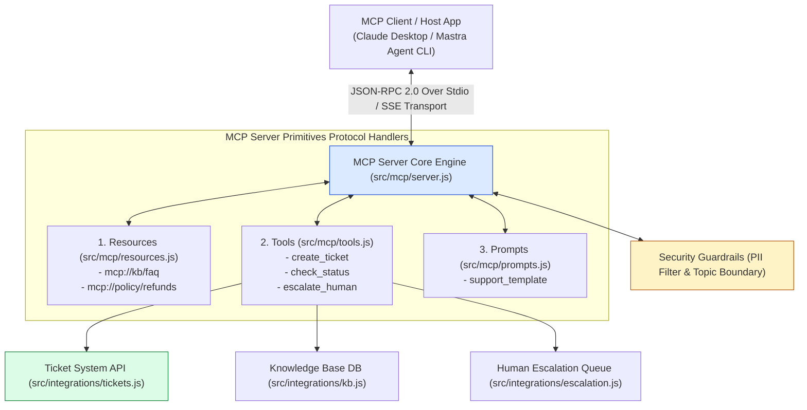
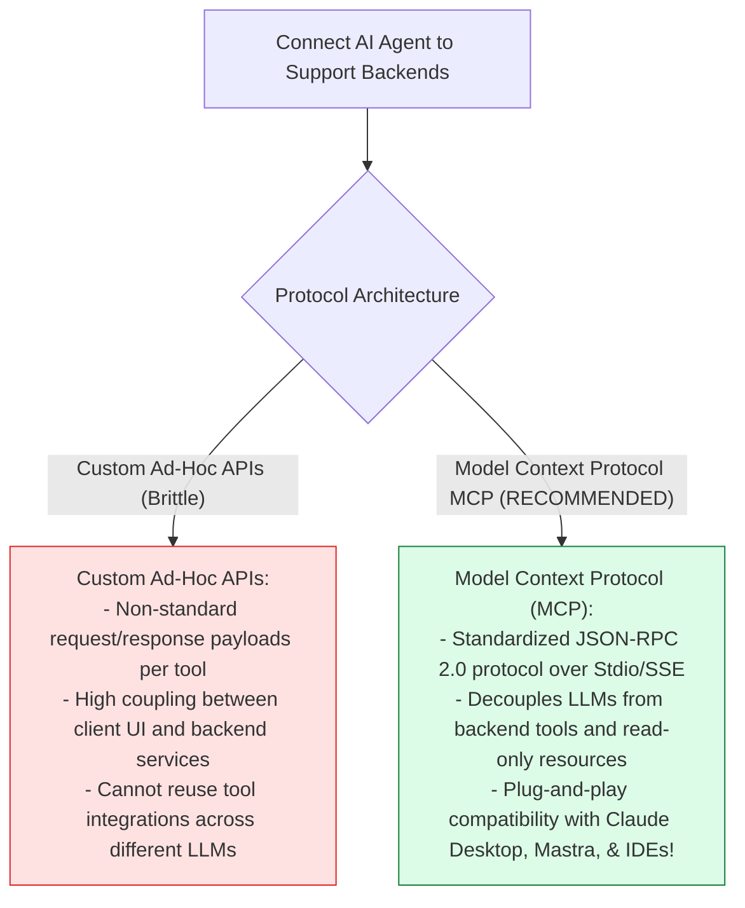
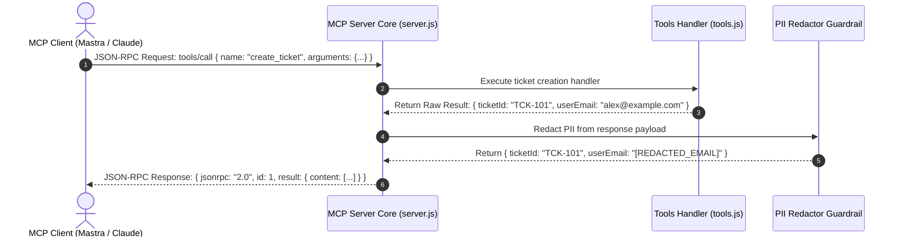

# Module 00: Model Context Protocol (MCP) Customer Support Architecture Overview

## Overview

Integrating AI assistants with enterprise backends (ticketing systems, knowledge base databases, and human escalation channels) often leads to custom, non-standard API glue code. Anthropic's **Model Context Protocol (MCP)** provides an open, standardized JSON-RPC 2.0 protocol over Stdio or HTTP/SSE transports for exposing contextual data and capabilities to LLMs. **Seva MCP** is an enterprise-grade customer support platform combining **MCP Server Primitives** (**Resources**, **Tools**, **Prompts**) with the **Mastra Framework** and dual-stage security guardrails (PII redaction and topic boundary enforcement).

Understanding **MCP JSON-RPC 2.0 Protocol Handshakes**, **Resource / Tool / Prompt Primitives**, **Stdio Transport Piping**, and **Mastra Agent Orchestration** is essential for protocol-driven AI systems.

---

## 1. Model Context Protocol (MCP) Topology

---

## 2. Custom Ad-Hoc Glue Code vs. Standardized Model Context Protocol (MCP)

### Seva MCP Protocol Primitive Reference Matrix

| MCP Primitive Category | Protocol JSON-RPC Methods | Source Module | Technical Functionality |
| :--- | :--- | :--- | :--- |
| **Resources** | `resources/list`, `resources/read` | `src/mcp/resources.js` | Exposes read-only URI assets (`mcp://kb/faq`) like policies and knowledge bases. |
| **Tools** | `tools/list`, `tools/call` | `src/mcp/tools.js` | Exposes executable functions (`create_ticket`, `escalate`) with JSON Schemas. |
| **Prompts** | `prompts/list`, `prompts/get` | `src/mcp/prompts.js` | Supplies standardized system prompt templates with dynamic arguments. |

---

## 3. Asynchronous MCP Request Handshake Sequence

---

## Key Production Takeaways

1. **Standardize Integrations via Anthropic MCP**: Build customer support tools using the Model Context Protocol (MCP) standard to ensure plug-and-play compatibility with Claude Desktop, Mastra, and custom AI agents.
2. **Expose Clear Primitive Boundaries**: Separate read-only contextual assets into **Resources** (`mcp://kb/*`), executable actions into **Tools** (`create_ticket`), and reusable prompts into **Prompts** (`support_template`).
3. **Decouple Transports via Stdio / SSE**: Use Stdio (Standard I/O) piping or HTTP Server-Sent Events (SSE) to isolate client transport details from server primitive implementation code.
4. **Enforce Security Guardrails at Server Boundary**: Wrap tool and resource handlers with PII redaction and topic boundary checkers before returning JSON-RPC payload results to external clients.

