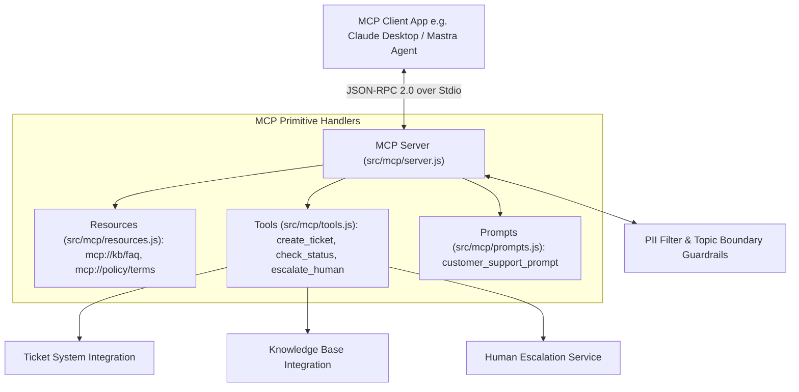

# File 00: Model Context Protocol (MCP) Customer Support Agent Overview

## Overview
**Seva MCP** is an enterprise-grade **Customer Support Agent System** leveraging Anthropic's **Model Context Protocol (MCP)** standard alongside the **Mastra Framework**. It exposes read-only data **Resources** (`mcp://kb/*`), executable **Tools** (`create_ticket`, `escalate`), and prompt **Templates** (`support_template`) over a JSON-RPC 2.0 Stdio transport layer, protected by PII redaction and topic boundary guardrails.

---

## 1. Model Context Protocol (MCP) System Architecture

---

## 2. System Primitive Matrix

| Primitive Category | Protocol Method | Source Module | Functionality |
| :--- | :--- | :--- | :--- |
| **Resources** | `resources/list`, `resources/read` | `src/mcp/resources.js` | Exposes read-only FAQ articles and company support policies |
| **Tools** | `tools/list`, `tools/call` | `src/mcp/tools.js` | Exposes executable functions to create support tickets and escalate to human agents |
| **Prompts** | `prompts/list`, `prompts/get` | `src/mcp/prompts.js` | Provides standardized system prompt templates for customer support workflows |

---

## Key Takeaways
1. Standardizes AI integrations using **Model Context Protocol (MCP)** JSON-RPC 2.0 primitives.
2. Decouples host LLM clients from backend service integrations (Ticketing, FAQ DB, Escalations).
3. Enforces strict **PII Redaction Guardrails** before returning customer support payloads.
