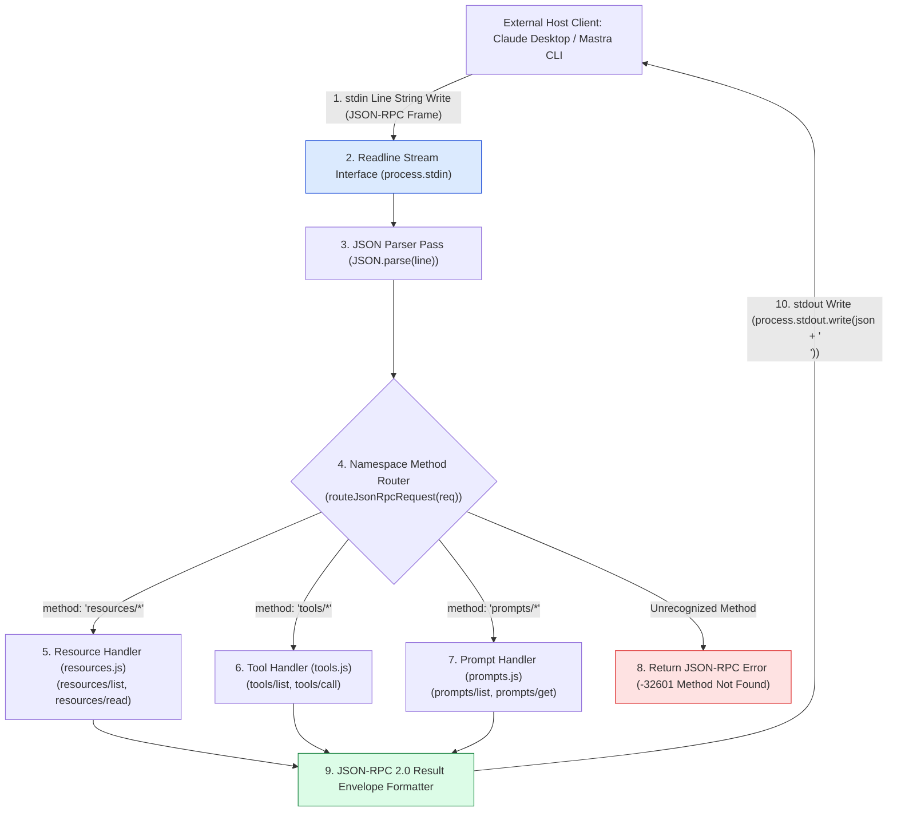
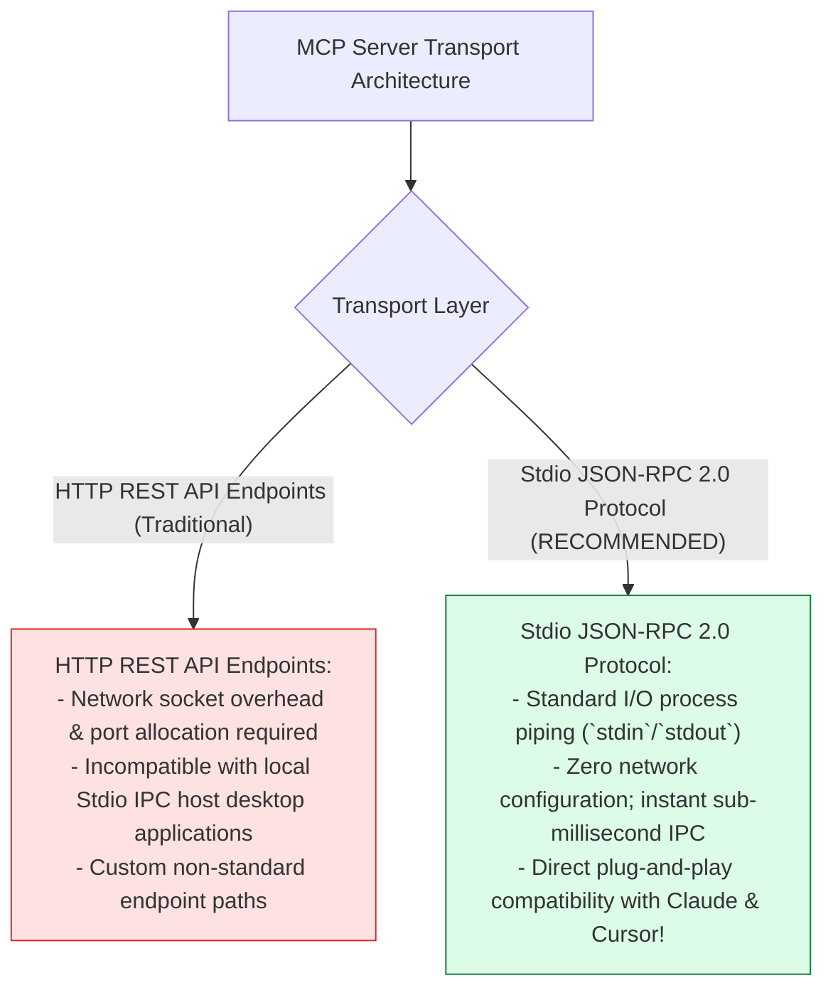
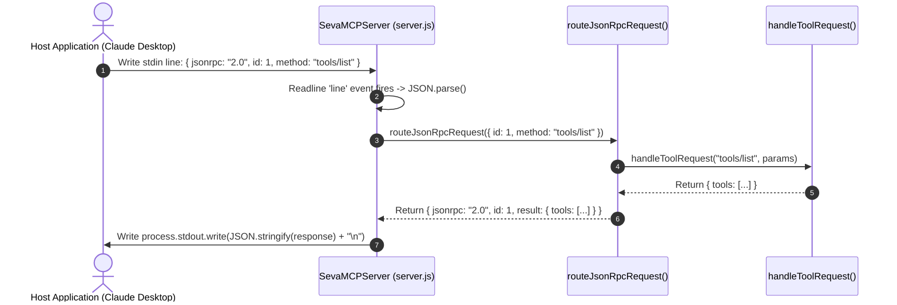

# Module 01: MCP Stdio Server Core & JSON-RPC 2.0 Engine (`src/mcp/server.js`)

## Overview

At the heart of every Model Context Protocol (MCP) server lies a transport engine capable of parsing line-buffered JSON-RPC 2.0 messages sent over standard input (`stdin`) and writing structured responses to standard output (`stdout`). The **MCP Stdio Server Core (`src/mcp/server.js`)** implements an asynchronous, event-driven JSON-RPC 2.0 router that handles incoming client requests (`resources/*`, `tools/*`, `prompts/*`), dispatches them to primitive handlers, and formats JSON-RPC success or error envelopes.

Understanding **JSON-RPC 2.0 Framing**, **Stdio Line-Buffered I/O Streams**, **Method Namespace Dispatching**, and **JSON-RPC Error Code Standards** is essential for protocol development.

---

## 1. Stdio Transport & Method Dispatch Topology



---

## 2. HTTP REST Endpoints vs. Stdio JSON-RPC 2.0 Transport



### JSON-RPC 2.0 Protocol Error Code Specification

| Standard Error Code | RPC Exception Name | Triggering Condition | Technical Purpose |
| :--- | :--- | :--- | :--- |
| **`-32700`** | `Parse Error` | Incoming `stdin` line contains malformed JSON. | Invalid JSON syntax sent by client. |
| **`-32600`** | `Invalid Request` | Payload missing required `jsonrpc: "2.0"` or `method`. | Protocol structural non-compliance. |
| **`-32601`** | `Method Not Found` | Method name is not registered in router handlers. | Unrecognized RPC method string. |
| **`-32602`** | `Invalid Params` | Method parameters fail schema validation checks. | Malformed arguments passed to tool/resource. |
| **`-32603`** | `Internal Error` | Internal handler function threw uncaught exception. | Server-side execution exception. |

---

## 3. Asynchronous Stdio Request Lifecycle Sequence



---

## 4. Code Walkthrough (`src/mcp/server.js`)

```javascript
import readline from "readline";
import { handleResourceRequest } from "./resources.js";
import { handleToolRequest } from "./tools.js";
import { handlePromptRequest } from "./prompts.js";

/**
 * Enterprise MCP Stdio Server Core Engine
 * Implements line-buffered JSON-RPC 2.0 over stdin/stdout
 */
export class SevaMCPServer {
  constructor() {
    // Initialize line-buffered reader over process.stdin
    this.rl = readline.createInterface({
      input: process.stdin,
      output: process.stdout,
      terminal: false
    });
  }

  /**
   * Starts listening for line-buffered JSON-RPC requests over Stdio
   */
  start() {
    console.error("⚡ [SEVA MCP SERVER] Server started over Stdio JSON-RPC 2.0 transport.");

    this.rl.on("line", async (line) => {
      const trimmed = line.trim();
      if (!trimmed) return;

      try {
        const request = JSON.parse(trimmed);
        const response = await this.routeJsonRpcRequest(request);
        process.stdout.write(JSON.stringify(response) + "\n");
      } catch (err) {
        // Return JSON-RPC Parse Error (-32700) or Internal Error (-32603)
        const errorRes = {
          jsonrpc: "2.0",
          id: null,
          error: {
            code: -32603,
            message: `JSON-RPC Execution Error: ${err.message}`
          }
        };
        process.stdout.write(JSON.stringify(errorRes) + "\n");
      }
    });
  }

  /**
   * Routes JSON-RPC 2.0 request frames to Primitive Protocol Handlers
   * @param {Object} req - Decoded JSON-RPC request object
   * @returns {Promise<Object>} JSON-RPC 2.0 response object
   */
  async routeJsonRpcRequest(req) {
    const { id, method, params } = req;

    if (!method || typeof method !== "string") {
      return {
        jsonrpc: "2.0",
        id: id || null,
        error: { code: -32600, message: "Invalid Request: Missing 'method' property." }
      };
    }

    try {
      // 1. Dispatch Resource Primitives (resources/*)
      if (method.startsWith("resources/")) {
        const result = await handleResourceRequest(method, params);
        return { jsonrpc: "2.0", id, result };
      }

      // 2. Dispatch Tool Primitives (tools/*)
      if (method.startsWith("tools/")) {
        const result = await handleToolRequest(method, params);
        return { jsonrpc: "2.0", id, result };
      }

      // 3. Dispatch Prompt Primitives (prompts/*)
      if (method.startsWith("prompts/")) {
        const result = await handlePromptRequest(method, params);
        return { jsonrpc: "2.0", id, result };
      }

      // 4. Return Method Not Found (-32601)
      return {
        jsonrpc: "2.0",
        id,
        error: { code: -32601, message: `Method '${method}' is not supported by Seva MCP Server.` }
      };
    } catch (err) {
      console.error(`🚨 [MCP ROUTER ERROR] Method '${method}' threw exception:`, err.message);
      return {
        jsonrpc: "2.0",
        id,
        error: { code: -32603, message: `Internal Handler Error: ${err.message}` }
      };
    }
  }
}
```

---

## Key Production Takeaways

1. **Use `console.error` for Server Debug Logs**: Never use `console.log` in Stdio MCP servers because standard output (`stdout`) is reserved exclusively for JSON-RPC response frames.
2. **Line-Buffer Stdio Streams**: Use Node.js `readline` interfaces to buffer incoming process stream lines, appending `\n` to outbound `process.stdout.write()` JSON strings.
3. **Comply Strictly with JSON-RPC 2.0 Specifications**: Ensure every response object includes `jsonrpc: "2.0"`, matching the client's request `id` and returning appropriate error codes (`-32601`, `-32603`).
4. **Namespace Method Routes Cleanly**: Prefix RPC methods with primitive namespaces (`resources/`, `tools/`, `prompts/`) to route request frames to focused handler modules.


## Learn from the implementation

Use the matching source file as an executable example, not just something to copy. Before running it, state in your own words what data enters the module, what it returns, and which values it changes. Then trace one realistic request from the caller through each function.

Pay special attention to these questions:

- **Data flow:** Which object, array, string, or state value moves between functions? What shape must it have?
- **Control flow:** Which branch, loop, early return, or retry changes the outcome? What condition selects it?
- **Async boundaries:** Where does the code wait for an LLM, database, network, file system, or tool? What should happen if that operation rejects or returns no result?
- **Side effects:** Which lines log information, make an external request, store data, or mutate in-memory state? Keep those distinct from pure calculations.
- **Production limits:** Which assumptions are only safe for a tutorial—for example, in-memory storage, fixed thresholds, approximate token counts, mock data, or a hard-coded batch size?

A useful practice is to change one input at a time and predict the result before executing it. If you can explain why the output changed, when the module should be used, and one way it could fail, you understand the concept rather than only the syntax.
