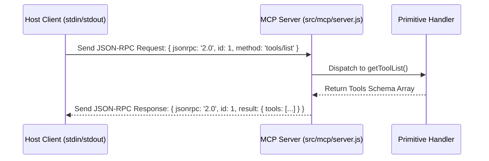

# File 01: MCP Stdio Server Core (`src/mcp/server.js`)

## Overview
The **MCP Stdio Server Core** handles low-level JSON-RPC 2.0 communication over standard input/output (`stdin`/`stdout`), parsing RPC request frames (`resources/list`, `tools/call`, `prompts/get`) and dispatching them to primitive handlers.

---

## 1. JSON-RPC 2.0 Stdio Message Lifecycle



---

## 2. MCP Server Core Implementation (`src/mcp/server.js`)

```javascript
import readline from "readline";
import { handleResourceRequest } from "./resources.js";
import { handleToolRequest } from "./tools.js";
import { handlePromptRequest } from "./prompts.js";

export class SevaMCPServer {
    constructor() {
        this.rl = readline.createInterface({
            input: process.stdin,
            output: process.stdout,
            terminal: false
        });
    }

    start() {
        console.error("[SEVA MCP SERVER] Server started over Stdio JSON-RPC 2.0 transport.");
        
        this.rl.on("line", async (line) => {
            if (!line.trim()) return;
            try {
                const request = JSON.parse(line);
                const response = await this.routeJsonRpcRequest(request);
                process.stdout.write(JSON.stringify(response) + "\n");
            } catch (err) {
                const errorRes = {
                    jsonrpc: "2.0",
                    id: null,
                    error: { code: -32603, message: err.message }
                };
                process.stdout.write(JSON.stringify(errorRes) + "\n");
            }
        });
    }

    async routeJsonRpcRequest(req) {
        const { id, method, params } = req;

        if (method.startsWith("resources/")) {
            return { jsonrpc: "2.0", id, result: await handleResourceRequest(method, params) };
        }
        if (method.startsWith("tools/")) {
            return { jsonrpc: "2.0", id, result: await handleToolRequest(method, params) };
        }
        if (method.startsWith("prompts/")) {
            return { jsonrpc: "2.0", id, result: await handlePromptRequest(method, params) };
        }

        return { jsonrpc: "2.0", id, error: { code: -32601, message: `Method '${method}' not found.` } };
    }
}
```

---

## Key Takeaways
1. Implements standard **JSON-RPC 2.0 over Stdio**, making the server compatible with Claude Desktop and Cursor IDE.
2. Dispatches `resources/*`, `tools/*`, and `prompts/*` RPC methods to primitive modules.
