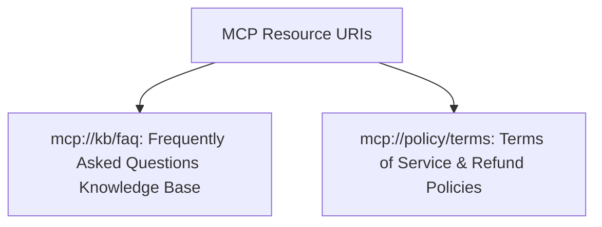

# File 02: MCP Resources Primitive (`src/mcp/resources.js`)

## Overview
The **MCP Resources Primitive** exposes read-only data sources (FAQ articles, refund policies, terms of service) identified by URI schemes (`mcp://kb/faq`, `mcp://policy/terms`) to LLM host applications.

---

## 1. MCP Resources URI Schema



---

## 2. Resources Primitive Implementation (`src/mcp/resources.js`)

```javascript
import { getKnowledgeBaseArticles } from "../integrations/knowledge-base.js";

export const RESOURCES_LIST = [
    {
        uri: "mcp://kb/faq",
        name: "Support FAQ Knowledge Base",
        description: "Frequently asked questions regarding shipping, refunds, and order tracking",
        mimeType: "text/plain"
    },
    {
        uri: "mcp://policy/terms",
        name: "Refund & Return Policy",
        description: "Official 30-day return policy and warranty guidelines",
        mimeType: "text/plain"
    }
];

export async function handleResourceRequest(method, params) {
    if (method === "resources/list") {
        return { resources: RESOURCES_LIST };
    }

    if (method === "resources/read") {
        const { uri } = params;
        if (uri === "mcp://kb/faq") {
            const articles = getKnowledgeBaseArticles();
            const textContent = articles.map(a => `Q: ${a.question}\nA: ${a.answer}`).join("\n\n");
            return { contents: [{ uri, mimeType: "text/plain", text: textContent }] };
        }
        if (uri === "mcp://policy/terms") {
            const termsText = "30-day money-back guarantee for unused items in original packaging.";
            return { contents: [{ uri, mimeType: "text/plain", text: termsText }] };
        }

        throw new Error(`Resource '${uri}' not found.`);
    }
}
```

---

## Key Takeaways
1. Exposes static and dynamic knowledge as **read-only URI resources**.
2. Allows LLM hosts to pre-fetch context without invoking executable tool side-effects.
