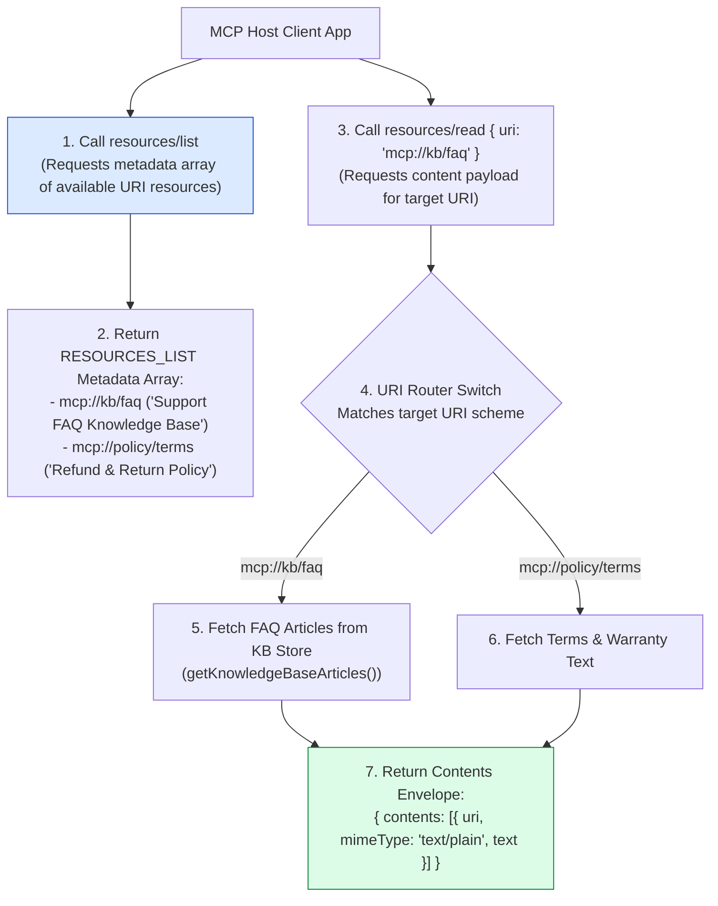
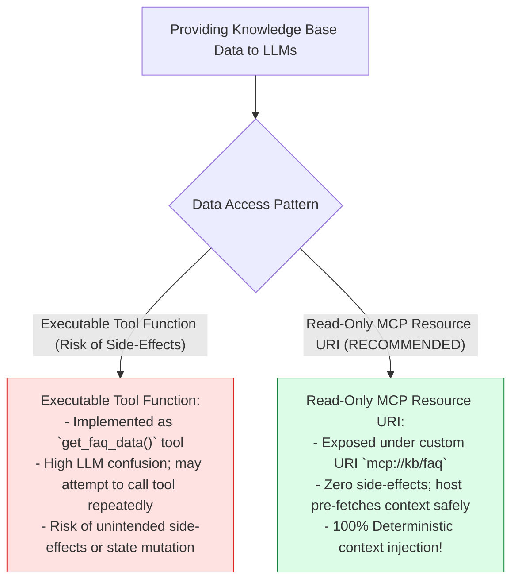
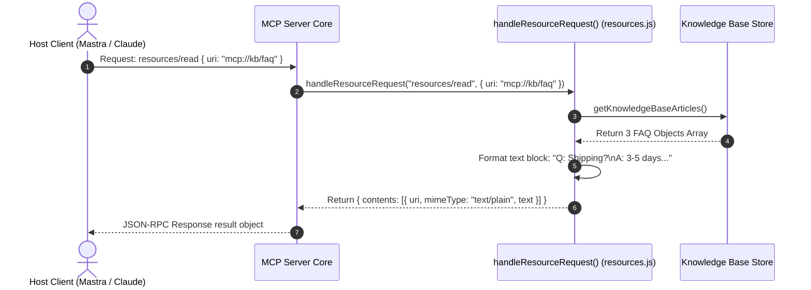

# Module 02: MCP Resources Primitive & URI Read-Only Data (`src/mcp/resources.js`)

## Overview

In the Model Context Protocol (MCP) specification, exposing contextual data (such as company policies, product documentation, or FAQ knowledge base articles) as executable tool functions introduces unnecessary risk of side-effects. The **MCP Resources Primitive (`src/mcp/resources.js`)** provides a standardized, read-only data access layer exposing static and dynamic assets over custom URI schemes (`mcp://kb/faq`, `mcp://policy/terms`). This allows host applications (like Claude Desktop or Mastra) to inspect resources via `resources/list` and fetch content via `resources/read` safely.

Understanding **Custom URI Schemes (`mcp://`)**, **`resources/list` Discovery Envelopes**, **`resources/read` Content Payloads**, and **Read-Only Context Boundaries** is essential for protocol design.

---

## 1. MCP Resources URI & Method Topology



---

## 2. Executable Tool Functions vs. Read-Only MCP Resources



### MCP Resources Schema Envelope Specification

| Schema Field | Data Type | Sample Resource Value | Technical Purpose |
| :--- | :--- | :--- | :--- |
| **`uri`** | `String` | `"mcp://kb/faq"` | Unique resource URI resource identifier string. |
| **`name`** | `String` | `"Support FAQ Knowledge Base"` | Human-readable title of the resource asset. |
| **`description`**| `String` | `"Frequently asked questions..."` | Summary description guiding host pre-fetching. |
| **`mimeType`** | `String` | `"text/plain"` \| `"application/json"` | Standard MIME type of returned content payload. |

---

## 3. Asynchronous Resource Reading Sequence



---

## 4. Code Walkthrough (`src/mcp/resources.js`)

```javascript
import { getKnowledgeBaseArticles } from "../integrations/knowledge-base.js";

/**
 * Metadata array of read-only MCP resources exposed by Seva MCP Server
 */
export const RESOURCES_LIST = [
  {
    uri: "mcp://kb/faq",
    name: "Support FAQ Knowledge Base",
    description: "Frequently asked questions regarding shipping, refunds, and order tracking",
    mimeType: "text/plain"
  },
  {
    uri: "mcp://policy/terms",
    name: "Refund & Return Policy",
    description: "Official 30-day return policy and warranty guidelines",
    mimeType: "text/plain"
  }
];

/**
 * Handles incoming 'resources/list' and 'resources/read' JSON-RPC requests
 * @param {string} method - RPC method string ("resources/list" | "resources/read")
 * @param {Object} params - Request parameters object (e.g. { uri: "mcp://kb/faq" })
 * @returns {Promise<Object>} Resource list or resource content payload envelope
 */
export async function handleResourceRequest(method, params = {}) {
  // 1. Handle 'resources/list' metadata query
  if (method === "resources/list") {
    console.error("⚡ [MCP RESOURCES] Handling 'resources/list' discovery request.");
    return { resources: RESOURCES_LIST };
  }

  // 2. Handle 'resources/read' content query
  if (method === "resources/read") {
    const { uri } = params;
    if (!uri) throw new Error("Parameter 'uri' is required for 'resources/read'.");

    console.error(`⚡ [MCP RESOURCES] Reading content payload for resource URI '${uri}'...`);

    if (uri === "mcp://kb/faq") {
      const articles = getKnowledgeBaseArticles();
      const formattedText = articles.map((a) => `Q: ${a.question}\nA: ${a.answer}`).join("\n\n---\n\n");

      return {
        contents: [
          {
            uri,
            mimeType: "text/plain",
            text: formattedText
          }
        ]
      };
    }

    if (uri === "mcp://policy/terms") {
      const termsText = `OFFICIAL SEVA REFUND & RETURN POLICY:
1. 30-day money-back guarantee for unused items in original packaging.
2. Return shipping fees are covered by customer unless product is defective.
3. Refunds are processed to original payment method within 5 business days.`;

      return {
        contents: [
          {
            uri,
            mimeType: "text/plain",
            text: termsText
          }
        ]
      };
    }

    throw new Error(`Resource URI '${uri}' is not registered on Seva MCP Server.`);
  }

  throw new Error(`Unsupported resources method '${method}'.`);
}
```

---

## Key Production Takeaways

1. **Expose Contextual Knowledge as Read-Only URIs**: Use MCP Resources (`mcp://`) rather than executable tools to provide static policies and FAQ data to LLMs safely.
2. **Use Clear `mcp://` URI Naming Schemes**: Follow structured URI paths (`mcp://kb/faq`, `mcp://policy/terms`) to categorize resources cleanly.
3. **Include Rich Metadata in `resources/list`**: Provide descriptive names and summaries in `resources/list` to guide LLM hosts on when to pre-fetch context.
4. **Format Content Payloads in Standard Envelopes**: Return content inside the standard `{ contents: [{ uri, mimeType, text }] }` object structure specified by the MCP protocol.


## Learn from the implementation

Use the matching source file as an executable example, not just something to copy. Before running it, state in your own words what data enters the module, what it returns, and which values it changes. Then trace one realistic request from the caller through each function.

Pay special attention to these questions:

- **Data flow:** Which object, array, string, or state value moves between functions? What shape must it have?
- **Control flow:** Which branch, loop, early return, or retry changes the outcome? What condition selects it?
- **Async boundaries:** Where does the code wait for an LLM, database, network, file system, or tool? What should happen if that operation rejects or returns no result?
- **Side effects:** Which lines log information, make an external request, store data, or mutate in-memory state? Keep those distinct from pure calculations.
- **Production limits:** Which assumptions are only safe for a tutorial—for example, in-memory storage, fixed thresholds, approximate token counts, mock data, or a hard-coded batch size?

A useful practice is to change one input at a time and predict the result before executing it. If you can explain why the output changed, when the module should be used, and one way it could fail, you understand the concept rather than only the syntax.
