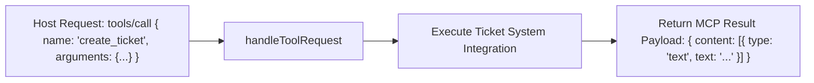

# File 03: MCP Tools Primitive (`src/mcp/tools.js`)

## Overview
The **MCP Tools Primitive** exposes executable functions (`create_ticket`, `check_ticket_status`, `escalate_to_human`) to host LLMs via structured JSON Schemas.

---

## 1. Tools Primitive Call Flow



---

## 2. Tools Primitive Implementation (`src/mcp/tools.js`)

```javascript
import { createSupportTicket, getTicketStatus } from "../integrations/ticket-system.js";
import { escalateToHumanAgent } from "../integrations/escalation.js";

export const TOOLS_LIST = [
    {
        name: "create_ticket",
        description: "Creates a new customer support ticket",
        inputSchema: {
            type: "object",
            properties: {
                userEmail: { type: "string" },
                issueSubject: { type: "string" },
                description: { type: "string" }
            },
            required: ["userEmail", "issueSubject", "description"]
        }
    },
    {
        name: "escalate_to_human",
        description: "Escalates complex issues to a human support representative",
        inputSchema: {
            type: "object",
            properties: {
                ticketId: { type: "string" },
                reason: { type: "string" }
            },
            required: ["ticketId", "reason"]
        }
    }
];

export async function handleToolRequest(method, params) {
    if (method === "tools/list") {
        return { tools: TOOLS_LIST };
    }

    if (method === "tools/call") {
        const { name, arguments: args } = params;

        if (name === "create_ticket") {
            const ticket = createSupportTicket(args.userEmail, args.issueSubject, args.description);
            return { content: [{ type: "text", text: JSON.stringify(ticket) }] };
        }
        if (name === "escalate_to_human") {
            const escalation = escalateToHumanAgent(args.ticketId, args.reason);
            return { content: [{ type: "text", text: JSON.stringify(escalation) }] };
        }

        throw new Error(`Tool '${name}' not found.`);
    }
}
```

---

## Key Takeaways
1. Defines JSON Schemas for executable customer support operations.
2. Wraps tool outputs in standard MCP text content objects.
