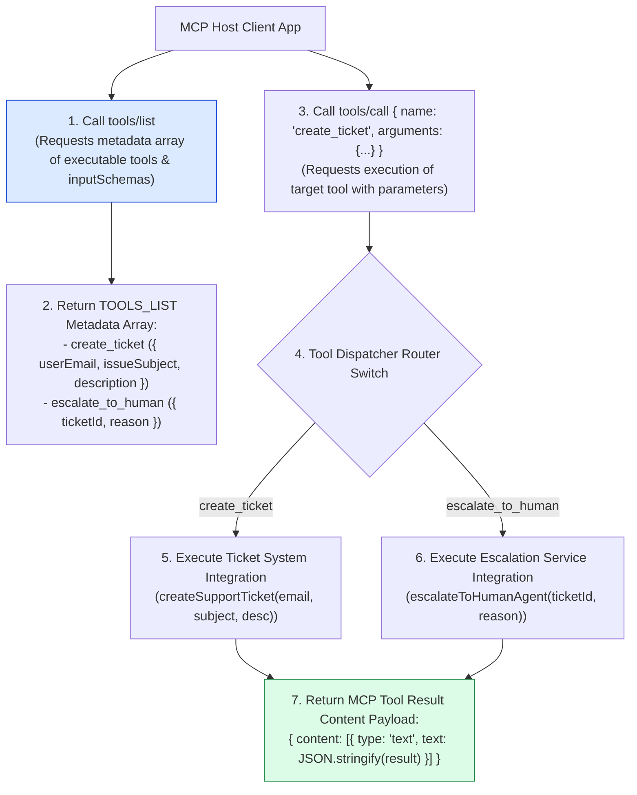
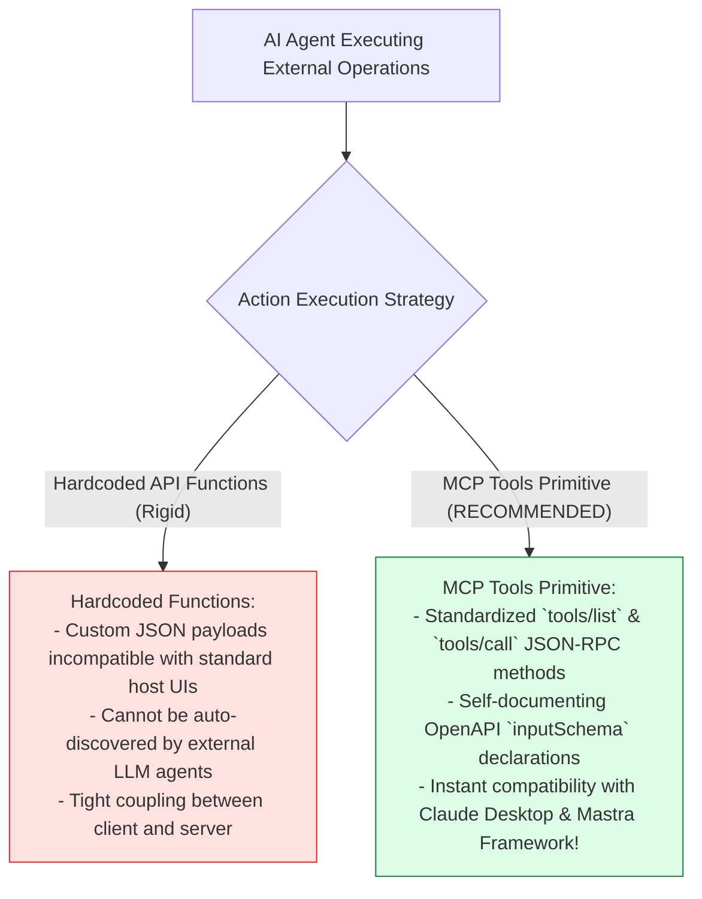
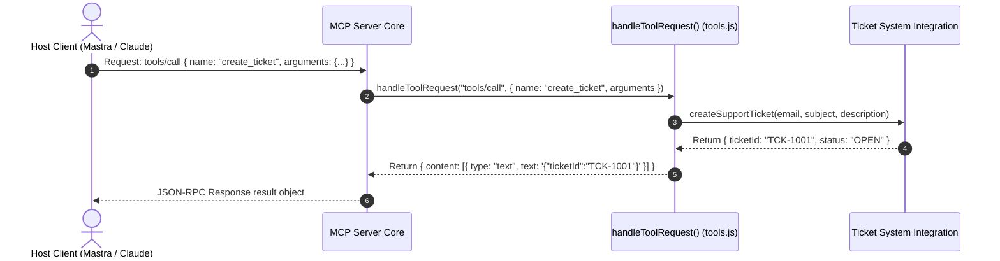

# Module 03: MCP Tools Primitive & Executable Handlers (`src/mcp/tools.js`)

## Overview

While MCP Resources provide read-only contextual assets, an active AI support agent must perform real-world side-effect actions (such as creating customer support tickets, checking order statuses, or escalating complex disputes to human supervisors). The **MCP Tools Primitive (`src/mcp/tools.js`)** defines OpenAPI-compliant JSON Schemas for executable support tools and routes incoming `tools/list` discovery queries and `tools/call` execution frames to underlying integration services.

Understanding **MCP Tool Schemas (`inputSchema`)**, **`tools/list` Capability Discovery**, **`tools/call` Execution Routers**, and **MCP Result Content Formatting (`content: [{ type: "text" }]`)** is essential for tool development.

---

## 1. MCP Tools Execution Topology



---

## 2. Hardcoded Monolithic APIs vs. MCP Tools Primitives



### MCP Tool Primitive Specification Matrix

| Tool Name | `inputSchema` Properties | Required Keys | Integration Module | Technical Purpose |
| :--- | :--- | :--- | :--- | :--- |
| **`create_ticket`** | `userEmail`, `issueSubject`, `description` | All 3 | `src/integrations/tickets.js` | Creates new support ticket in ticket database. |
| **`check_ticket_status`** | `ticketId` | `ticketId` | `src/integrations/tickets.js` | Queries status of existing support ticket. |
| **`escalate_to_human`** | `ticketId`, `reason` | All 2 | `src/integrations/escalation.js` | Pushes ticket to human agent escalation queue. |

---

## 3. Asynchronous Tool Execution Sequence



---

## 4. Code Walkthrough (`src/mcp/tools.js`)

```javascript
import { createSupportTicket, getTicketStatus } from "../integrations/ticket-system.js";
import { escalateToHumanAgent } from "../integrations/escalation.js";

/**
 * Metadata array of executable tools exposed by Seva MCP Server
 */
export const TOOLS_LIST = [
  {
    name: "create_ticket",
    description: "Creates a new customer support ticket in the ticketing system",
    inputSchema: {
      type: "object",
      properties: {
        userEmail: { type: "string", description: "Customer email address" },
        issueSubject: { type: "string", description: "Short summary subject of the issue" },
        description: { type: "string", description: "Detailed description of the customer problem" }
      },
      required: ["userEmail", "issueSubject", "description"]
    }
  },
  {
    name: "check_ticket_status",
    description: "Checks the active status and resolution details of an existing support ticket",
    inputSchema: {
      type: "object",
      properties: {
        ticketId: { type: "string", description: "Target support ticket identifier (e.g. 'TCK-1001')" }
      },
      required: ["ticketId"]
    }
  },
  {
    name: "escalate_to_human",
    description: "Escalates a complex or unresolved customer dispute to a human supervisor",
    inputSchema: {
      type: "object",
      properties: {
        ticketId: { type: "string", description: "Target support ticket ID to escalate" },
        reason: { type: "string", description: "Detailed justification for human escalation" }
      },
      required: ["ticketId", "reason"]
    }
  }
];

/**
 * Handles incoming 'tools/list' and 'tools/call' JSON-RPC requests
 * @param {string} method - RPC method string ("tools/list" | "tools/call")
 * @param {Object} params - Request parameters object
 * @returns {Promise<Object>} Tools list or tool execution result payload envelope
 */
export async function handleToolRequest(method, params = {}) {
  // 1. Handle 'tools/list' discovery query
  if (method === "tools/list") {
    console.error("⚡ [MCP TOOLS] Handling 'tools/list' capability discovery request.");
    return { tools: TOOLS_LIST };
  }

  // 2. Handle 'tools/call' execution query
  if (method === "tools/call") {
    const { name, arguments: args } = params;
    if (!name || !args) throw new Error("Parameters 'name' and 'arguments' are required for 'tools/call'.");

    console.error(`⚡ [MCP TOOLS] Executing tool '${name}' with arguments:`, JSON.stringify(args));

    if (name === "create_ticket") {
      const ticket = createSupportTicket(args.userEmail, args.issueSubject, args.description);
      return {
        content: [
          {
            type: "text",
            text: JSON.stringify(ticket, null, 2)
          }
        ]
      };
    }

    if (name === "check_ticket_status") {
      const status = getTicketStatus(args.ticketId);
      return {
        content: [
          {
            type: "text",
            text: JSON.stringify(status, null, 2)
          }
        ]
      };
    }

    if (name === "escalate_to_human") {
      const escalation = escalateToHumanAgent(args.ticketId, args.reason);
      return {
        content: [
          {
            type: "text",
            text: JSON.stringify(escalation, null, 2)
          }
        ]
      };
    }

    throw new Error(`Tool '${name}' is not registered on Seva MCP Server.`);
  }

  throw new Error(`Unsupported tools method '${method}'.`);
}
```

---

## Key Production Takeaways

1. **Provide OpenAPI-Compliant `inputSchema` Declarations**: Define explicit JSON Schema properties and required parameter arrays for every exposed MCP tool.
2. **Format Execution Results in Standard Content Objects**: Wrap tool outputs inside `content: [{ type: "text", text: JSON.stringify(result) }]` arrays as required by the MCP protocol specification.
3. **Decouple Tool Handlers from Integration Logic**: Keep `handleToolRequest()` focused on RPC dispatching while delegating actual work to integration modules (`tickets.js`, `escalation.js`).
4. **Log Tool Parameters for Audit Trails**: Log incoming tool names and arguments using `console.error` to build diagnostic audit trails.


## Learn from the implementation

Use the matching source file as an executable example, not just something to copy. Before running it, state in your own words what data enters the module, what it returns, and which values it changes. Then trace one realistic request from the caller through each function.

Pay special attention to these questions:

- **Data flow:** Which object, array, string, or state value moves between functions? What shape must it have?
- **Control flow:** Which branch, loop, early return, or retry changes the outcome? What condition selects it?
- **Async boundaries:** Where does the code wait for an LLM, database, network, file system, or tool? What should happen if that operation rejects or returns no result?
- **Side effects:** Which lines log information, make an external request, store data, or mutate in-memory state? Keep those distinct from pure calculations.
- **Production limits:** Which assumptions are only safe for a tutorial—for example, in-memory storage, fixed thresholds, approximate token counts, mock data, or a hard-coded batch size?

A useful practice is to change one input at a time and predict the result before executing it. If you can explain why the output changed, when the module should be used, and one way it could fail, you understand the concept rather than only the syntax.
