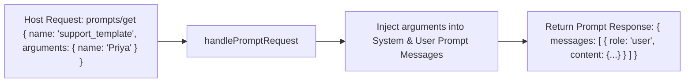

# File 04: MCP Prompts Primitive (`src/mcp/prompts.js`)

## Overview
The **MCP Prompts Primitive** provides pre-configured prompt templates to LLM hosts, allowing users to select standard support personas and arguments (`customer_name`, `issue_summary`) from UI dropdown menus.

---

## 1. Prompts Primitive Workflow



---

## 2. Prompts Primitive Implementation (`src/mcp/prompts.js`)

```javascript
export const PROMPTS_LIST = [
    {
        name: "support_template",
        description: "Standard customer support assistant persona prompt",
        arguments: [
            { name: "customerName", description: "Name of the customer", required: false },
            { name: "issueCategory", description: "Category of issue e.g. Shipping, Billing", required: false }
        ]
    }
];

export async function handlePromptRequest(method, params) {
    if (method === "prompts/list") {
        return { prompts: PROMPTS_LIST };
    }

    if (method === "prompts/get") {
        const { name, arguments: args = {} } = params;

        if (name === "support_template") {
            const customerName = args.customerName || "Valued Customer";
            const category = args.issueCategory || "General Inquiry";

            return {
                description: `Support prompt for ${customerName}`,
                messages: [
                    {
                        role: "user",
                        content: {
                            type: "text",
                            text: `You are Seva, an empathetic customer support AI assistant for TechCorp. You are speaking with ${customerName} regarding a ${category} issue. Greet them warmly and assist them using available tools.`
                        }
                    }
                ]
            };
        }

        throw new Error(`Prompt '${name}' not found.`);
    }
}
```

---

## Key Takeaways
1. Exposes reusable prompt templates over the MCP protocol.
2. Parameterizes prompts cleanly using prompt arguments.
