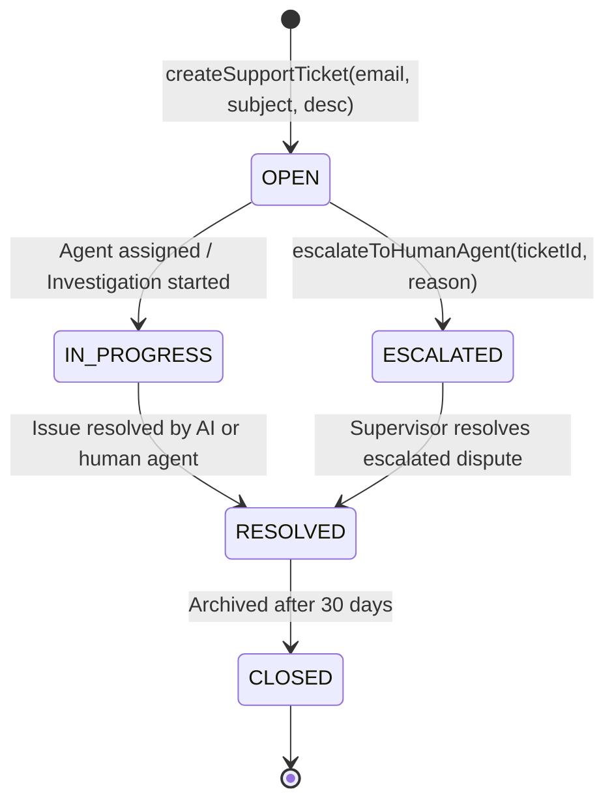
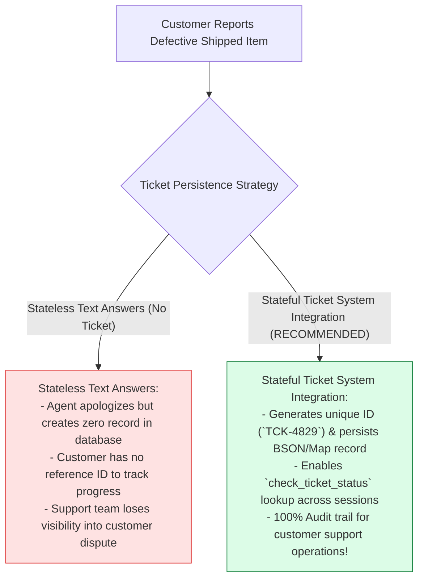
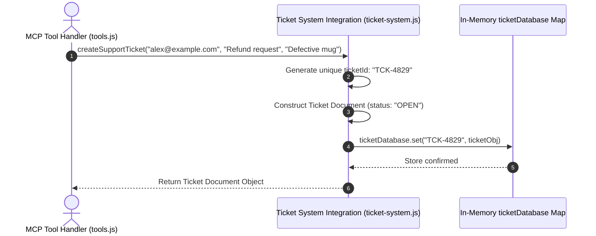

# Module 05: Ticketing System Backend Integration (`src/integrations/ticket-system.js`)

## Overview

A core capability of an AI customer support platform is persisting customer inquiries into an enterprise ticketing system (simulating Zendesk, Freshdesk, or Jira Service Desk). The **Ticket System Integration (`src/integrations/ticket-system.js`)** provides an in-memory transactional ticket repository that handles ticket creation (`createSupportTicket`), unique ID generation (`TCK-xxxx`), and status retrieval (`getTicketStatus`), powering the execution of the `create_ticket` and `check_ticket_status` MCP tools.

Understanding **Ticket State Machine Lifecycles**, **Transactional In-Memory Repositories**, **Unique Ticket Key Generators**, and **Status Query Contracts** is essential for integration engineering.

---

## 1. Ticket State Machine Lifecycle Topology



---

## 2. Stateless Helpdesk Responses vs. Stateful Ticket Persistence



### Ticket Document Schema Specification

| Property Name | Data Type | Sample Document Value | Technical Purpose |
| :--- | :--- | :--- | :--- |
| **`ticketId`** | `String` | `"TCK-4829"` | Unique primary ticket key identifier string. |
| **`userEmail`** | `String` | `"alex@example.com"` | Customer contact email address. |
| **`issueSubject`** | `String` | `"Item damaged during transit"` | Short summary subject title. |
| **`description`** | `String` | `"Package box arrived crushed..."` | Detailed description of customer issue. |
| **`status`** | `String` | `"OPEN" \| "ESCALATED"` | Current ticket state machine status flag. |
| **`createdAt`** | `String` | ISO 8601 Timestamp | ISO timestamp recording ticket creation time. |

---

## 3. Asynchronous Ticket Creation Sequence



---

## 4. Code Walkthrough (`src/integrations/ticket-system.js`)

```javascript
/**
 * In-memory repository simulating an enterprise ticketing database (Zendesk / Jira)
 */
const ticketDatabase = new Map();

/**
 * Creates and persists a new customer support ticket
 * @param {string} userEmail - Customer email address
 * @param {string} issueSubject - Issue subject line
 * @param {string} description - Detailed problem description
 * @returns {Object} Newly created ticket document object
 */
export function createSupportTicket(userEmail, issueSubject, description) {
  if (!userEmail || !issueSubject || !description) {
    throw new Error("[TICKET SYSTEM ERROR] All fields (userEmail, issueSubject, description) are required.");
  }

  // Generate unique 4-digit numeric ticket identifier
  const randomId = Math.floor(1000 + Math.random() * 9000);
  const ticketId = `TCK-${randomId}`;

  const ticket = {
    ticketId,
    userEmail: userEmail.trim(),
    issueSubject: issueSubject.trim(),
    description: description.trim(),
    status: "OPEN",
    createdAt: new Date().toISOString()
  };

  ticketDatabase.set(ticketId, ticket);
  console.error(`🎫 [TICKET SYSTEM] Successfully created ticket '${ticketId}' for user '${userEmail}'.`);

  return { ...ticket };
}

/**
 * Fetches an existing support ticket document by ID
 * @param {string} ticketId - Target ticket ID string
 * @returns {Object} Ticket document object or error object
 */
export function getTicketStatus(ticketId) {
  if (!ticketId) {
    throw new Error("[TICKET SYSTEM ERROR] Parameter 'ticketId' string is required.");
  }

  const cleanId = String(ticketId).trim().toUpperCase();
  const ticket = ticketDatabase.get(cleanId);

  if (!ticket) {
    console.error(`⚠️ [TICKET SYSTEM] Ticket ID '${cleanId}' not found in database.`);
    return { error: `Support ticket '${cleanId}' was not found in the ticketing system.` };
  }

  console.error(`🔍 [TICKET SYSTEM] Retrieved status for ticket '${cleanId}': Status = ${ticket.status}`);
  return { ...ticket };
}

/**
 * Internal helper for escalation status updates
 */
export function updateTicketStatusInternal(ticketId, newStatus) {
  const ticket = ticketDatabase.get(ticketId);
  if (ticket) {
    ticket.status = newStatus;
    ticket.updatedAt = new Date().toISOString();
    ticketDatabase.set(ticketId, ticket);
  }
}
```

---

## Key Production Takeaways

1. **Generate Deterministic Unique Ticket IDs**: Formulate clear ticket identifiers (`TCK-xxxx`) to provide customers with reference numbers.
2. **Track State Machine Statuses**: Maintain explicit ticket statuses (`"OPEN"`, `"IN_PROGRESS"`, `"ESCALATED"`, `"RESOLVED"`) to govern support workflows.
3. **Decouple Integration Storage from Protocol Handlers**: Isolate database Map operations inside `src/integrations/ticket-system.js` so MCP tools simply invoke exported functions.
4. **Log State Mutations via `console.error`**: Use `console.error` to log ticket state transitions without interfering with JSON-RPC Stdio stdout streams.

