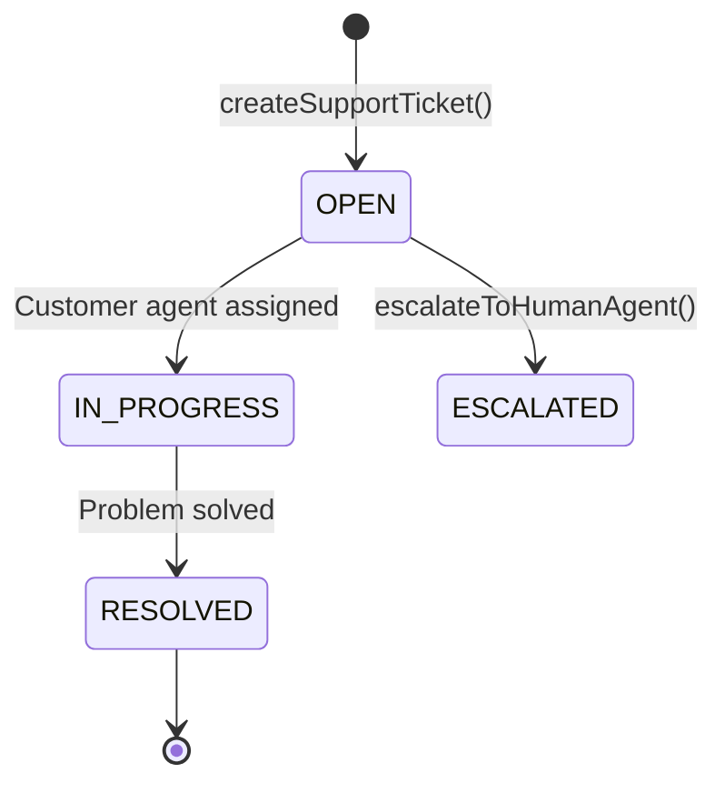

# File 05: Ticket System Integration (`src/integrations/ticket-system.js`)

## Overview
The **Ticket System Integration** simulates a customer support ticketing backend (Zendesk / Jira), creating, updating, and querying ticket status states.

---

## 1. Ticket System State Lifecycle



---

## 2. Ticket System Implementation (`src/integrations/ticket-system.js`)

```javascript
const ticketDatabase = new Map();

export function createSupportTicket(userEmail, issueSubject, description) {
    const ticketId = `TICK-${Math.floor(1000 + Math.random() * 9000)}`;
    const ticket = {
        ticketId,
        userEmail,
        issueSubject,
        description,
        status: "OPEN",
        createdAt: new Date().toISOString()
    };

    ticketDatabase.set(ticketId, ticket);
    console.error(`[TICKET SYSTEM] Created ticket: ${ticketId}`);
    return ticket;
}

export function getTicketStatus(ticketId) {
    const ticket = ticketDatabase.get(ticketId);
    if (!ticket) {
        return { error: `Ticket '${ticketId}' not found.` };
    }
    return ticket;
}
```

---

## Key Takeaways
1. Generates unique ticket tracking IDs (`TICK-xxxx`).
2. Provides backend integration logic wrapped by MCP tools.
