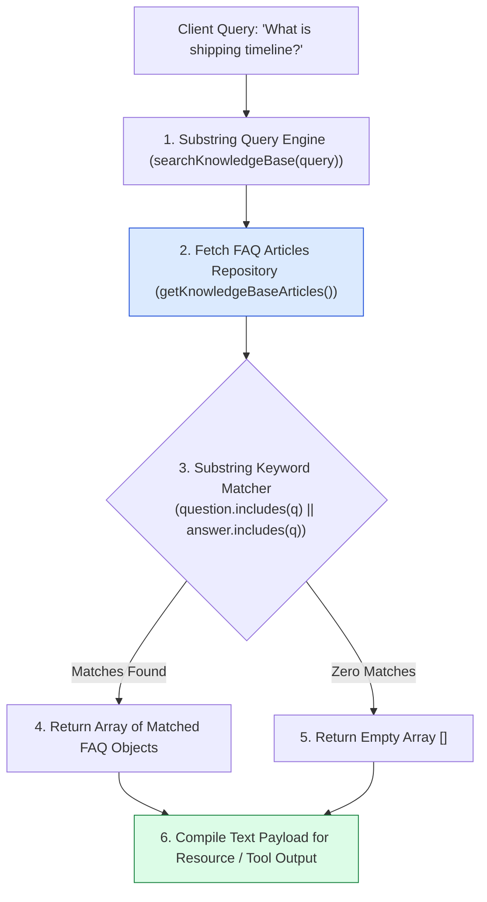
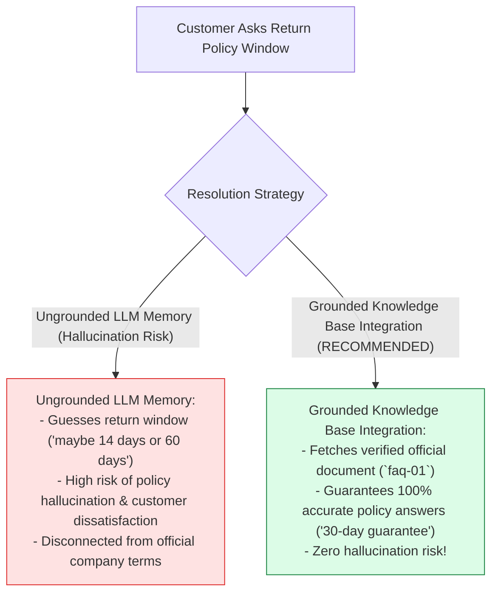
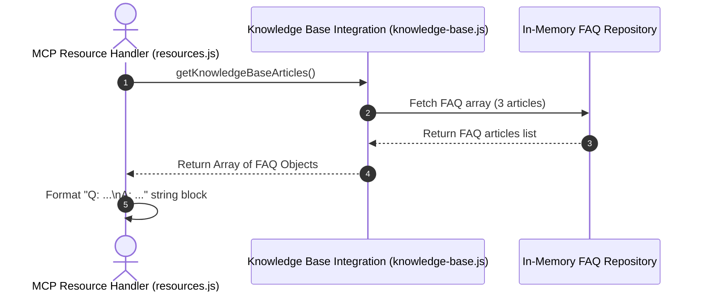

# Module 06: Knowledge Base DB Integration (`src/integrations/knowledge-base.js`)

## Overview

Self-service resolution of customer inquiries requires instant access to accurate FAQ documentation (such as shipping timelines, return policies, and warranty rules). The **Knowledge Base Integration (`src/integrations/knowledge-base.js`)** provides an in-memory document repository powering both the `mcp://kb/faq` read-only MCP Resource and the `searchKnowledgeBase` query engine.

Understanding **Knowledge Base Document Schemas**, **Substring Keyword Matching**, **Resource Content Payload Compilation**, and **Offline Document Repositories** is essential for self-service engines.

---

## 1. Knowledge Base Query Topology



---

## 2. Hardcoded LLM Answers vs. Grounded Knowledge Base Queries



### Knowledge Base Article Document Schema Specification

| Property Name | Data Type | Sample Document Value | Technical Purpose |
| :--- | :--- | :--- | :--- |
| **`id`** | `String` | `"faq-01"` | Unique article identifier string. |
| **`category`** | `String` | `"Shipping"` \| `"Returns"` | Categorical domain classification tag. |
| **`question`** | `String` | `"What is your refund policy?"` | Standard customer question text. |
| **`answer`** | `String` | `"We offer a full 30-day..."` | Verified official answer text. |

---

## 3. Asynchronous Knowledge Base Lookup Sequence



---

## 4. Code Walkthrough (`src/integrations/knowledge-base.js`)

```javascript
/**
 * In-memory repository of official company FAQ knowledge base articles
 */
const FAQ_ARTICLES = [
  {
    id: "faq-01",
    category: "Returns",
    question: "What is your refund policy?",
    answer: "We offer a full 30-day money-back guarantee for all unused items returned in their original packaging."
  },
  {
    id: "faq-02",
    category: "Shipping",
    question: "How long does shipping take?",
    answer: "Standard domestic shipping takes 3 to 5 business days. Express shipping takes 1 to 2 business days."
  },
  {
    id: "faq-03",
    category: "Orders",
    question: "How can I track my order?",
    answer: "Once your order ships, you will receive an email with a tracking link. You can also query order status using your ticket ID."
  }
];

/**
 * Returns list of all available Knowledge Base FAQ articles
 * Used by the `mcp://kb/faq` MCP Resource
 * @returns {Array<Object>} Array of FAQ article objects
 */
export function getKnowledgeBaseArticles() {
  console.error(`📚 [KB INTEGRATION] Retreiving ${FAQ_ARTICLES.length} FAQ articles...`);
  return FAQ_ARTICLES.map((article) => ({ ...article }));
}

/**
 * Searches Knowledge Base articles by keyword substring matching
 * @param {string} query - Search query string
 * @returns {Array<Object>} Filtered array of matching FAQ articles
 */
export function searchKnowledgeBase(query = "") {
  if (!query || typeof query !== "string") {
    return getKnowledgeBaseArticles();
  }

  const qLower = query.toLowerCase().trim();
  console.error(`🔍 [KB INTEGRATION] Searching FAQ articles for query: "${query}"...`);

  const matches = FAQ_ARTICLES.filter(
    (article) =>
      article.question.toLowerCase().includes(qLower) ||
      article.answer.toLowerCase().includes(qLower) ||
      article.category.toLowerCase().includes(qLower)
  );

  console.error(`✅ [KB INTEGRATION SUCCESS] Found ${matches.length} matching FAQ articles.`);
  return matches.map((m) => ({ ...m }));
}
```

---

## Key Production Takeaways

1. **Ground Customer Answers in Official Articles**: Provide structured FAQ articles (`FAQ_ARTICLES`) to prevent LLM hallucinations on return policies or shipping windows.
2. **Expose Pure Read Functions for Resources**: Provide clean getter functions (`getKnowledgeBaseArticles()`) so the `mcp://kb/faq` resource can fetch raw data easily.
3. **Case-Insensitive Substring Keyword Searching**: Support case-insensitive keyword filtering across `question`, `answer`, and `category` fields.
4. **Log Knowledge Base Calls to `console.error`**: Use `console.error` for diagnostic logs to preserve stdout standard JSON-RPC framing.


## Learn from the implementation

Use the matching source file as an executable example, not just something to copy. Before running it, state in your own words what data enters the module, what it returns, and which values it changes. Then trace one realistic request from the caller through each function.

Pay special attention to these questions:

- **Data flow:** Which object, array, string, or state value moves between functions? What shape must it have?
- **Control flow:** Which branch, loop, early return, or retry changes the outcome? What condition selects it?
- **Async boundaries:** Where does the code wait for an LLM, database, network, file system, or tool? What should happen if that operation rejects or returns no result?
- **Side effects:** Which lines log information, make an external request, store data, or mutate in-memory state? Keep those distinct from pure calculations.
- **Production limits:** Which assumptions are only safe for a tutorial—for example, in-memory storage, fixed thresholds, approximate token counts, mock data, or a hard-coded batch size?

A useful practice is to change one input at a time and predict the result before executing it. If you can explain why the output changed, when the module should be used, and one way it could fail, you understand the concept rather than only the syntax.
