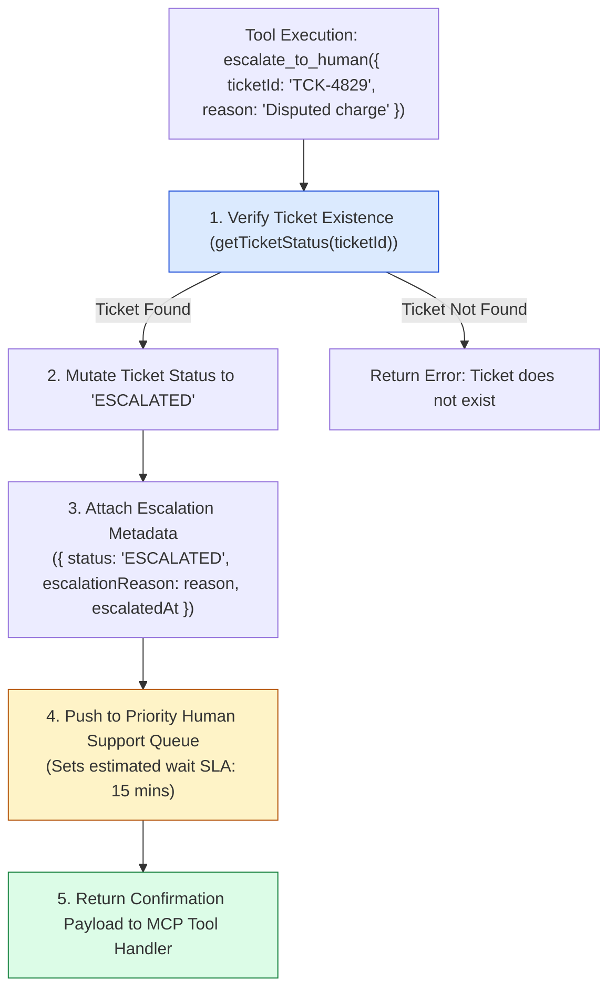
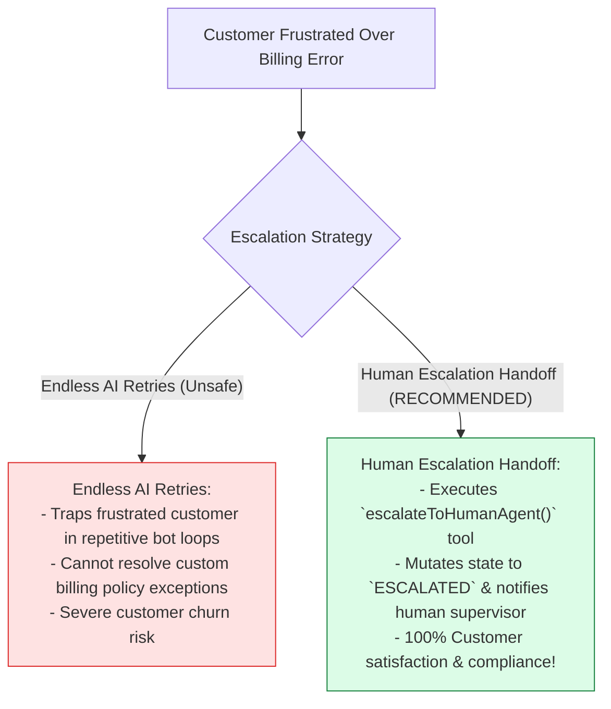
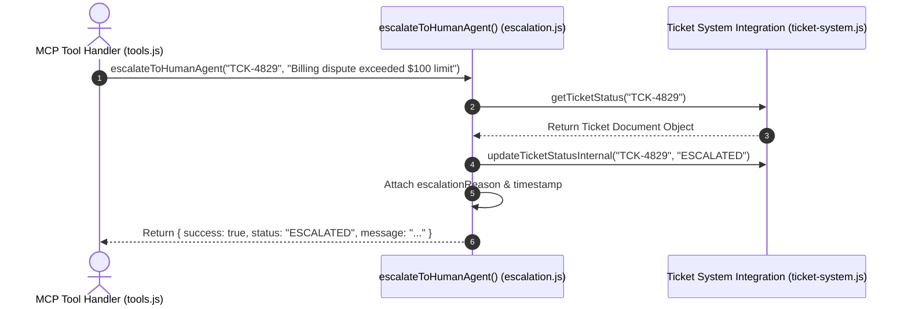

# Module 07: Human Escalation Backend Integration (`src/integrations/escalation.js`)

## Overview

When an automated customer support agent encounters complex disputes, high customer frustration, or out-of-scope requests, attempting to answer without human oversight risks damaging customer trust. The **Human Escalation Integration (`src/integrations/escalation.js`)** provides a secure handoff mechanism (`escalateToHumanAgent`) that updates ticket statuses to `ESCALATED`, attaches detailed justification reasons, and pushes tickets into high-priority human support queues.

Understanding **Human Handoff Workflows**, **Ticket State Mutations (`ESCALATED`)**, **Priority Queue Integration**, and **Estimated SLA Messaging** is essential for support systems.

---

## 1. Human Escalation Handoff Topology



---

## 2. Endless AI Retry Loops vs. Seamless Human Handoffs



### Escalation Response Payload Schema Specification

| Property Name | Data Type | Sample Response Value | Technical Purpose |
| :--- | :--- | :--- | :--- |
| **`success`** | `Boolean` | `true` | Indicates successful human escalation handoff. |
| **`ticketId`** | `String` | `"TCK-4829"` | Unique ID of the escalated support ticket. |
| **`status`** | `String` | `"ESCALATED"` | Updated ticket status flag. |
| **`message`** | `String` | `"Your ticket has been transferred..."` | Reassuring SLA customer message string. |

---

## 3. Asynchronous Human Escalation Sequence



---

## 4. Code Walkthrough (`src/integrations/escalation.js`)

```javascript
import { getTicketStatus, updateTicketStatusInternal } from "./ticket-system.js";

/**
 * Escalates an existing support ticket to a human support agent queue
 * @param {string} ticketId - Target ticket ID string to escalate
 * @param {string} reason - Detailed justification reason for human escalation
 * @returns {Object} Escalation confirmation object or error envelope
 */
export function escalateToHumanAgent(ticketId, reason) {
  if (!ticketId || !reason) {
    throw new Error("[ESCALATION ERROR] Both 'ticketId' and 'reason' are required.");
  }

  console.error(`🚨 [ESCALATION] Processing human escalation request for ticket '${ticketId}'...`);

  // Step 1: Verify target ticket existence in ticket system
  const ticket = getTicketStatus(ticketId);
  if (ticket.error) {
    console.error(`⚠️ [ESCALATION FAILED] Cannot escalate: ${ticket.error}`);
    return { error: ticket.error };
  }

  // Step 2: Mutate ticket status to ESCALATED and attach metadata
  updateTicketStatusInternal(ticketId, "ESCALATED");
  ticket.escalatedAt = new Date().toISOString();
  ticket.escalationReason = String(reason).trim();

  console.error(`✅ [ESCALATION SUCCESS] Ticket '${ticketId}' moved to High-Priority Human Queue. Reason: "${reason}"`);

  // Step 3: Return confirmation payload with customer SLA message
  return {
    success: true,
    ticketId,
    status: "ESCALATED",
    reason: ticket.escalationReason,
    escalatedAt: ticket.escalatedAt,
    message: "Your ticket has been transferred to a senior human support specialist. Estimated wait time: 15 minutes."
  };
}
```

---

## Key Production Takeaways

1. **Provide Seamless Human Handoff Options**: Always equip support AI systems with a dedicated escalation tool (`escalate_to_human`) to hand off complex disputes safely.
2. **Mutate Ticket Status State to `ESCALATED`**: Update the underlying ticket database status (`status = "ESCALATED"`) to alert human support queues.
3. **Capture Detailed Escalation Justifications**: Store the explicit escalation reason (`escalationReason`) to give human agents full context when taking over.
4. **Reassure Customers with SLA Messaging**: Return clear customer-facing messages specifying estimated response times (e.g. *"Estimated wait time: 15 minutes"*).

