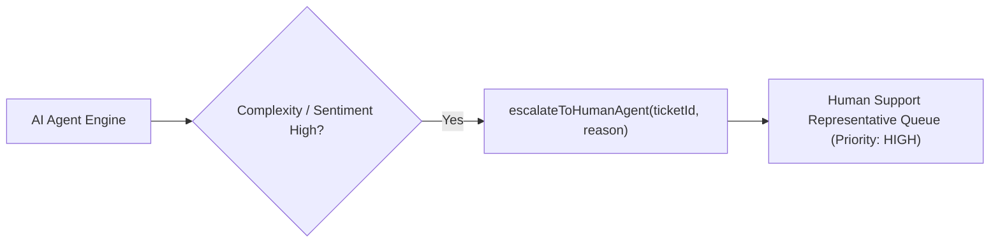

# File 07: Human Escalation Integration (`src/integrations/escalation.js`)

## Overview
The **Human Escalation Integration** routes complex, frustrated, or out-of-scope customer issues to human support representatives.

---

## 1. Human Escalation Architecture



---

## 2. Escalation Implementation (`src/integrations/escalation.js`)

```javascript
import { getTicketStatus } from "./ticket-system.js";

export function escalateToHumanAgent(ticketId, reason) {
    const ticket = getTicketStatus(ticketId);
    if (ticket.error) {
        return { error: ticket.error };
    }

    ticket.status = "ESCALATED";
    ticket.escalatedAt = new Date().toISOString();
    ticket.escalationReason = reason;

    console.error(`[ESCALATION] Ticket ${ticketId} escalated to human agent queue. Reason: ${reason}`);

    return {
        success: true,
        ticketId,
        status: "ESCALATED",
        message: "Your ticket has been transferred to a senior human support specialist. Estimated wait time: 15 minutes."
    };
}
```

---

## Key Takeaways
1. Safely hands off complex support conversations to human agents.
2. Updates ticket state to `ESCALATED` in the ticketing database.
