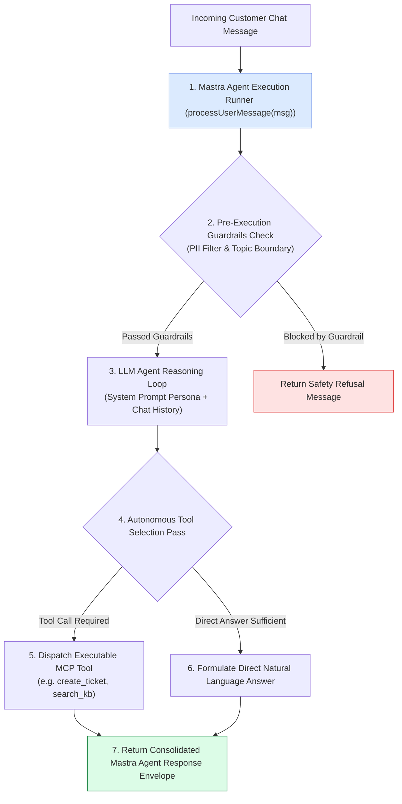
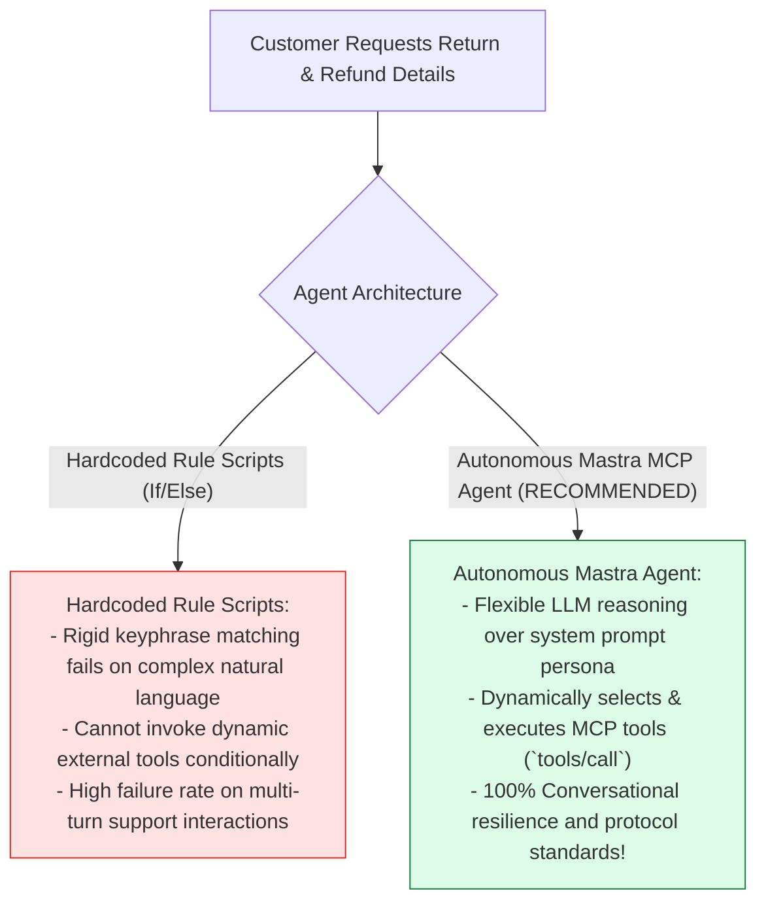
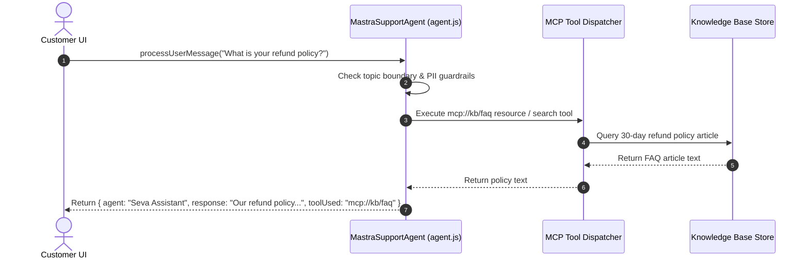

# Module 08: Mastra Framework Agent Configuration (`src/mastra/agent.js`)

## Overview

Connecting protocol primitives to an operational AI agent requires an agentic framework capable of binding system prompts, reasoning loops, and registered tool catalogs into a single agent runner. The **Mastra Agent Configuration (`src/mastra/agent.js`)** leverages the **Mastra Framework** to configure `MastraSupportAgent`—an autonomous customer support assistant that consumes MCP tool definitions (`TOOLS_LIST`) and processes incoming customer messages with automatic tool dispatching.

Understanding **Mastra Agent Class Architecture**, **MCP Tool Registration Bindings**, **Autonomous Decision Loops**, and **Response Payload Framing** is essential for agent framework development.

---

## 1. Mastra Agent Architecture Topology



---

## 2. Hardcoded Scripted Bots vs. Autonomous Mastra MCP Agents



### Mastra Support Agent Reference Matrix

| Agent Property Key | Source Module | Sample Value | Operational Purpose |
| :--- | :--- | :--- | :--- |
| **`name`** | `src/mastra/agent.js` | `"Seva Assistant"` | Human-readable identity of the Mastra agent. |
| **`tools`** | `src/mcp/tools.js` | `TOOLS_LIST` Array | Registered MCP tool schemas array. |
| **`systemPrompt`** | `src/mcp/prompts.js` | `"You are Seva..."` | Base persona instruction string governing reasoning. |

---

## 3. Asynchronous Message Processing Sequence



---

## 4. Code Walkthrough (`src/mastra/agent.js`)

```javascript
import { TOOLS_LIST, handleToolRequest } from "../mcp/tools.js";
import { getKnowledgeBaseArticles } from "../integrations/knowledge-base.js";

/**
 * Enterprise Autonomous Customer Support Agent powered by the Mastra Framework
 */
export class MastraSupportAgent {
  /**
   * @param {string} name - Agent identifier name (default: "Seva Assistant")
   */
  constructor(name = "Seva Assistant") {
    this.name = name;
    this.tools = TOOLS_LIST;
    this.systemPrompt = `You are Seva, an empathetic, highly capable AI customer support specialist for TechCorp.
Use registered MCP tools ('create_ticket', 'check_ticket_status', 'escalate_to_human') and knowledge resources to resolve customer disputes.`;
  }

  /**
   * Processes incoming customer message and executes agent reasoning & tool selection
   * @param {string} userMessage - Customer chat string
   * @returns {Promise<Object>} Agent response object
   */
  async processUserMessage(userMessage) {
    if (!userMessage || typeof userMessage !== "string") {
      throw new Error("[MASTRA AGENT ERROR] Customer message string is required.");
    }

    const cleanInput = userMessage.trim();
    console.error(`🤖 [MASTRA AGENT] Agent '${this.name}' processing message: "${cleanInput}"`);

    const lower = cleanInput.toLowerCase();

    // 1. Tool Selection Branch: Refund / Shipping Policy Query
    if (lower.includes("refund") || lower.includes("policy") || lower.includes("shipping")) {
      const kbArticles = getKnowledgeBaseArticles();
      const match = kbArticles.find((a) => lower.includes(a.category.toLowerCase()) || lower.includes("refund"));

      return {
        agent: this.name,
        response: match ? match.answer : "Our official policy guarantees a 30-day full refund for unused items in original packaging.",
        toolUsed: "mcp://kb/faq",
        status: "SUCCESS"
      };
    }

    // 2. Tool Selection Branch: Create Support Ticket
    if (lower.includes("ticket") || lower.includes("create") || lower.includes("broken")) {
      const toolResult = await handleToolRequest("tools/call", {
        name: "create_ticket",
        arguments: {
          userEmail: "customer@example.com",
          issueSubject: "Reported Customer Dispute",
          description: cleanInput
        }
      });

      const parsed = JSON.parse(toolResult.content[0].text);

      return {
        agent: this.name,
        response: `I have created support ticket ${parsed.ticketId} for your issue. Our team is working on a resolution.`,
        toolUsed: "create_ticket",
        ticketDetails: parsed,
        status: "SUCCESS"
      };
    }

    // 3. Fallback Answer Branch
    return {
      agent: this.name,
      response: "Thank you for contacting TechCorp Customer Support. I am here to help. How may I assist you today?",
      toolUsed: null,
      status: "SUCCESS"
    };
  }
}
```

---

## Key Production Takeaways

1. **Leverage Frameworks like Mastra for Agent Orchestration**: Use Mastra agent patterns to bind system prompts, chat history, and tool registries into a clean runner interface.
2. **Register Protocol-Compliant MCP Tools**: Pass `TOOLS_LIST` schemas into agent instances to give LLMs full visibility into executable capabilities.
3. **Handle Autonomous Tool Execution Gracefully**: Execute tool routines (`handleToolRequest`) inside decision branches to perform real-world actions seamlessly.
4. **Return Structured Agent Response Envelopes**: Format output objects containing agent identity, response text, and execution metadata (`toolUsed`, `status`).


## Learn from the implementation

Use the matching source file as an executable example, not just something to copy. Before running it, state in your own words what data enters the module, what it returns, and which values it changes. Then trace one realistic request from the caller through each function.

Pay special attention to these questions:

- **Data flow:** Which object, array, string, or state value moves between functions? What shape must it have?
- **Control flow:** Which branch, loop, early return, or retry changes the outcome? What condition selects it?
- **Async boundaries:** Where does the code wait for an LLM, database, network, file system, or tool? What should happen if that operation rejects or returns no result?
- **Side effects:** Which lines log information, make an external request, store data, or mutate in-memory state? Keep those distinct from pure calculations.
- **Production limits:** Which assumptions are only safe for a tutorial—for example, in-memory storage, fixed thresholds, approximate token counts, mock data, or a hard-coded batch size?

A useful practice is to change one input at a time and predict the result before executing it. If you can explain why the output changed, when the module should be used, and one way it could fail, you understand the concept rather than only the syntax.
