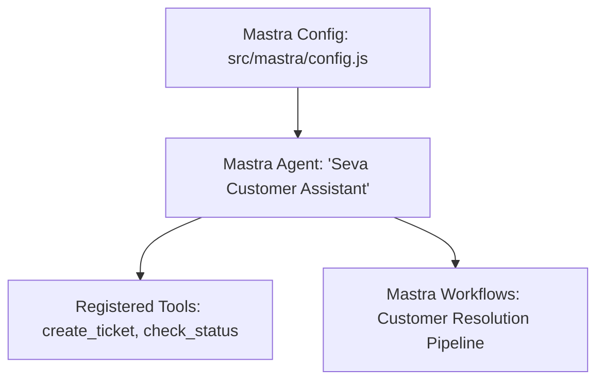

# File 08: Mastra Agent Configuration (`src/mastra/agent.js` & `config.js`)

## Overview
The **Mastra Agent Configuration** configures an autonomous support agent using the **Mastra Agentic Framework**, connecting system prompts, LLM engines, and MCP tool declarations.

---

## 1. Mastra Framework Architecture



---

## 2. Mastra Agent Implementation (`src/mastra/agent.js`)

```javascript
import { TOOLS_LIST } from "../mcp/tools.js";

export class MastraSupportAgent {
    constructor(name = "Seva Assistant") {
        this.name = name;
        this.tools = TOOLS_LIST;
        this.systemPrompt = `You are Seva, an AI customer support specialist for TechCorp. Be polite, helpful, and clear. Use registered tools to resolve customer queries.`;
    }

    async processUserMessage(userMessage) {
        console.log(`[MASTRA AGENT] Received message: "${userMessage}"`);

        // Simulated Agent Tool Execution Loop
        if (userMessage.toLowerCase().includes("refund")) {
            return {
                agent: this.name,
                response: "Our refund policy allows returns within 30 days of purchase for unused items.",
                toolUsed: "mcp://kb/faq"
            };
        }

        return {
            agent: this.name,
            response: "I have logged your request. How else can I assist you today?",
            toolUsed: null
        };
    }
}
```

---

## Key Takeaways
1. Integrates with modern agentic framework structures (**Mastra**).
2. Connects MCP primitive tool definitions directly into agent reasoning instances.
