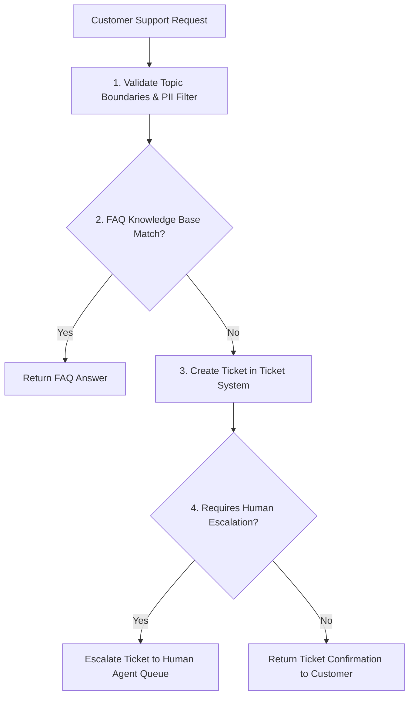

# File 10: Mastra Support Workflows (`src/mastra/workflows.js`)

## Overview
**Mastra Workflows** orchestrate multi-step support automation sequences: **Validate Query** $\rightarrow$ **Check Knowledge Base** $\rightarrow$ **Create Ticket (if unresolved)** $\rightarrow$ **Escalate (if high severity)**.

---

## 1. Support Resolution Workflow Pipeline



---

## 2. Mastra Workflow Implementation (`src/mastra/workflows.js`)

```javascript
import { searchKnowledgeBase } from "../integrations/knowledge-base.js";
import { createSupportTicket } from "../integrations/ticket-system.js";
import { escalateToHumanAgent } from "../integrations/escalation.js";

export async function runCustomerSupportWorkflow(userEmail, query, isUrgent = false) {
    console.log(`[WORKFLOW START] Processing query for ${userEmail}`);

    // Step 1: Check FAQ Knowledge Base
    const faqMatches = searchKnowledgeBase(query);
    if (faqMatches.length > 0) {
        return {
            status: "RESOLVED_VIA_FAQ",
            answer: faqMatches[0].answer,
            articleId: faqMatches[0].id
        };
    }

    // Step 2: Create Support Ticket
    const ticket = createSupportTicket(userEmail, query, query);

    // Step 3: Check Escalation
    if (isUrgent || query.toLowerCase().includes("urgent")) {
        const escalation = escalateToHumanAgent(ticket.ticketId, "Customer marked request as urgent.");
        return {
            status: "ESCALATED",
            ticketId: ticket.ticketId,
            message: escalation.message
        };
    }

    return {
        status: "TICKET_CREATED",
        ticketId: ticket.ticketId,
        message: "Your support ticket has been created. An agent will respond shortly."
    };
}
```

---

## Key Takeaways
1. Automates multi-branch support ticket resolution flows.
2. Integrates knowledge base lookup before creating new backend tickets.
