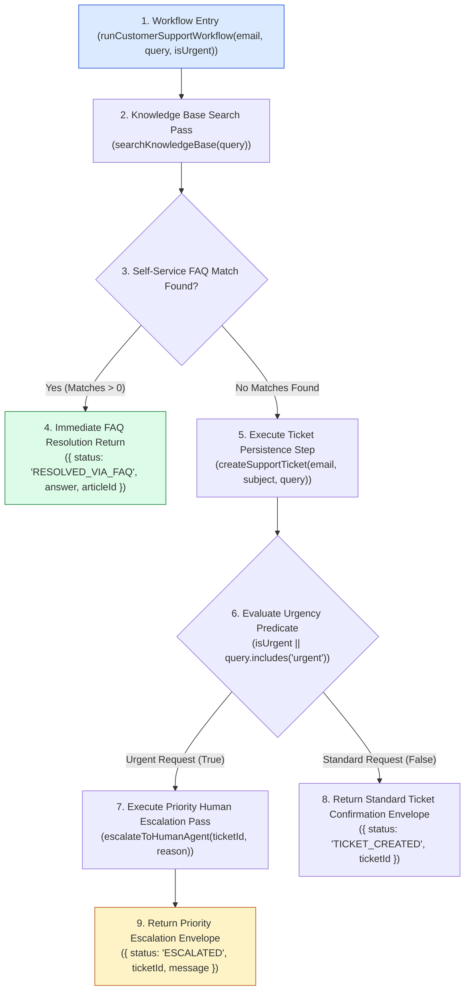
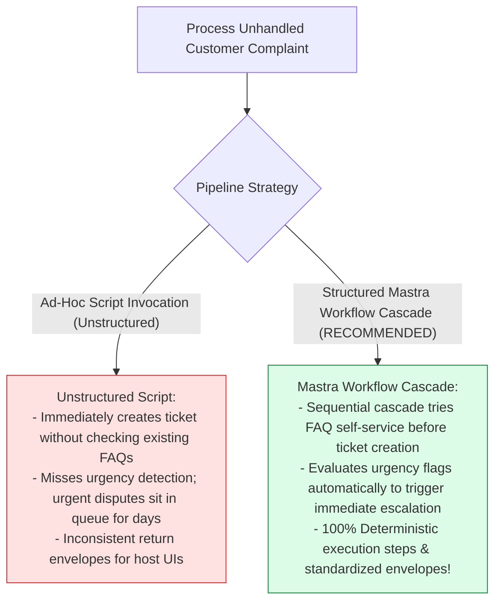
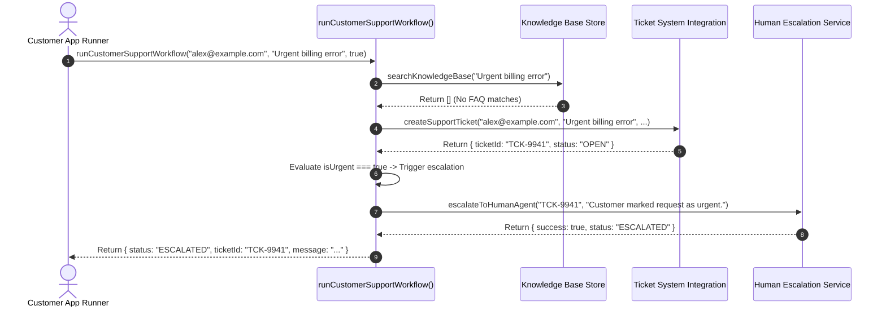

# Module 10: Mastra Workflows & Support Pipeline Cascades (`src/mastra/workflows.js`)

## Overview

Single-step LLM tool calls are insufficient for complex enterprise customer support scenarios that require structured, multi-stage execution pipelines. **Mastra Workflows (`src/mastra/workflows.js`)** orchestrates multi-step support automation pipelines (**Validate Query & PII** $\rightarrow$ **Knowledge Base Lookup** $\rightarrow$ **Ticket Creation** $\rightarrow$ **Urgency Evaluation & Escalation**). This ensures that customer issues are first checked against self-service documentation before persisting tickets or escalating urgent disputes to human support queues.

Understanding **Deterministic Workflow Cascades**, **Sequential Step Execution**, **Urgency Predicate Evaluation**, and **Fallback Resolution Pipelines** is essential for workflow orchestration.

---

## 1. Customer Support Workflow Pipeline Topology



---

## 2. Ad-Hoc Script Calling vs. Mastra Workflow Cascades



### Mastra Workflow Status Return Specification

| Workflow Status Key | Triggering Execution Branch | Output Payload Envelopes | Operational Function |
| :--- | :--- | :--- | :--- |
| **`RESOLVED_VIA_FAQ`** | Knowledge base query matched article. | `answer`, `articleId` | Resolved customer query via FAQ document. |
| **`TICKET_CREATED`** | No FAQ match; created standard ticket. | `ticketId`, `message` | Created ticket for standard queue assignment. |
| **`ESCALATED`** | Request flagged urgent or escalation needed. | `ticketId`, `message` | Moved ticket to high-priority human supervisor. |

---

## 3. Asynchronous Workflow Execution Sequence



---

## 4. Code Walkthrough (`src/mastra/workflows.js`)

```javascript
import { searchKnowledgeBase } from "../integrations/knowledge-base.js";
import { createSupportTicket } from "../integrations/ticket-system.js";
import { escalateToHumanAgent } from "../integrations/escalation.js";

/**
 * Executes multi-step customer support resolution pipeline
 * @param {string} userEmail - Customer email address
 * @param {string} query - Customer problem query string
 * @param {boolean} isUrgent - Optional urgency override flag (default: false)
 * @returns {Promise<Object>} Consolidated workflow execution response envelope
 */
export async function runCustomerSupportWorkflow(userEmail, query, isUrgent = false) {
  if (!userEmail || !query) {
    throw new Error("[MASTRA WORKFLOW ERROR] Both 'userEmail' and 'query' are required.");
  }

  const cleanEmail = userEmail.trim();
  const cleanQuery = query.trim();

  console.error(`🔄 [MASTRA WORKFLOW START] Processing support pipeline for '${cleanEmail}'...`);

  // Step 1: Self-Service Check against Knowledge Base FAQ Store
  console.error("🔍 [WORKFLOW STEP 1] Checking Knowledge Base FAQ articles...");
  const faqMatches = searchKnowledgeBase(cleanQuery);

  if (faqMatches.length > 0) {
    const topArticle = faqMatches[0];
    console.error(`✅ [WORKFLOW RESOLVED] Issue resolved via Knowledge Base article '${topArticle.id}'.`);

    return {
      status: "RESOLVED_VIA_FAQ",
      answer: topArticle.answer,
      articleId: topArticle.id,
      category: topArticle.category,
      resolvedAt: new Date().toISOString()
    };
  }

  // Step 2: Unresolved by FAQ -> Create Ticket in Ticket System
  console.error("🎫 [WORKFLOW STEP 2] No FAQ match found. Persisting new support ticket...");
  const ticket = createSupportTicket(cleanEmail, cleanQuery, cleanQuery);

  // Step 3: Urgency Predicate Evaluation & Escalation Check
  const lowerQuery = cleanQuery.toLowerCase();
  const requiresUrgentEscalation = isUrgent || lowerQuery.includes("urgent") || lowerQuery.includes("emergency") || lowerQuery.includes("broken");

  if (requiresUrgentEscalation) {
    console.error(`🚨 [WORKFLOW STEP 3] High urgency detected! Escalating ticket '${ticket.ticketId}' to human supervisor queue...`);
    const escalation = escalateToHumanAgent(ticket.ticketId, "Customer request flagged as high urgency/emergency.");

    return {
      status: "ESCALATED",
      ticketId: ticket.ticketId,
      userEmail: cleanEmail,
      message: escalation.message,
      escalatedAt: new Date().toISOString()
    };
  }

  // Step 4: Standard Ticket Confirmation
  console.error(`✅ [WORKFLOW COMPLETE] Ticket '${ticket.ticketId}' successfully queued for standard support handling.`);
  return {
    status: "TICKET_CREATED",
    ticketId: ticket.ticketId,
    userEmail: cleanEmail,
    message: "Your support ticket has been created. An agent will respond within 24 hours.",
    createdAt: ticket.createdAt
  };
}
```

---

## Key Production Takeaways

1. **Prioritize FAQ Self-Service Resolution**: Check knowledge base articles before persisting database tickets to reduce unnecessary support volume.
2. **Implement Urgency Evaluation Predicates**: Automatically inspect urgency flags (`isUrgent`, `"urgent"`, `"emergency"`) to trigger immediate human escalations.
3. **Return Standardized Workflow Envelopes**: Format execution return objects with explicit status strings (`"RESOLVED_VIA_FAQ"`, `"TICKET_CREATED"`, `"ESCALATED"`).
4. **Log Sequential Workflow Steps to `console.error`**: Trace step progression using `console.error` to preserve Stdio JSON-RPC protocol framing.

