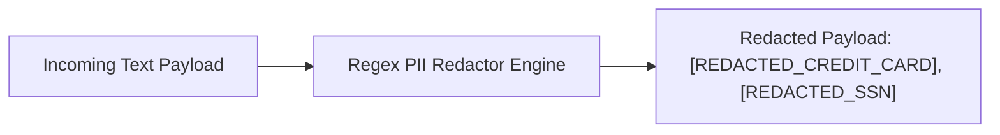

# File 11: PII Filter Guardrail (`src/guardrails/pii-filter.js`)

## Overview
The **PII Filter Guardrail** redacts sensitive Personally Identifiable Information (**PII**)—such as credit card numbers, Social Security Numbers (SSN), Aadhaar IDs, and passwords—before text payloads are logged or sent to LLMs.

---

## 1. PII Redaction Pipeline



---

## 2. PII Filter Implementation (`src/guardrails/pii-filter.js`)

```javascript
export class PIIFilter {
    static redactPII(text) {
        if (!text || typeof text !== "string") return text;

        const patterns = [
            // Credit Card Numbers (16 digits)
            { regex: /\b\d{4}[- ]?\d{4}[- ]?\d{4}[- ]?\d{4}\b/g, replacement: "[REDACTED_CREDIT_CARD]" },
            // US SSN / Indian Aadhaar (9-12 digits)
            { regex: /\b\d{3}[- ]?\d{2}[- ]?\d{4}\b/g, replacement: "[REDACTED_SSN]" },
            { regex: /\b\d{4}\s\d{4}\s\d{4}\b/g, replacement: "[REDACTED_AADHAAR]" },
            // Passwords in text strings
            { regex: /password\s*=\s*['"][^'"]+['"]/gi, replacement: "password='[REDACTED]'" }
        ];

        let sanitized = text;
        for (const { regex, replacement } of patterns) {
            sanitized = sanitized.replace(regex, replacement);
        }

        return sanitized;
    }
}
```

---

## Key Takeaways
1. Protects customer financial and personal identity data from leaking into LLM prompts or telemetry logs.
2. Applies regex pattern matching for instant, low-latency sanitization.
