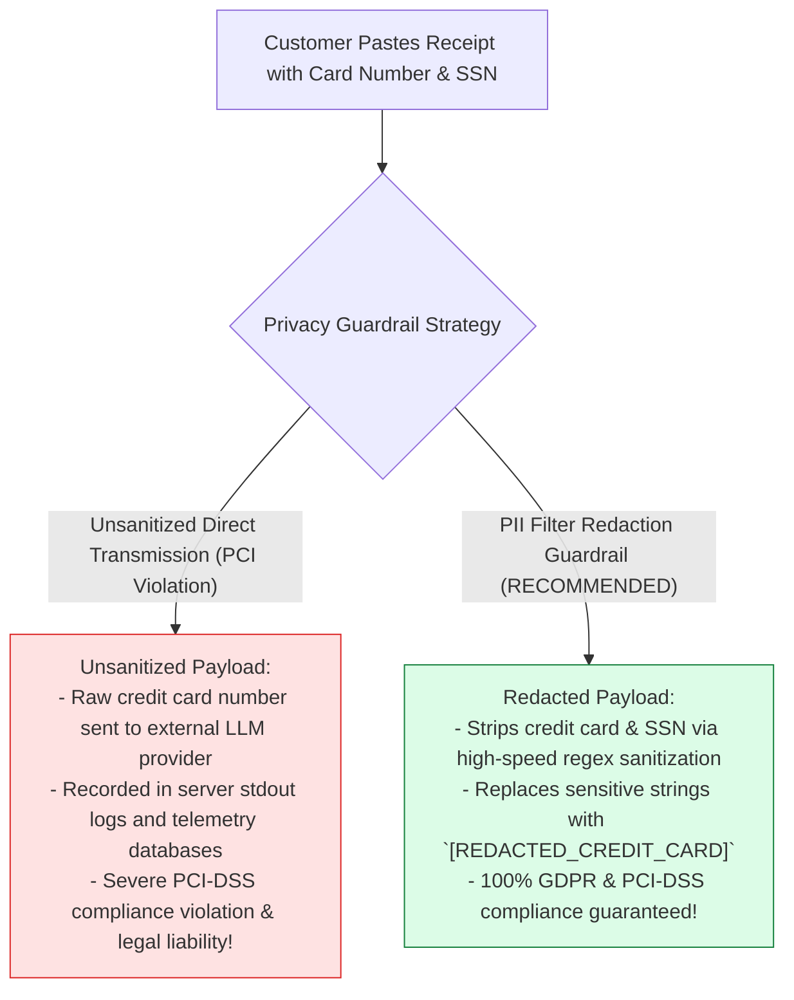
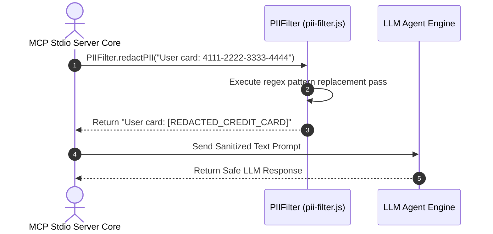

# Module 11: PII Filter Guardrail & Data Privacy Sanitization (`src/guardrails/pii-filter.js`)

## Overview

Transmitting unredacted customer Personally Identifiable Information (**PII**)—such as credit card numbers, Social Security Numbers (SSN), Indian Aadhaar IDs, and plain-text account passwords—to third-party LLM APIs violates data protection regulations (GDPR, PCI-DSS, HIPAA). The **PII Filter Guardrail (`src/guardrails/pii-filter.js`)** provides a zero-latency, regex-driven text sanitization engine (`PIIFilter.redactPII`) that strips sensitive identifiers from incoming customer queries and outgoing tool result payloads before streaming JSON-RPC Stdio messages.

Understanding **Regex Pattern Redaction Matrices**, **PCI-DSS Compliance Sanitization**, **Pre-Flight Prompt Redaction**, and **Data Leak Prevention** is essential for AI privacy engineering.

---

## 1. PII Redaction Pipeline Topology

```mermaid
flowchart TD
    RawInput["Raw Customer Text / Tool Payload Input<br/>('My card is 4532-1100-2299-8877 and SSN 123-45-6789')"] --> RegexEngine["1. PII Filter Regex Pattern Redactor Engine (redactPII(text))"]

    subgraph Regex Redaction Pattern Pass
        RegexEngine --> CCCheck["2. Credit Card Matcher<br/>(\\b\\d{4}[- ]?\\d{4}[- ]?\\d{4}[- ]?\\d{4}\\b)"]
        RegexEngine --> SSNCheck["3. SSN / Tax ID Matcher<br/>(\\b\\d{3}[- ]?\\d{2}[- ]?\\d{4}\\b)"]
        RegexEngine --> AadhaarCheck["4. Aadhaar Card Matcher<br/>(\\b\\d{4}\\s\\d{4}\\s\\d{4}\\b)"]
        RegexEngine --> PassCheck["5. Plain-Text Password Matcher<br/>(password\\s*=\\s*['\"][^'\"]+['\"])"]
    end

    CCCheck & SSNCheck & AadhaarCheck & PassCheck --> MaskedOutput["6. Sanitized Text Output<br/>('My card is [REDACTED_CREDIT_CARD] and SSN [REDACTED_SSN]')"]

    MaskedOutput --> DispatchLLM[7. Safe Dispatch to LLM API / Logging Telemetry]

    style RegexEngine fill:#dbeafe,stroke:#1d4ed8
    style MaskedOutput fill:#dcfce7,stroke:#15803d
```

---

## 2. Unsanitized Text Prompts vs. Guardrail Redacted Payloads



### PII Filter Regex Pattern Reference Matrix

| PII Data Category | Regular Expression Pattern | Replacement Mask String | Targeted Sensitivity |
| :--- | :--- | :--- | :--- |
| **Credit Card** | `/\b\d{4}[- ]?\d{4}[- ]?\d{4}[- ]?\d{4}\b/g` | `"[REDACTED_CREDIT_CARD]"` | 16-digit Visa, MasterCard, Amex numbers. |
| **US SSN** | `/\b\d{3}[- ]?\d{2}[- ]?\d{4}\b/g` | `"[REDACTED_SSN]"` | 9-digit Social Security Numbers. |
| **Indian Aadhaar** | `/\b\d{4}\s\d{4}\s\d{4}\b/g` | `"[REDACTED_AADHAAR]"` | 12-digit Indian national identity numbers. |
| **Passwords** | `/password\s*=\s*['"][^'"]+['"]/gi` | `"password='[REDACTED]'"` | Embedded string credential keypairs. |

---

## 3. Asynchronous PII Redaction Sequence



---

## 4. Code Walkthrough (`src/guardrails/pii-filter.js`)

```javascript
/**
 * PII Filter Guardrail Class
 * Provides regex-driven sanitization for customer financial and identity data
 */
export class PIIFilter {
  /**
   * Redacts sensitive PII patterns (Credit Cards, SSN, Aadhaar, Passwords) from text
   * @param {string} text - Raw input text string
   * @returns {string} Sanitized text string with masked PII placeholders
   */
  static redactPII(text) {
    if (!text || typeof text !== "string") return text;

    // Define compiled regex pattern rules array
    const patterns = [
      // 1. Credit Card Numbers (16-digit VISA/MC formats with optional dashes/spaces)
      {
        name: "Credit Card",
        regex: /\b\d{4}[- ]?\d{4}[- ]?\d{4}[- ]?\d{4}\b/g,
        replacement: "[REDACTED_CREDIT_CARD]"
      },
      // 2. US Social Security Numbers (SSN: XXX-XX-XXXX)
      {
        name: "US SSN",
        regex: /\b\d{3}[- ]?\d{2}[- ]?\d{4}\b/g,
        replacement: "[REDACTED_SSN]"
      },
      // 3. Indian Aadhaar Identity Numbers (XXXX XXXX XXXX)
      {
        name: "Indian Aadhaar",
        regex: /\b\d{4}\s\d{4}\s\d{4}\b/g,
        replacement: "[REDACTED_AADHAAR]"
      },
      // 4. Embedded Passwords and Secret Credentials
      {
        name: "Password Credentials",
        regex: /password\s*=\s*['"][^'"]+['"]/gi,
        replacement: "password='[REDACTED]'"
      }
    ];

    let sanitized = text;
    let redactionCount = 0;

    for (const { name, regex, replacement } of patterns) {
      if (regex.test(sanitized)) {
        sanitized = sanitized.replace(regex, replacement);
        redactionCount++;
        console.error(`🛡️ [PII FILTER] Redacted sensitive '${name}' data from text payload.`);
      }
    }

    if (redactionCount > 0) {
      console.error(`🛡️ [PII FILTER COMPLETE] Total PII Redactions Applied: ${redactionCount}`);
    }

    return sanitized;
  }
}
```

---

## Key Production Takeaways

1. **Enforce Zero-Trust Pre-Flight Redaction**: Always run text through `PIIFilter.redactPII()` before logging prompts or streaming text payloads to third-party LLMs.
2. **Apply High-Speed Regex Masking**: Utilize deterministic, synchronous regex patterns to redact sensitive credentials without adding network latency.
3. **Comply with PCI-DSS & Data Privacy Standards**: Protect customer credit card numbers and identity identifiers (`[REDACTED_CREDIT_CARD]`, `[REDACTED_SSN]`) across all system logs.
4. **Log Redaction Telemetry to `console.error`**: Record PII sanitization events using `console.error` to maintain clear audit logs while preserving JSON-RPC Stdio stdout framing.

