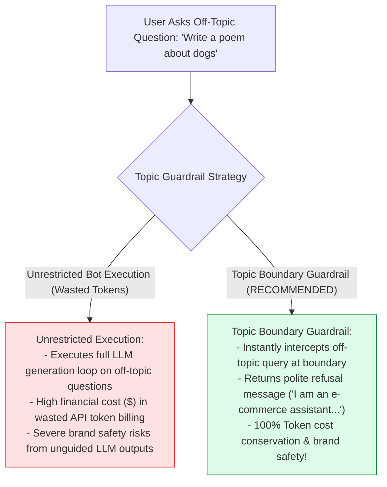
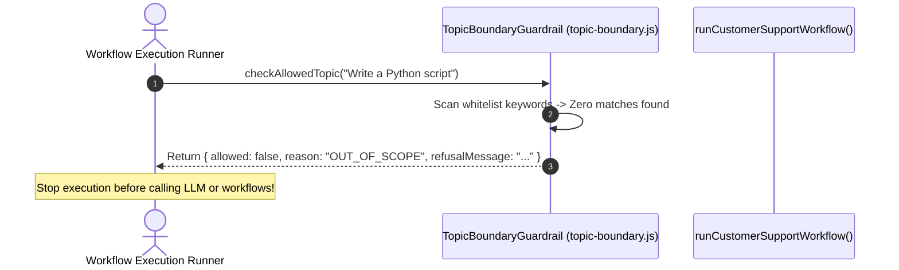

# Module 12: Topic Boundary Guardrail & Domain Refusal (`src/guardrails/topic-boundary.js`)

## Overview

Allowing a customer support AI assistant to answer arbitrary off-topic questions (such as writing Python code, discussing politics, or solving general math problems) wastes expensive LLM token budgets and exposes the enterprise to brand safety risks. The **Topic Boundary Guardrail (`src/guardrails/topic-boundary.js`)** enforces strict operational domain boundaries, employing domain keyword whitelist sets and prompt classifier predicates (`TopicBoundaryGuardrail.checkAllowedTopic`) to intercept off-topic queries and return polite refusal messages.

Understanding **Domain Boundary Whitelisting**, **Off-Topic Query Interception**, **Standardized Refusal Envelopes**, and **Token Budget Conservation** is essential for enterprise AI safety.

---

## 1. Topic Boundary Decision Topology

```mermaid
flowchart TD
    UserQuery["Incoming User Query Input<br/>('Can you write a Python web scraper for me?')"] --> KeywordPass["1. Whitelist Keyword Scanner Pass<br/>(allowedKeywords.some(kw => q.includes(kw)))"]

    KeywordPass --> ScopePredicate{"2. Is Query Relevant to E-Commerce Support?<br/>(shipping, refund, order, status, payment...)"}

    ScopePredicate -- "Allowed Keyword Match (True)" --> PassPipeline["3. Pass Query to Support Workflow Pipeline"]

    ScopePredicate -- "No Allowed Keywords (False)" --> RefusalEngine["4. Intercept Query & Build Refusal Envelope<br/>({ allowed: false, reason: 'OUT_OF_SCOPE', refusalMessage })"]

    RefusalEngine --> ImmediateReturn[5. Immediate Refusal Return to User UI (Zero LLM Tokens Consumed!)]

    style ScopePredicate fill:#dbeafe,stroke:#1d4ed8
    style ImmediateReturn fill:#fee2e2,stroke:#dc2626
    style PassPipeline fill:#dcfce7,stroke:#15803d
```

---

## 2. Unrestricted Off-Topic Bots vs. Domain Boundary Guardrails



### Topic Boundary Specification Matrix

| Whitelisted Category | Keyword Whitelist Set | Action on Match | Operational Function |
| :--- | :--- | :--- | :--- |
| **Order Management** | `"order"`, `"delivery"`, `"shipping"` | `allowed: true` | Permits order status & shipping tracking queries. |
| **Billing & Payments**| `"refund"`, `"payment"`, `"invoice"` | `allowed: true` | Permits refund disputes & invoice requests. |
| **Account & Support** | `"account"`, `"ticket"`, `"help"` | `allowed: true` | Permits account management & ticket lookup queries. |
| **Off-Topic / Coding**| Zero matching keywords | `allowed: false` | Intercepts query & returns refusal envelope. |

---

## 3. Asynchronous Topic Validation Sequence



---

## 4. Code Walkthrough (`src/guardrails/topic-boundary.js`)

```javascript
/**
 * Topic Boundary Guardrail Class
 * Restricts customer support AI interactions strictly to e-commerce operations
 */
export class TopicBoundaryGuardrail {
  /**
   * Evaluates if an incoming user query falls within allowed support domains
   * @param {string} userQuery - Raw user prompt string
   * @returns {Object} Allowed status object with refusal message if out of scope
   */
  static checkAllowedTopic(userQuery) {
    if (!userQuery || typeof userQuery !== "string") {
      return { allowed: false, reason: "INVALID_INPUT", refusalMessage: "Query must be a non-empty string." };
    }

    // Whitelisted e-commerce support domain keywords
    const allowedKeywords = [
      "shipping", "delivery", "order", "refund", "return", "status",
      "product", "payment", "invoice", "account", "ticket", "help",
      "cancel", "damaged", "package", "exchange", "warranty"
    ];

    const qLower = userQuery.toLowerCase().trim();

    // Check if query contains at least one allowed domain keyword
    const isAllowed = allowedKeywords.some((kw) => qLower.includes(kw));

    if (!isAllowed) {
      console.error(`🛡️ [TOPIC GUARDRAIL BLOCKED] Intercepted off-topic query: "${userQuery}"`);

      return {
        allowed: false,
        reason: "OUT_OF_SCOPE",
        refusalMessage: "I am Seva, an e-commerce support assistant for TechCorp. I can only assist with orders, shipping, refunds, and product inquiries."
      };
    }

    console.error("🛡️ [TOPIC GUARDRAIL PASSED] Query verified within e-commerce support domain.");
    return { allowed: true };
  }
}
```

---

## Key Production Takeaways

1. **Protect Token Budgets with Topic Guardrails**: Intercept off-topic questions at the application boundary to avoid spending LLM tokens on non-business queries.
2. **Use Whitelisted Keyword Arrays**: Maintain explicit arrays of domain-relevant keywords (`"shipping"`, `"refund"`, `"ticket"`) to filter out-of-scope interactions.
3. **Return Reassuring, Polite Refusal Messages**: Supply clear refusal messages (`"I can only assist with orders, shipping, refunds..."`) to guide users back to supported topics.
4. **Log Guardrail Interceptions to `console.error`**: Record blocked off-topic queries using `console.error` for security telemetry without breaking Stdio JSON-RPC formatting.


## Learn from the implementation

Use the matching source file as an executable example, not just something to copy. Before running it, state in your own words what data enters the module, what it returns, and which values it changes. Then trace one realistic request from the caller through each function.

Pay special attention to these questions:

- **Data flow:** Which object, array, string, or state value moves between functions? What shape must it have?
- **Control flow:** Which branch, loop, early return, or retry changes the outcome? What condition selects it?
- **Async boundaries:** Where does the code wait for an LLM, database, network, file system, or tool? What should happen if that operation rejects or returns no result?
- **Side effects:** Which lines log information, make an external request, store data, or mutate in-memory state? Keep those distinct from pure calculations.
- **Production limits:** Which assumptions are only safe for a tutorial—for example, in-memory storage, fixed thresholds, approximate token counts, mock data, or a hard-coded batch size?

A useful practice is to change one input at a time and predict the result before executing it. If you can explain why the output changed, when the module should be used, and one way it could fail, you understand the concept rather than only the syntax.
