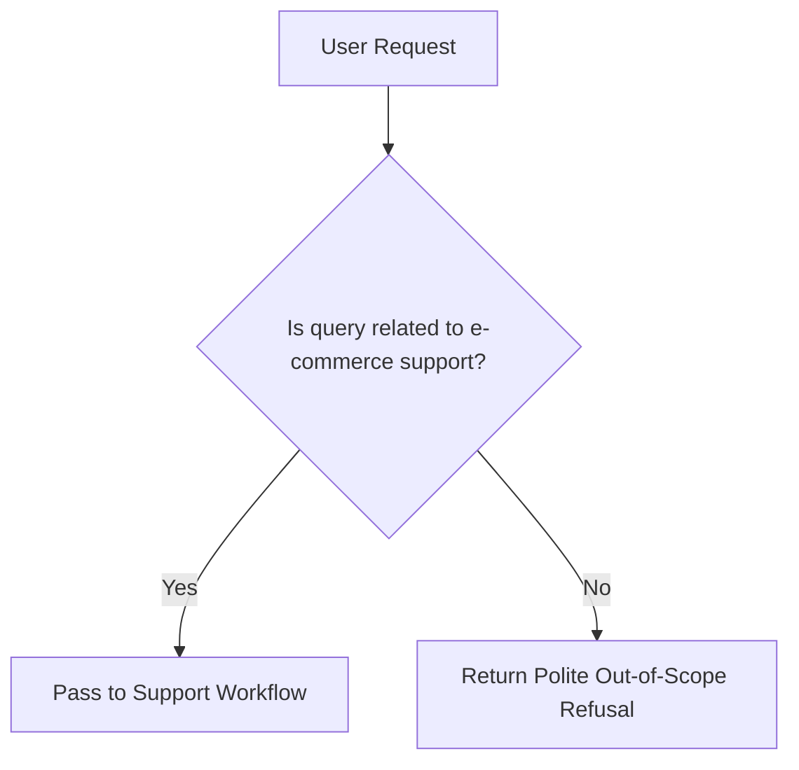

# File 12: Topic Boundary & Response Validator (`src/guardrails/topic-boundary.js` & `response-validator.js`)

## Overview
The **Topic Boundary Guardrail** ensures that the support agent only answers queries relevant to e-commerce customer support (orders, shipping, refunds, products), rejecting off-topic prompts like coding help or general trivia.

---

## 1. Topic Boundary Decision Flow



---

## 2. Topic Boundary Implementation (`src/guardrails/topic-boundary.js`)

```javascript
export class TopicBoundaryGuardrail {
    static checkAllowedTopic(userQuery) {
        const allowedKeywords = [
            "shipping", "delivery", "order", "refund", "return", "status",
            "product", "payment", "invoice", "account", "ticket", "help"
        ];

        const qLower = userQuery.toLowerCase();
        const isAllowed = allowedKeywords.some(kw => qLower.includes(kw));

        if (!isAllowed) {
            return {
                allowed: false,
                reason: "OUT_OF_SCOPE",
                refusalMessage: "I am an e-commerce support assistant. I can only help with orders, shipping, refunds, and product inquiries."
            };
        }

        return { allowed: true };
    }
}
```

---

## Key Takeaways
1. Prevents support agent token waste on irrelevant off-topic queries.
2. Keeps conversational AI strictly within business operational domain boundaries.
