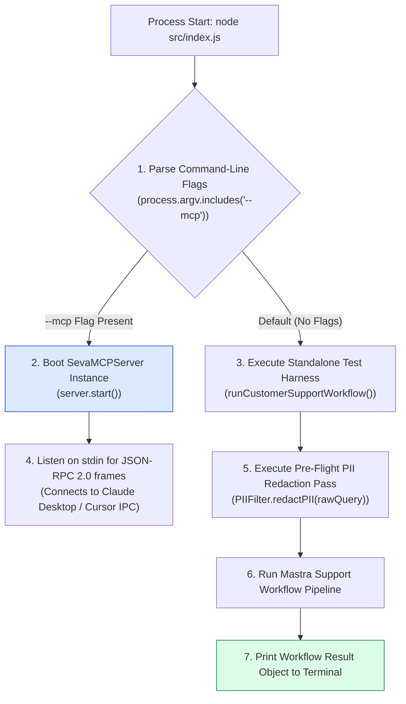
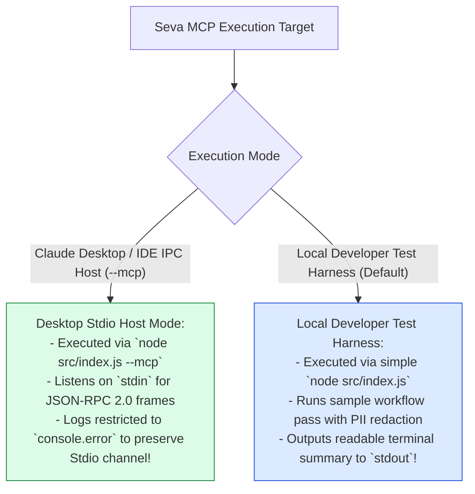

# Module 13: Main Server & CLI Runner Orchestrator (`src/index.js`)

## Overview

The **Main Server & CLI Runner (`src/index.js`)** is the operational boot orchestrator for Seva MCP. Depending on command-line flag parameters (`process.argv`), it either boots the **MCP Stdio Server Core** (`node src/index.js --mcp`) for direct Stdio JSON-RPC 2.0 integration with host desktop applications (like Claude Desktop or Cursor IDE), or executes a standalone customer support workflow test pass (`node src/index.js`) protected by pre-flight PII redaction.

Understanding **CLI Flag Parsing (`process.argv`)**, **Stdio Host Protocol Bindings**, **Standalone Workflow Test Harnesses**, and **Process Lifecycle Management** is essential for application deployment.

---

## 1. Application Boot Topology



---

## 2. Desktop Stdio Protocol Host Mode vs. Local Workflow Test Mode



### CLI Execution Command Matrix

| Target Operational Environment | Launch Command Line | Execution Mode | Stdio Handling |
| :--- | :--- | :--- | :--- |
| **Claude Desktop Integration** | `node src/index.js --mcp` | MCP Stdio Protocol Server | Reserved exclusively for JSON-RPC 2.0 framing. |
| **Cursor IDE Integration** | `node src/index.js --mcp` | MCP Stdio Protocol Server | Reserved exclusively for JSON-RPC 2.0 framing. |
| **Local Workflow Sandbox** | `node src/index.js` | Standalone Test Harness | Unrestricted standard terminal output. |

---

## 3. Asynchronous Stdio Server Boot Sequence

```mermaid
sequenceDiagram
    autonumber
    actor Desktop as Host Desktop App (Claude)
    participant Index as Main Entry (src/index.js)
    participant Core as SevaMCPServer Instance

    Desktop->>Index: Spawn process: node src/index.js --mcp
    Index->>Index: Parse process.argv -> isMcpMode === true
    
    Index->>Core: const server = new SevaMCPServer(); server.start()
    Core-->>Desktop: Write stderr: "[SEVA MCP SERVER] Server started..."
    
    loop Active Stdio Connection
        Desktop->>Core: Send JSON-RPC Request via stdin
        Core-->>Desktop: Write JSON-RPC Response via stdout
    end
```

---

## 4. Code Walkthrough (`src/index.js`)

```javascript
import { SevaMCPServer } from "./mcp/server.js";
import { runCustomerSupportWorkflow } from "./mastra/workflows.js";
import { PIIFilter } from "./guardrails/pii-filter.js";

// Check if launched with --mcp flag
const isMcpMode = process.argv.includes("--mcp");

if (isMcpMode) {
  // Mode A: Launch MCP Protocol Server over Stdio
  console.error("⚡ [SEVA MCP] Launching in Stdio MCP Protocol Server Mode...");
  const server = new SevaMCPServer();
  server.start();
} else {
  // Mode B: Run Local Workflow Standalone Test Pass
  async function main() {
    console.log("=================================================");
    console.log("🚀 [SEVA MCP CUSTOMER SUPPORT TEST RUNNER]");
    console.log("=================================================\n");

    const rawQuery = "I need a refund for my order. My credit card is 4111-2222-3333-4444 and my email is priya@example.com.";

    console.log("📥 Raw Input Customer Query:");
    console.log(`"${rawQuery}"\n`);

    // Step 1: Pre-Flight PII Redaction Pass
    const sanitizedQuery = PIIFilter.redactPII(rawQuery);
    console.log("🛡️ Sanitized Input Query (Post-PII Redaction):");
    console.log(`"${sanitizedQuery}"\n`);

    // Step 2: Run Mastra Support Workflow Pipeline
    console.log("⚡ Executing Customer Support Workflow Pipeline...\n");
    const result = await runCustomerSupportWorkflow("priya@example.com", sanitizedQuery, false);

    console.log("=================================================");
    console.log("🎉 [WORKFLOW TEST EXECUTION COMPLETE]");
    console.log("=================================================");
    console.log(JSON.stringify(result, null, 2));
    console.log("=================================================\n");
  }

  main().catch((err) => {
    console.error("🚨 [CLI RUNNER ERROR] Execution failed:", err);
    process.exit(1);
  });
}
```

---

## Key Production Takeaways

1. **Support Dual Execution Modes via Flags**: Support both `--mcp` protocol mode for desktop integrations and standard mode for local developer debugging.
2. **Isolate Stdio Streams in Protocol Mode**: Ensure that in `--mcp` mode, all diagnostic logging is directed strictly to `console.error` to avoid corrupting Stdio stdout streams.
3. **Execute Pre-Flight PII Redaction in Test Harnesses**: Run input queries through `PIIFilter.redactPII()` before passing prompts to workflows.
4. **Format Clean Test Summary Envelopes**: Print formatted JSON result summaries to stdout during local test runs for easy inspection.


## Learn from the implementation

Use the matching source file as an executable example, not just something to copy. Before running it, state in your own words what data enters the module, what it returns, and which values it changes. Then trace one realistic request from the caller through each function.

Pay special attention to these questions:

- **Data flow:** Which object, array, string, or state value moves between functions? What shape must it have?
- **Control flow:** Which branch, loop, early return, or retry changes the outcome? What condition selects it?
- **Async boundaries:** Where does the code wait for an LLM, database, network, file system, or tool? What should happen if that operation rejects or returns no result?
- **Side effects:** Which lines log information, make an external request, store data, or mutate in-memory state? Keep those distinct from pure calculations.
- **Production limits:** Which assumptions are only safe for a tutorial—for example, in-memory storage, fixed thresholds, approximate token counts, mock data, or a hard-coded batch size?

A useful practice is to change one input at a time and predict the result before executing it. If you can explain why the output changed, when the module should be used, and one way it could fail, you understand the concept rather than only the syntax.
